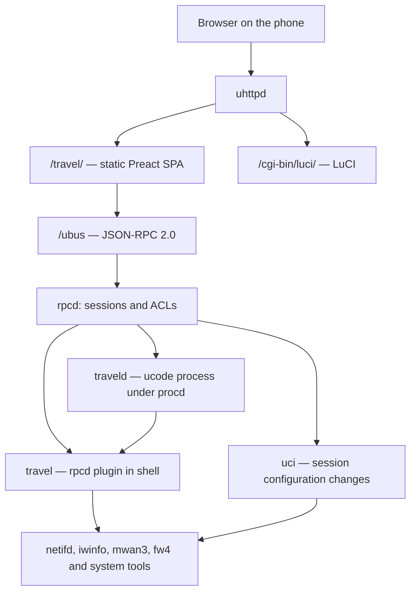

# Architecture

The project provides a mobile-first management interface for a GL.iNet Beryl 7
(GL-MT3600BE) travel router, with vanilla OpenWrt 25.12 as the reference
environment. The browser loads every asset the UI needs from the router; the
local configuration functions remain usable without Internet access.

This document describes the implementation found in the repository. Firmware,
kernel, installed packages and available resources are properties of the
device, read at runtime: they are neither architectural constants nor checks
repeated during this revision.

## Components and communication



The SPA is built on the PC and installed in `/www/travel/`. Neither Node.js,
Vite nor any additional application server runs on the router. The SPA's data
requests and commands go through `/ubus`; the project has no REST or WebSocket
endpoints of its own.

| Component | Implementation | Responsibility |
|---|---|---|
| `travel` | `package/travel/files/usr/libexec/rpcd/travel` | rpcd shell plugin: filtered reads, scans, VPN operations, multi-WAN, USB, profiles and system. Uses jshn, jsonfilter, UCI, local ubus and system commands. |
| `traveld` | `package/travel/files/usr/share/travel/traveld.uc` | Resident process: WiFi reconnection, traffic sampling, captive portal cache and re-arming of the suspended kill switch. |
| `uci` | Object provided by OpenWrt | Staging and applying the browser session's changes, with rollback where required. |

The `/etc/init.d/travel` service starts the daemon through procd, with respawn
`3600 5 5` and reload triggers for `travel` and `wireless`. Before starting it
uses `probe.uc` to test which execution mode the ucode interpreter supports and
re-applies the USB mode, IPv4 forwarding and VPN routing. The daemon requires
the ucode modules `uloop`, `ubus`, `uci` and `fs`.

The daemon orchestrates `travel.radios`, `travel.uplinks`, `travel.scan` and
`travel.portal_probe`. Scans and wireless reads use the OpenWrt tools; calls to
the plugin can temporarily block the daemon's loop. Configured connections stay
in netifd's hands even if `traveld` stops. In that case the aggregated
dashboard and the automations are unavailable, while the plugin keeps serving
the independent operations.

`setup.sh` saves `/www/index.html` once as `/www/index.html.luci` and installs
a page with an immediate meta-refresh to `/travel/` and links to the SPA and to
LuCI. LuCI keeps its own path; it can also be reached from the link in
Settings, as long as the network and uhttpd are working.

## Frontend and implemented features

The frontend uses Preact 10, TypeScript and Vite 5. `src/app.tsx` handles login
and navigation with local state, mounting only the selected screen. The initial
tab is WiFi. The five tabs in the bottom bar are:

| Tab | Features |
|---|---|
| WiFi | Radios and uplinks, scanning, connecting and disconnecting, manually adding hidden networks, MAC and DHCP hostname, automatic reconnection, shared settings and AP switches, portal status. Saved networks have a dedicated page, opened from the "Manage saved networks" entry with the total next to it. |
| LAN | IPv4 address, DHCP pool, DNS, conflicts with the WANs, roles and MAC address of the ethernet ports, list of connected devices. |
| Internet | Per-WAN dashboard, current and session traffic, link and portal status, multi-WAN, routing rules and health checks. |
| VPN | Tailscale login and settings, tailnet nodes, WireGuard import and control, routing diagnostics, kill switch and temporary suspension. |
| Settings | Router status and name, status LED switch and physical switch function, USB devices and mode, profiles, backup and restore, clock/NTP, reboot and link to LuCI. |

`src/lib/` contains the RPC client, types, transformations, validations and UCI
write sequences. `src/screens/` contains screens and panels; `src/components/`
holds the shared controls for hostname and apply status. The styles are in
`src/style.css`.

### Languages

The interface is available in Italian and English. `src/i18n/index.ts` holds
the current language: on first access it is the first entry of
`navigator.languages` that is `it` or `en`, otherwise English; a choice made
from the menu (login page or Settings) is saved in `localStorage`
(`travel.lang`) and takes precedence over the browser. Switching updates
`<html lang>` and makes `main.tsx` redraw the tree, without losing the screens'
state. Dates and times use the locale of the chosen language.

Texts are TypeScript objects, one per area (`common`, `wifi`, `lan`, `vpn`,
`settings`, …), defined with `defineText({ it, en })`: the type of the English
text is that of the Italian one, so a forgotten key does not compile. The
functions in `src/lib/` that produce text (labels, validations, reasons) read
the same dictionaries, in the current language. No external library: the
package stays small for the router's flash.

The router writes its messages in English, which stay in the logs and serve as
a fallback. Alongside the message it sends a stable code:

- the rpcd plugin replies with `error`, `error_code` and `error_params`
  (`fail_code`); the helpers `led.sh`, `toggle.sh`, `wg.sh` and `ap.sh` write
  the code to the file named by `TRAVEL_ERR_FILE`, and `fail_helper` adds it to
  the reply;
- `profile_apply` accompanies `note` with `note_code` and `note_params`;
- `traveld` adds `code` and `params` to events and `last_error_code` /
  `last_error_params` to the last error.

The frontend rebuilds the message from the code, in Italian or English
(`src/i18n/backend.ts`, `src/i18n/auto.ts`); an unknown code falls back to the
router's English message. The reasons why a VPN option is blocked are also
rebuilt from `blocked_by`.

### Sessions, permissions and secrets

`src/lib/ubus.ts` sends JSON-RPC 2.0 with `fetch('/ubus')`. Login uses
`session.login` with the null session; the token is kept in `sessionStorage` as
`travel.session` and added to subsequent requests. The login password is not
stored. On opening, a `travel.status` call verifies the session; logout deletes
the local token. Expiry and authorizations are handled by rpcd.

The client distinguishes transport errors, ubus codes and JSON-RPC rejections
for an expired session. The ordinary timeout is 10 seconds; login, scanning,
VPN and other slow operations can set their own.

The ACLs installed in `/usr/share/rpcd/acl.d/travel.json` list the allowed
methods. For UCI they allow reading and writing `wireless`, `network`,
`firewall`, `dhcp`, `system`, `travel` and `mwan3`. The UI reads the mwan3
status through `travel.mwan`; the UCI read of `mwan3` is only used to know
whether the IPv6 twin sections (`<wan>6`, `<wan>6_f`, `travel_default6`) exist
before aligning them: without it, `uci get` was rejected and the twins were
never updated. The project does not publish a generic shell execution method.
Every `traveld` method explicitly declares `ubus_rpc_session` in its signature
for requests forwarded by uhttpd.

The application reads `travel.ap`, `travel.networks` and `travel.wg_get` return
flags such as `has_key` and `has_private_key`, leaving out the secrets. For a
saved network, `travel.stage_connect_saved` reads the key on the router and
copies it into the UCI changes of the same RPC session. WiFi keys are persisted
in `travel` and `wireless`; WireGuard keys in `network`. The Tailscale auth key
preferably goes through a temporary file created with `umask 077` and deleted
after use; there is a CLI fallback for versions that do not support
`--auth-key=file:`.

Leaving out secrets applies to ordinary application replies: the ACLs also
allow UCI reads of the files that contain them, and the backup downloaded by
the browser can include them. The interface is an administration tool, not a
boundary isolating secrets from a user who is authorized to read UCI or export
backups.

### Status updates

`src/lib/poll.ts` schedules the next request after the previous one completes
and suspends periodic requests while `document.hidden` is true. When the page
returns to the foreground it requests an update. Each hook has its own timer;
there is no single global poll.

| Browser read | Configured interval |
|---|---|
| `traveld.dashboard`, in the Internet tab | 2 s |
| `travel.mwan`, in the Internet tab | 10 s |
| `travel.vpn` | 4 s |
| `travel.wg_get` | 6 s |
| `travel.status` and USB devices in Settings | 5 s |
| WiFi, saved networks, LAN and clients | On opening, on refresh or after an action |

The intervals add to the request time. The dashboard combines in-RAM counters
with an uplink cache refreshed on request when it is at least 5 seconds old.
System data is read from `/proc` and sysfs. A dashboard reply can therefore
require additional reads and processes.

The daemon samples `/proc/net/dev` every 2 seconds, computes bytes per second
and totals since the device was first seen by the current process, and handles
counter resets. These totals are not a persistent history. Health checks and
policy status are provided by mwan3, separately from the association/IP status
and the HTTP probe.

## Applying configurations

The browser stages many changes with `uci.add`, `uci.set` and `uci.delete`,
then applies them with `uci.apply`. LAN, ports and WiFi are sequences of UCI
calls in the session; they do not have a single application method that runs a
custom transaction and returns a diff.

`src/lib/apply.ts` implements `useApply` for changes that can cut off access:

1. It runs the staging and calls
   `uci.apply({ rollback: true, timeout: seconds })`.
2. Every 2 seconds it tries `travel.status` and the additional check, if any.
3. When the checks pass, it automatically calls `uci.confirm`.
4. Without confirmation, the rollback is left to rpcd; cancelling tries
   `uci.rollback`.

| Operation | Window | Additional check |
|---|---|---|
| WiFi connection, saved networks and relevant wireless commands | 90 s ordinary | Radio/AP status via `wirelessCameUp` |
| Changing the APs' SSID, encryption and password | 240 s | `wirelessCameUp` |
| MAC cloning from the portal panel | 150 s | `wirelessCameUp` |
| MAC of an ethernet port | 150 s | Re-reading the MAC in use on the port |
| LAN | 300 s | New address among the active ones **and** IPv6 announcement mode applied |
| Role of an ethernet port | 90 s | Re-reading the requested role |

`wirelessCameUp` rejects `retry_setup_failed` and requires active radios with a
device when they must offer an AP. It does not check Internet on the STA: the
connection screen then reads association, address and portal to show the
outcome.

Changing the LAN subnet adds the new address while keeping the previous one as
secondary, allowing confirmation in the old IP's session. The UI then offers
explicit removal of the previous address with `dropOldAddress`, applied without
rollback. Confirmation proves that netifd has activated the new IP, not that
the phone has already renewed its lease.

Saved networks, automation parameters, multi-WAN, profiles and various system
functions use ordinary applies or direct commits by the plugin. Tailscale and
WireGuard have their own checks and apply commands. The project adds neither an
automatic save of the last confirmed configuration nor a restore at boot after
a power loss during apply.

## WiFi and radio plan

The reference device has two bands, 2.4 and 5 GHz, exposed as two radios on the
same phy. AP and STA on the same radio share the channel; reconfiguring the STA
can also interrupt that AP. The code derives device names from the OpenWrt
state and from sysfs, without assuming `wlanN`.

| Reference radio | AP | STA | Uplink DHCP interface |
|---|---|---|---|
| `radio0`, 2.4 GHz | `ap_radio0` | `sta_radio0` | `wwan_radio0` |
| `radio1`, 5 GHz | `ap_radio1` | `sta_radio1` | `wwan_radio1` |

`tools/setup-ap.ps1` and `tools/setup-ap.sh` initialize the APs on the radios,
with a shared SSID and password and a configurable country code, `IT` by
default. They try `sae-mixed`, falling back to `psk2` if no AP shows up. This
initialization is separate from deployment: it also disables any existing
non-`ap_*` wifi-ifaces and reloads wireless.

The UI changes the shared credentials and explicitly turns the APs on and off.
The encryptions offered are `sae-mixed`, `sae` and `psk2`. Which section counts
on a radio is written once in `usr/share/travel/ap.sh`, which `travel.radios`,
`travel.ap` and the physical switch all read from: three copies of the rule
would sooner or later pick different sections, that is, report or turn on
different access points. There are two rules. **The one that is on wins**,
since it is the one actually broadcasting. **Among those that are off, ours
wins**, `ap_<radio>`: while ours is on the first rule is enough, but the switch
turns it off by design, and with the whole radio off the first section in
`uci show` order would have been picked — possibly OpenWrt's default
`wifi-iface`, which sits there disabled, **open and without a password**. As a
safety net independent of the name, `ap_switch` refuses anyway to turn on a
section without encryption: turning off is always allowed, only one direction
is dangerous. The same file contains `ap_switch`, the only place where an AP
changes state from the router. The UI instead writes `disabled` with the `uci`
object and goes through apply-and-confirm: turning off the AP you are connected
through locks out whoever is doing it, and the automatic rollback is the only
safety net there is. A client connection picks the radio from the network's
band and recreates only `sta_<radio>`, plus the DHCP hostname of the
corresponding interface. It does not move the APs or change whether they are
enabled. Having an AP on the other radio as well offers an additional access
path, whose availability still depends on the configuration and on the uplinks
active on that radio.

### Scanning and manual connection

`travel.scan` is synchronous. It validates the radio, finds a usable device and
invokes `ubus call iwinfo scan`; if there is no device it creates a temporary
managed one with `iw`, removing it at the end and through a trap. The frontend
allows 30 seconds, filters by band, normalizes the security type and groups the
results. Empty SSIDs are shown as hidden networks: they cannot be selected,
because there is no name to put in the configuration, but tapping them opens
the form that asks for one.

Each row carries the tags that apply to it: *connected*, *open* and ***saved***
when that network is already configured. The last one is muted like *hidden*
in the saved networks list — it is a fact about the configuration, not about
the current state, and in green it would compete with *connected*. It also
states the band when it is not this one (*saved · 5 GHz*): that network is the
same and the popup will reuse its password, but on this radio it is not yet
configured, and the word "saved" alone would hide that. Nameless rows never get
one: an empty SSID is not "the saved network without a name", and matching it
would mark random rows.

The connection supports open, WPA2, WPA3 and transition-mode networks.

The MAC can be the device's own, random, manual or cloned from a LAN client.
The four modes live in a single shared control, `components/MacPicker.tsx`,
used by the WiFi connection and by the ethernet ports: it is the same choice,
and seeing it in two different forms would suggest two different settings —
the same reason `HostnamePicker` exists. The portal panel keeps its own client
list, because there the only choice is cloning and it lives inside a flow of
its own. The random MAC is generated in the browser, unicast and locally
administered; saving it with the network reuses it on reconnections.

The three modes that write an address — `random`, `manual`, `clone` — must be
listed identically everywhere the STA is rewritten from a saved network:
`travel.stage_connect_saved` and travelD's `applyConnection`. Leaving `clone`
out of one of them means joining the network with the factory address exactly
when the chosen MAC was the only thing that mattered — a portal that authorizes
addresses — and without telling anyone.

On the WiFi STA the MAC is written in the `wifi-iface` section. On the ethernet
ports it is instead written in a `device` section of `/etc/config/network`
(`option macaddr`): since OpenWrt 21.02 netifd reads it only from there, and
put on the interface it would be silently ignored. The section is created on
first use with the name `dev_<port>` and then reused, so as not to leave two on
the same device. Going back to the factory address means **deleting** the
option, not writing it empty: `macaddr=` would be passed to the kernel as is.
The section stays, however, because it can carry other port settings. The
factory address is not read from anywhere: it comes back by removing the
option.

Confirmation re-reads the address **in use**, not the one written: the write
was already guaranteed by `uci apply`, while what matters is that netifd has
applied it to the port. Changing the MAC of a WAN port restarts DHCP upstream
and invalidates any captive portal login — which is also why one changes it; on
a bridge port the address of `br-lan` can change too, since it takes its own
from one of the ports that make it up.

The DHCP hostname has three modes: no name (`hostname='*'`), the router's name
(option removed), custom name. It is configurable per WAN and remembered per
saved WiFi network.

### Saved networks and automatic reconnection

Networks are `network` sections in `/etc/config/travel`. **A saved network is a
single configuration, valid on one band or on both**: the identity used by the
UI is the SSID alone, and the bands are a property of the network.

The choice is written in the `band` field, which has always had exactly the
three values needed: `2.4`, `5` and empty for both. So there is no new format to
introduce, existing configurations are read as they are, and a router with the
old package keeps understanding what the UI writes. The canonical form — two
booleans — is derived in `lib/networks.ts`, at the boundary, and not in the
components: it is the same place where the fields that a not-yet-updated router
does not send get their answer. A `band` value that is none of the three is
read as "no band", because that is how travelD already behaves, matching it to
no radio.

Almost everything is shared between the two bands — password, encryption, DHCP
name, note, priority, outcome of the last attempt. The only parameter kept
separate is the **MAC**, in `mac_mode_24`/`mac_value_24` and
`mac_mode_5`/`mac_value_5`: it belongs to the station, and there are two
stations, one per radio. Whoever lacks those fields uses `mac_mode`/`mac_value`,
which are still written as a mirror of the first active band for routers not yet
updated. When a new band is enabled the mode is inherited and a random address
is regenerated: the same random MAC on two radios toward the same AP would be a
conflict.

When cloning a MAC for a portal, instead, **only the WAN's band** is written,
and the mirror takes that address — it is the only field a not-yet-updated
router reads, and leaving it as it was, the first automatic reconnection would
put back the previous MAC. But on an entry that only has the mirror, the other
band falls back on it, so it would be moved as a side effect: before writing,
it is pinned in its own field to the value it is using — and a section with no
MAC field at all counts as `device`, that is, the radio's address, not "don't
know". That value is read with `uci get` on the section and not from the list,
because `travel.networks` from an old package does not report the per-band
fields even when they are in the configuration, and trusting the list would
mean writing over them. If that read fails, the mirror is **not** touched:
moving it blindly would shift the other band of an entry that falls back on it,
and losing a compatibility convenience is better than changing a configuration
nobody asked to touch.

Before enabling a band, the UI checks that no other entry with the same SSID
already covers it: there is only one station on the radio, so a duplicate would
never be tried. In that case the UI says so, does not save and does not touch
the existing entry.

Editing, deleting, enabling, notes, reordering priorities and connecting with
saved credentials are implemented. `mark_used` records `last_used` and
`last_result` for the actions that invoke it from the UI.

The list lives on a dedicated page, not in the WiFi tab: it grows with your
travels, and at the bottom of the tab it pushed radios and scanning down. The
tab only shows its entry point with the total; the page is a view of
`screens/Wifi.tsx`, so it reuses the networks, radios and uplinks already read
and is not a sixth tab in the bar. Inside there is **a single list**, ordered by
priority: each row shows encryption, last use, outcome of the last attempt if
different from "ok" and note, plus tags for the enabled bands and for
*connected*, *hidden* and *disabled*. From six networks up a search by SSID or
note appears; the priority number shown stays that of the full list even while
filtering. Opening a network lets you choose the bands with two checkboxes — at
least one — and, when both are active, which radio to connect with.

Scanning, instead, stays split by band and is unchanged: the 2.4 GHz section
shows what that radio sees, the 5 GHz section what the other one sees. Bands
are chosen only when saving, and there the band the network was seen from is
mandatory: it is the only one on which the network is known to exist and the
password is known to be right. The other can be added right away, and can be
changed later. Connecting to a network already saved on the other band does not
create a second entry: the UI offers to add the band to the existing one, and
this happens only if the connection succeeds.

### An already saved network, found by scanning

The connection popup is the same for all networks found by scanning, but when
the chosen one is already saved — on the scanned band or on the other — it
starts from the **stored configuration** instead of from scratch: the MAC of
the band concerned and the DHCP name come from there and remain editable,
because the saved configuration is the form's initial value, not a cage.

The password is the exception, for a structural reason: it never leaves the
router, so there is nothing to prefill. The field stays empty and is
**optional**, **Connect** can be pressed right away, and from there the two
paths diverge:

- empty field → the configuration is staged by the router with
  `travel.stage_connect_saved`, which reads the key from `/etc/config/travel`
  without passing it through the browser. Form values that differ from the
  saved ones — MAC, DHCP name — are written over the section just staged, in
  the same batch of pending changes; if nothing changed, the calls are exactly
  those of "Connect" from the saved networks page. The MAC comparison is
  between **addresses**, not modes: what the router wrote is the MAC saved for
  that band, empty if it is the radio's own;
- filled-in field → the normal `stageConnection` path, and the new password is
  written to the saved entry **after** the network has been joined, with the
  usual rule: a credential that did not work is not saved.

An empty field is never a deletion. On a network not yet saved the rule is
unchanged: without a password **Connect** is disabled, because there is no key
to reuse. The only case in which the password becomes necessary again on a
known network is saving it as a **separate entry** after declining to extend
the existing one: connecting only needs the router's key, but a new entry would
be born without it, and it would be a saved network that never connects.

### Sharing saved networks

The menu of every saved network offers **Share**, even when the network is
disabled, not connected or no radio is available. Every time it opens,
`uci.get` reads only the selected `travel` section: SSID, encryption, password,
band and hidden state come from the same fresh reply. List reads keep leaving
out the passwords; the existing ACL permissions already allow this
administrative read.

The password stays masked until **Show password** is pressed and is hidden
again on reopening. The data lives only in the screen's state and is cleared on
closing. The QR code is generated locally with `qrcode-generator`, UTF-8
encoding and a white margin of four modules, without sending credentials to
external services.

The content follows the [ZXing WiFi format](https://github.com/zxing/zxing/wiki/Barcode-Contents#wi-fi-network-config-android-ios-11):
`WIFI:T:WPA;S:SSID;P:password;;`, with special characters escaped, `H:true` for
hidden networks and `T:nopass` without a password for open ones. WPA/WPA2 and
mixed WPA2/WPA3 use `WPA`; pure WPA3 uses `SAE` and requires a compatible
reader and device. Read errors, missing credentials or unsupported encryptions
prevent the QR code from being shown.

`npm test` checks the content and the decoding of the QR codes with an
independent reader, as well as masking, reopening, fresh data, errors,
asynchronous replies and simulator behaviour. Actually connecting from
Android/iPhone cameras is still to be verified on physical devices.

### Hidden networks

A network that does not broadcast its SSID shows up in no scan, so there is no
row to tap to connect: it is added by hand from the radio's card, with "Add
hidden network", or by tapping the "hidden network" row in the scan results.
The form asks for SSID, bands and security type, and for the password only for
encryptions that have one (`psk2`, `sae`, `sae-mixed`; `none` does not ask for
it). SSIDs of 1 to 32 bytes and passphrases of 8 to 63 characters are validated
before saving.

Saving writes only to `/etc/config/travel`, which does not touch the running
network: a hidden network can be configured even if it is not reachable at that
moment. `hidden='1'` stays in the section together with the other parameters —
it is not form state — and it is what distinguishes the entry in the list and
what the automatic engine consults. From then on the network is edited,
reordered, disabled and deleted like any other saved network. Bands are chosen
with the same two checkboxes as the other networks and here none is mandatory:
nobody has seen it anywhere, it is a hand-typed name, so there is no band that
counts as a witness.

Connecting needs no scan: the STA is written with the saved SSID and OpenWrt
always generates `scan_ssid=1` for `mode=sta`, so wpa_supplicant probes that
name directly instead of waiting for a beacon. So no `hidden` option is needed
in the `wireless` section: the uci option with that name only concerns AP mode.

For hidden networks the automatic engine skips the visibility check and the
RSSI threshold — there is no signal to measure until it connects — and tries
them in priority order like the others; the existing backoff and blacklist
throttle fruitless attempts. They remain excluded from roaming, however: moving
to a better network means comparing signals, and the signal of a network never
seen cannot be compared.

### Why a connection fails

From the outside a wrong password and a network that is not there look the
same: no association, no address. No netifd state tells them apart, because in
both cases the configuration is valid and was applied without errors — which is
why `wirelessCameUp` confirms the apply anyway. Only wpa_supplicant knows the
difference, and it writes it to the log: `travel.sta_diagnose` filters
`logread` on the radio's interface and returns `wrong-key`, `not-found`,
`rejected` or empty, together with the line that says so.

The log, however, is the history of the whole radio, and the interface name
does not change from one network to another: a `WRONG_KEY` line from a previous
attempt would still match and be reported as the reason for the current one,
that is, it would send you to fix the password when the problem is that the
network is not there. That is why the method only reads what follows a
bookmark: the screen asks for one (`sta_diagnose` without `after`, which only
replies with `mark` and no verdict) before touching the radio, and passes it
back afterwards. If the ring buffer has wrapped around in the meantime, nothing
is found and the reply is empty — a missing reason, never a wrong one.

After the apply the screen watches the uplink for 30 seconds, **comparing the
SSID**: when switching networks on the same radio, the previous association may
still be up and have an address, and a check on the state alone would declare
successful a connection that has not even started.

Of those reads, **the last one counts, not the best one**. With a wrong
password the station associates anyway and drops right after, when the
four-way handshake fails: for a couple of seconds the uplink shows the SSID
without an address, indistinguishable from slow DHCP. Keeping the first good
read, that moment would stand for the whole attempt and the outcome would be
`no-address` — that is, "the password is right, DHCP is not answering" —
precisely when the password is the only problem, and on top of that skipping
the log read that would have said `wrong-key`. The simulator reproduces that
association window on purpose.

If no read succeeds, or the last successful one is older than about three
polling rounds, the outcome is `unknown`: not a failure, but the absence of a
measurement. It is not written to `last_result`, because it would replace a
true history with a fault nobody observed. The other outcomes end up there
through `mark_used`, which now also accepts `wrong-key` and `not-found`. In no
case does a failure delete the saved network: it stays configured and editable,
and the sheet offers "Edit" next to the error — for a hidden network also on the
SSID, which is the most likely cause of `not-found`.

The automatic engine is disabled by default (`autoreconnect=0`) and evaluates
the situation every 10 seconds. For each radio it sorts the networks enabled
**on that band** by descending priority, compares them with the SSIDs visible on
the radio and applies an RSSI threshold of -78 dBm by default. The MAC written
is that of the radio's band.

Penalties and blacklist stay in RAM and are per **network and band**, keyed by
`section@band`: "won't connect" is a fact about the radio, and the same network
can be out of range at 5 GHz and work at 2.4. With the two bands in two separate
sections the counters were already two, and the single list did not merge them
— the list of networks set aside therefore shows network and band.

- Backoff from 30 to 900 seconds; after 3 failures, by default, the blacklist
  lasts 600 seconds.
- After an attempt of its own it waits 25 seconds of settling plus 30 seconds
  of cooldown before re-evaluating the radio.
- With `roam_mode=stay` it keeps an uplink that has an address. With `best` it
  looks for a higher-priority network respecting `scan_interval` (60 s by
  default) and requiring an RSSI of at least `rssi_min + roam_hysteresis`
  (8 dB).
- Success is the `addressed` state; the captive portal probe does not affect
  network selection.
- `traveld.reset` clears penalties and blacklist. Recent events are limited to
  60 entries in RAM and are also sent to the system log.

The daemon commits `wireless.sta_<radio>`, applies the hostname in
`network.wwan_<radio>` if it changes, then runs `wifi up <radio>`. Changing the
hostname also causes a netifd reload. These automatic actions do not use apply
with confirmation.

## WAN, multi-WAN and USB tethering

Uplinks are identified from the `wan` firewall zone, excluding disabled
interfaces and devices used as LAN ports. IPv6 logical interfaces stay excluded
**from the list**, but not from the read: their addresses join the row of their
IPv4 sibling instead of opening a new entry, because dual-stack means a single
port with two families. Pairing is done on the `l3_device` and not on the name,
which cannot be guessed.

The backend rebuilds IP, gateway, DNS, metric and runtime state through netifd,
iwinfo and sysfs, distinguishing a missing WiFi association, a missing ethernet
carrier and a missing address. An uplink counts as addressed when it has an
address of **either** family: a v6-only mobile network (464XLAT) works, and
reporting it as having no address would send you looking for a fault that does
not exist.

The setup initializes `eth0` once as WAN and `eth1` in the `br-lan` bridge, and
creates a DHCP `wwan_<radio>` per radio and `wan_usb`, initially disabled. New
WANs are created without a DHCP hostname and **without the `ipv6` option**: on
OpenWrt 25.12 nobody reads that option for a `proto dhcp` interface, and IPv6 on
a WAN is obtained only with a dedicated `config interface`. See the IPv6 section
below.

### mwan3 configuration

`mwan3-setup.sh` installs `mwan3` and `ip-full` if needed, disables software/
hardware flow offload if enabled and prepares `/etc/config/mwan3`.

| Section | Role |
|---|---|
| `network.<wan>.metric` | Metric of the interface's route |
| `mwan3.<wan>` | Multi-WAN enablement and tracking parameters |
| `mwan3.<wan>_f` | Failover member: priority metric, weight 1 |
| `mwan3.<wan>_b` | Balancing member: metric 1, configurable weight |
| `travel_failover`, `travel_balance` | General policies with their members |
| `o_<wan>`, `p_<wan>` | Dedicated policies: mandatory or preferred WAN |
| `travel_default` | General rule selecting policy and sticky |

The initial metrics, if missing, favour `wan` (10), other WAN ports (15), 5 GHz
WiFi (20), 2.4 GHz WiFi (30), USB (40). The setup avoids collisions with
metrics already met during assignment. Reordering from the UI realigns network
metrics and failover members in steps of ten.

The default health checks use IPv4 ping, two targets per WAN chosen in rotation
from eight resolvers, reliability 1, count 1, timeout 2 s, interval 5 s and
up/down thresholds of 3. The UI lets you change them. Excluding a WAN from
mwan3 does not shut the interface down.

Custom rules combine IPv4 or CIDR source/destination, protocol, destination
port/range, WAN and sticky. `o_<wan>` uses `last_resort=unreachable`,
`p_<wan>` uses `default`. The general rule is recreated at the end when a
specific rule is saved. Changes go through UCI and then through
`travel.mwan_apply`, which reloads network and mwan3 and checks VPN
incompatibilities.

The setup creates missing sections and realigns the members of the general
policies, keeping existing weights and settings where intended. Switching a
port from the UI updates only the mwan3 section if it already exists: creating
the sections for a new WAN is left to the setup.

### USB

The hotplug script `/etc/hotplug.d/net/30-travel-usb` identifies tethering from
the sysfs driver: it recognizes `cdc_ncm`, `cdc_mbim`, `cdc_ether`, `cdc_eem`,
`rndis_host` and `ipheth`. It assigns the device to `wan_usb`, enables the
interface, commits UCI, reloads netifd and starts DHCP. On removal it disables
the interface, keeping the device name. If another tethering device is already
present, it does not replace it.

Automatic installation covers `kmod-usb-net`, `kmod-usb-net-cdc-ncm`,
`kmod-usb-net-rndis` and `kmod-usb-net-cdc-ether`, checking that the modules
load. The hotplug script therefore recognizes more drivers than the setup
installs.

`travel.usb_devices` lists peripherals, speed, USB functions, drivers, modules
and network devices. `travel.usb_reset` rebinds the USB controller through
sysfs. `usb-mode.sh` can disable the root hub's SuperSpeed ports to force
USB 2.0; the default is full speed (`travel.usb.force_usb2=0`). The preference
is re-applied when the service starts and on USB hotplug. Support depends on the
kernel's `disable` attribute.

## LAN, ethernet ports and clients

The UI configures the LAN as an IPv4 `/24`, validates the address and DHCP pool
and compares the uplinks' subnets with the local one. If they overlap it can
suggest another address. The IPv4 address stays a fixed `/24`: the conflict
check is IPv4-only on purpose, because collisions are a problem of private IPv4
addresses and nobody chooses the LAN's v6 prefix — it comes from delegation, so
there would be nothing to suggest.

The LAN's IPv6 addresses and the ULA prefix are **shown** and not configured,
and the screen offers the choice of announcement mode (RA and DHCPv6). See the
IPv6 section.

The DNS servers announced to clients are written in DHCP option 6 for IPv4 and
in the `dhcp.lan.dns` list for IPv6 — **they are two different mechanisms**,
and the difference is explained in the IPv6 section. The router's own DNS
servers go in the `server` list of the dnsmasq section, which accepts both
families in a single list. Empty lists are removed through UCI. A hand-picked
list longer than two entries does not fit the screen's two fields: it is shown
and **not rewritten**, instead of being silently truncated.

The physical ports are enumerated by the backend; the role is inferred from the
actual configuration. `stageEthPort` adds or removes the port from `br-lan`,
creates or re-enables the DHCP WAN and adds it to the firewall zone when
needed. When going back to LAN it disables the WAN without deleting it. The DHCP
pool stays the bridge's. The backend returns the actual names of anonymous
sections for ubus writes.

`travel.clients` combines DHCP leases, IPv4 **and IPv6** neighbours, AP
associations and the bridge FDB. It uses `bridge fdb` or `brctl showmacs`; if
this information is missing it leaves the entry point unknown. It also shows
clients associated without an IP and uses the names of DHCP reservations where
available.

The list has **one row per device, not per address**: with privacy extensions
a phone has three or four IPv6 addresses at once, and tripling the row would
make the only question the list answers — who is here — harder, not easier.
Addresses beyond the first are counted (`+2 IPv6`). `fe80::` link-local
addresses are not shown — everyone has one and they tell nothing — but they are
used to establish the **presence** of a device that has neither a global IPv6
address nor an IPv4 lease.

odhcpd's lease file is **not parsed**, and that choice has a precise reason:
its second column is a DUID, and a DUID is not a MAC. Type `0001` DUIDs
(DUID-LLT) carry the MAC at the end, so the join *seems* to work on the first
device you look at; type `0004` DUIDs (DUID-UUID) — the type this very router
uses for itself — contain none. An extraction written on that basis would work
in the lab and fail elsewhere. The v6 addresses come from `ip -6 neigh`, which
gives the same MAC key the list is already built on. The list feeds the LAN tab
and the picker of the MAC to clone; it does not measure per-device traffic.

## IPv6

IPv6 is active along the whole path: WAN, LAN, firewall, VPN, WireGuard and
multi-WAN. There is no global switch, and there must not be one: a feature that
covers only one family leaks traffic without saying so.

### The WANs: one `config interface` per family

**`option ipv6` on a `proto dhcp` interface does nothing.** Verified on OpenWrt
25.12: `/lib/netifd/proto/dhcp.sh` does not mention that option, and no script
in `/lib/netifd/proto/` creates `<net>_6` aliases on the fly. It is a leftover
that other versions used to read, and writing or removing it changes nothing.

IPv6 on a WAN is obtained in one way only: an **explicit
`config interface '<net>6'`** with `proto dhcpv6`. This is why the factory image
already has a `wan6` next to `wan`, and `setup.sh` does the same for the other
WANs:

    config interface 'wwan_radio06'
        option proto 'dhcpv6'
        option device '@wwan_radio0'
        option metric '30'

`device '@<net>'` is a symbolic reference and not a device name: for a WiFi STA
the device does not exist in uci — the wireless section assigns it — and it
changes at every reassociation. The **metric is copied from the IPv4 sibling**:
if the two families preferred different WANs, half the web would load, which is
much harder to diagnose than a clean failure.

To turn IPv6 off on a WAN, set `disabled 1` on its `<net>6`: that survives a new
`setup.sh`, while deleting the section would only get it recreated.

#### "IPv6 address yes, IPv6 gateway no"

This is the case that looks like a fault without being one, and it is worth
recognizing. An upstream router can announce a **ULA** prefix (`fd00::/8`) and
**no default route**, that is, a Router Advertisement with a *router lifetime*
of zero. Our router gets a valid address, `ipv6-address` is populated, and the
gateway stays empty: it is not a read error, it is the upstream router
declaring that it is not an IPv6 gateway.

It happens when that router does not get IPv6 from its provider: it hands out a
ULA so that the local network's devices can talk to each other, and does not
announce itself as an exit. Observed on a FRITZ!Box, where the routing table
contained only `fd…` prefixes, no `default`, and `ping6` toward the Internet
answered *Network unreachable*.

`ipv6Reach()` therefore distinguishes three cases — no IPv6, local-only IPv6,
IPv6 that goes out — and what decides is **the gateway, not the shape of the
address**: a routed ULA goes out, a GUA without a default route does not. The
cards say so instead of showing a dash, which invites the wrong conclusion.

What those rows do **not** say is how IPv4 is doing, and the omission is
deliberate: an uplink may have no IPv4 address at all, and even having one is
not enough — behind a captive portal you still cannot get out. "Can we really
get out" is a separate question, and it is the one answered by the exit check.

A one-off migration, under the marker `travel.globals.ipv6_init`, **deletes**
the old `ipv6 '0'` from the existing WANs. It deletes rather than writing `1`:
this goes back to the distribution's default instead of imposing a value, and
it is the same distinction as `macaddr` in `stageEthMac`.

### The LAN: announcement modes, not seven knobs

The LAN takes its `/64` from the DHCPv6-PD delegation and from OpenWrt's ULA.
There is no field for the prefix, because nobody chooses it.

How the router announces IPv6 to devices is **a three-way choice**, not seven
independent options:

| Choice | `ra` | `dhcpv6` | `ra_flags` | `ra_slaac` |
|---|---|---|---|---|
| **Automatic** (recommended) | `server` | `server` | `managed-config`, `other-config` | `1` |
| **SLAAC only** | `server` | `disabled` | `other-config` | `1` |
| **Off** | `disabled` | `disabled` | *(deleted)* | *(deleted)* |

"Automatic" is OpenWrt's default and is the only combination in which both
Android — which only does SLAAC — and Windows — which prefers DHCPv6 — work.
"Off" must exist: it is the answer to "IPv6 broke my connection at the hotel",
and without it the only way back is SSH.

A single function (`raValues`) decides what each mode writes, and
`matchRaMode` reads it back: two copies of the table would be how writing and
reading back drift apart, showing "Custom" right after saving. When the
configuration on the router is none of the three, the screen shows the raw
values **read-only** and refuses to overwrite them.

A missing `ra_slaac` counts as `1`: that is how an OpenWrt router starts out,
and requiring the explicit value would turn the most common configuration there
is into "Custom".

`ra_default` stays fixed at `0` and has no switch. At `1` the router would
announce itself as the default IPv6 gateway **even without an IPv6 upstream**:
clients would go out by a road that leads nowhere, and IPv6 would vanish on
every v4-only network.

### `dhcp_option 6` is not `dhcp.lan.dns`

They are two different mechanisms, and confusing them is the classic way to
break name resolution while thinking you are improving it.

| | Who reads it | Family | How it reaches the client |
|---|---|---|---|
| `dhcp_option '6,<csv>'` | dnsmasq | **IPv4 only** | DHCPv4 reply |
| `dhcp.lan.dns` (list) | odhcpd | **IPv6 only** | RDNSS field of the RA and DHCPv6 reply |

An IPv6 address inside `dhcp_option 6` announces nothing to anyone, and it is
not merely useless: dnsmasq can reject the **whole** list over one entry it does
not like, so the IPv4 DNS servers would break too while you think you are adding
some.

The screen therefore splits by family what is written in the two free fields,
and sends them to the two options. The entries for known providers always carry
**both** halves, never the IPv6 one alone: an IPv6 resolver is reachable only
with an IPv6 WAN, and offering it alone would give a configuration that stops
resolving as soon as you change network. `matchDnsProvider` therefore compares
only the IPv4 half and treats the IPv6 one as derived.

The two families live in two uci options but are **a single choice** in the
interface: the screen's state is built on both, because the half not read would
be deleted at the first save.

### Firewall, VPN and WireGuard

The kill switch already covers both families without changes: `fw4` builds an
`inet` table, and the rule carries no `family`. *(Note: having no `proto`, it
stops `tcp` and `udp` and lets ICMP and ICMPv6 through — a pre-existing IPv4
limitation that IPv6 extends to the second family, still to be decided.)*

The `travel_vpn` zone has `masq6` next to `masq`: `masq` is IPv4 only, and
without its twin a client's ULA address would go out into the tailnet with no
way back, with the symptom "some things work".

The tailnet exit inside WireGuard is **two sections**, `travel_vpn_wg` and
`travel_vpn_wg6` (range `fd7a:115c:a1e0::/48`), turned on and off together by
the same function: one on and one off would give "intermittent internet"
instead of a clean failure. Both have `proto 'all'`, and it is not redundant —
without `proto`, `fw4` accepts `tcp udp` and leaves out ICMPv6, that is,
*Packet Too Big*; and since IPv6 routers do not fragment, without those
messages large packets silently disappear.

The route toward the tailnet also has its IPv6 twin (`fd7a:115c:a1e0::/48` in
table 52) and its routing rule: tailscaled gives the router a tailnet address in
IPv6 as well, and without that route the router reaches no peer on the other
side — with replies going out of the WAN instead of the tunnel.

Only **the ULA** is advertised to Tailscale, never the delegated global prefix:
that changes with every network, and a route advertised to the tailnet would
outlive it as a black hole.

For WireGuard, an IPv6 endpoint is written **in square brackets** in
`endpoint_host`, and it looks wrong but is not: netifd rebuilds the endpoint as
`"$endpoint_host:$endpoint_port"`, with a naive join. Without brackets, host
`2001:db8::1` and port `443` would give `2001:db8::1:443`, which is a valid and
**different** IPv6 address. The failure depends on the port — with `51820`,
five digits, the result is an invalid string and the error is visible — and
that is precisely why the brackets are not optional: the silent case is the one
that looks harmless.

The tunnel routing in table 53 has its `ip -6` twins, but **only when the
profile's AllowedIPs really contain an IPv6 range**: a default IPv6 route into a
tunnel that does not carry IPv6 makes IPv6 disappear, and silently, because IPv4
keeps working. The same safety check as the IPv4 version — which tears down the
routing if it also captures the LAN — has its twin, and there it matters more:
the same mistake in IPv6 leaves SSH-over-IPv4 working, so the router *looks*
fine while every browser hangs.

The two IPv6 rows of the tunnel's diagnostic list are **informational**: they
say that part of the traffic does not go through the tunnel, not that the
tunnel carries no traffic, and they do not count toward the verdict "WireGuard
is carrying the traffic".

### mwan3

`mwan3.<section>` is **single-family**, and the section name must match that of
a real netifd interface: this is why IPv6 failover became possible only once the
`<net>6` interfaces existed.

Each WAN therefore has a section, two members and two twin policies. Mode,
priority, weight and exclusion are written on **both families**: the writes
stay staged and `applyMwan()` is the last thing run, so if one fails nothing
takes effect. Misaligned priorities would send IPv4 and IPv6 over different
WANs.

**The IPv6 policy names are shortened**, and not as a matter of taste: mwan3
imposes 15 characters — the limit for iptables chain names — and
`travel_failover` already uses all of them. `travel_failover6` would be 16 and
would be rejected **silently**. Hence `travel_fail6` and `travel_bal6`. For the
per-WAN policies the `6` goes at the **front** (`o6_<net>`, `p6_<net>`): at the
end it could not be read back, because a port called `lan6` produces the
interface `wan_lan6`, and `o_wan_lan6` would no longer say which of the two it
is.

Tracking IPs stay **IPv4 in the interface's field**: that field writes to
`mwan3.<net>`, which is `family=ipv4`, and an IPv6 address there would be probed
with `ping` and keep the WAN down forever. The IPv6 probes live in the twin and
are chosen by `mwan3-setup.sh` from a pool of its own. The **timings**, instead,
are shared: they are the same decision, and keeping them different would make
the two families drop at different moments on the same WAN.

A rule that mixes families is rejected before being written:
`mwan3.<rule>.family` is a single value, and a rule written anyway would have a
criterion that never matches.

### What stays IPv4-only, on purpose

- **The captive portal.** Detection and bypass (`portal_resolve`, service table
  97) work only in IPv4. Captive portals are an IPv4 mechanism almost by
  definition — lying DNS plus HTTP redirect — and the networks that use them
  hand out IPv4. If an IPv6 one ever appeared, the symptom would be clear: the
  portal is not detected.
- **The LAN subnet conflict**, and with it `prefix24`, `lastOctet`,
  `LAN_NETMASK` and the candidate addresses.
- **The default `AllowedIPs = 0.0.0.0/0`** of a WireGuard profile that does not
  declare it: a file that does not mention IPv6 is a file that did not think
  about IPv6, and guessing `::/0` would create a black hole on every such
  profile.

## Captive portal

`travel.portal_probe` runs the HTTP probe; the daemon decides how often and
keeps the outcomes per WAN. The automatic check starts out enabled,
independently of WiFi reconnection.

Every 15 seconds the daemon picks at most one WAN to check, favouring those with
no outcome or the oldest one. It repeats after at least 300 seconds for
`online` and 60 seconds in the other cases. Availability changes are detected in
the uplink reads, with a cache of up to 60 seconds for this loop; there is no
rtnetlink subscription. `traveld.portal_check` checks on demand and updates the
same cache.

By default the probe uses `http://detectportal.firefox.com/success.txt` and the
marker `success`, which can be overridden through `travel.globals.portal_url`
and `portal_marker`. It resolves the endpoint with the router's resolver, then
installs a temporary host route in table 97 and a priority-90 rule toward that
IP through the chosen WAN, without changing the mwan3 policies. A lock in `/tmp`
serializes the probes; trap and cleanup remove the rules and recover abandoned
locks.

The request uses `nc`, with a 5-second timeout and a limited read of the
reply; the fallback is `uclient-fetch`. The former can read the HTTP code and
`Location`, the latter can follow redirects.

| Outcome | Meaning in the implementation |
|---|---|
| `online` | The expected marker appears in the reply |
| `portal` | Content arrived without the marker |
| `blocked` | The available HTTP clients got no reply |
| `unknown` | Measurement not possible, with a reason: DNS, no address, missing tools, probe busy or other error |

The UI opens the portal in the browser and lets you retry the check or clone an
authorized MAC onto the STA. It does not log in automatically. The link opened
from the phone follows the clients' current routing: the probe's temporary route
does not constrain that browsing.

The `portal` sections store network, URL, last sighting and last login,
inferred from the return to `online`. The key is the SSID for WiFi, the
interface name otherwise. The sighting is rewritten at most every 300 seconds;
the login is recorded if the portal had been seen within the last hour and had
not already been followed by a recorded login.

## VPN and routing

Tailscale is driven through its CLI and JSON status; WireGuard through netifd
and `wg`. `travel.vpn` and `travel.wg_get` distinguish configuration, tunnel
state and the routing components present. The UI uses this data to explain a
tunnel that exists but does not carry the expected traffic.

### Mode compatibility

The application methods on the router enforce one constraint: at most one of
mwan3 load balancing, using a remote Tailscale exit node and enabled WireGuard.
The `policy` reply tells the UI about blocks and reasons. A profile that
requires load balancing with an incompatible VPN is applied in failover with a
note; the other commands reject or correct the request according to the
respective method.

The ordinary connection to the tailnet and advertising the router as a subnet
router or exit node can coexist with WireGuard. The router can offer its own
Tailscale nodes an exit through WireGuard. Offering an exit node is distinct
from selecting a remote one.

### Tailscale

Login happens through an authorization link or an auth key. The service is
started and enabled at boot on first login. Connecting, disconnecting, logging
out, choosing the exit node, `accept_routes`, `accept_dns`, advertising the LAN
and advertising as an exit node are available. Tailnet authorizations and
approvals remain managed by Tailscale.

The application preferences are in `travel.tailscale`; the authenticated state
is handled by the Tailscale service. The plugin starts the link login in the
background, keeps temporary outcome/output and normalizes nodes, names and
presence.

### WireGuard

Several saved configurations are managed, with only one active at a time. Each
configuration is a pair of sections in `/etc/config/network`: the interface
`network.travel_wg<N>` and the peer `network.travel_wg<N>_peer` of type
`wireguard_travel_wg<N>`. The section name matches the interface name and is
the identifier used by the rpcd methods. `travel_wg` without a number is the
single tunnel of earlier versions: it is listed as the first profile without
being renamed. New profiles take the first free number starting from 1.

The name chosen by the user is stored in `travel_name` on the interface section
and is mandatory on creation; for the inherited tunnel, which does not have one,
the list shows the endpoint until it is given a name. Names are unique,
ignoring case and leading/trailing spaces.

`wg_get` returns the list of profiles with their configuration, the id of the
active one, and — referring only to the active profile — `config`, `status` and
`routing`. `wg_import` creates a new (disabled) profile or rewrites the sections
of an existing one, keeping its activation state; `wg_save` replaces the
parameters of a single profile, where empty secret fields mean "unchanged" and
`drop_preshared` removes the preshared key; `wg_delete` deletes a profile and
removes it from the firewall zone; `wg_toggle` takes `id` and `enabled`. None of
these methods reads or writes the other sections.

The import reads the recognized fields of `[Interface]` and `[Peer]`: keys,
addresses, DNS, MTU, endpoint, AllowedIPs and keepalive. It checks the presence
and shape of the essential fields — 44-character base64 keys, addresses and
AllowedIPs as lists of IP/CIDR, numeric port and MTU within range — and does not
run shell directives from the file. The default keepalive is 25 seconds and
AllowedIPs, if missing, is `0.0.0.0/0`.

Each tunnel uses `fwmark=0x1000000` and `route_allowed_ips=0`; the application
routing installs a default route in a dedicated table for the active device
only — IPv4 always, IPv6 only if the profile's AllowedIPs really contain an IPv6
range (see the IPv6 section). `wg_toggle` refuses to turn a profile on when
another one is already active, naming it, and `wg_delete` refuses to delete the
active one: switching between two profiles requires an explicit deactivation.
Turning on waits up to 15 seconds for the device to appear before re-applying
the routing; the same happens after a change to the active profile, which
rebuilds its sections.

Profiles, policy and activation live in `/usr/share/travel/wg.sh`, which the
rpcd plugin sources at the top. The file exists because there are two paths
that turn a tunnel on — the WireGuard tab and the physical switch — and the
gates must be the same: `wg_switch <id> on|off <ui|toggle>` is the only place
where a configuration changes state, and `method_wg_toggle` merely reads the
arguments and reports how it went. It is the same choice that makes the
switch's `led` action call `led_set` instead of writing to sysfs.

The third argument says where the request comes from and changes only two
things. **Switching**: from `ui` it is refused and the UI is told which one to
turn off, because between the tunnel going down and the one coming up there is
a moment of cleartext traffic nobody asked for; from `toggle` it switches,
because assigning a configuration to the switch *is* that request and a switch
has no second gesture to offer. The switch-over is still a single uci write and
a single `network reload`. And the **switch's control**: from `ui` it is
refused altogether while the physical switch controls a configuration. Asking
for a state that is already true writes and reloads nothing, so an alignment
does not drop traffic.

### Tables, rules and firewall

`vpn-setup.sh runtime` re-applies forwarding, routes and rules for both
families. It is invoked by travel's init, by the relevant VPN commands and by
the hotplug script `/etc/hotplug.d/net/40-travel-vpn` when `tailscale0` or a
`travel_wg*` device appears.

| Priority | Rule |
|---|---|
| 899, with a WireGuard device present | Looks up `main` with `suppress_prefixlength 0`, keeping local specific routes |
| 900 | Looks up Tailscale table 52, except packets marked `0x80000/0xff0000` |
| 901, with a WireGuard device present | Looks up table 53, except packets marked `0x1000000/0x1000000` |

Table 53 contains a default route on the active WireGuard device. WireGuard's
outer UDP traffic carries the mark and goes on to WAN routing: the project does
not maintain a host route to the endpoint at every failover. The setup also
installs `100.64.0.0/10 dev tailscale0` in table 52 when the device exists.
Before keeping the WireGuard routing it tests a LAN destination with
`ip route get` and removes its own rules if the answer points to the tunnel.

Forwarding is set at runtime and persisted in
`/etc/sysctl.d/30-travel-forwarding.conf` for both families. The IPv6 line
restates a value OpenWrt already sets by itself: it is written for interfaces
created outside netifd, such as `tailscale0`. The firewall uses:

| Section | Effect |
|---|---|
| `travel_vpn` | vpn zone: `tailscale0` and the `travel_wg*` networks of all saved profiles, even disabled ones; input/forward REJECT, output ACCEPT, **IPv4 and IPv6** masquerade and MSS clamping |
| `travel_vpn_fwd` | LAN → VPN forwarding |
| `travel_vpn_out` | VPN → WAN forwarding, tied to advertising as exit node |
| `travel_vpn_lan` | VPN → LAN forwarding, tied to advertising the LAN |
| `travel_vpn_wg` | IPv4 VPN → VPN rule for sources `100.64.0.0/10`, tied to advertising as exit node |
| `travel_vpn_wg6` | The IPv6 twin, for sources `fd7a:115c:a1e0::/48`; turned on and off together with the previous one |
| `travel_killswitch` | REJECT LAN → WAN when enabled, in both families |

The kill switch starts out off. `travel.vpn.killswitch` keeps the user's choice,
`firewall.travel_killswitch.enabled` the configured state of the rule and
`resume_at` the expiry of a suspension. Every 20 seconds the daemon checks
whether it must re-arm the rule, commit and reload fw4.

Suspending it to reach a portal temporarily disables the whole LAN → WAN rule.
There is no per-client or per-domain bypass. The rule does not block output
originating from the router or VPN → WAN forwarding, and it is not a standalone
DNS leak protection.

## Persistent configuration and volatile state

`network`, `wireless`, `dhcp`, `firewall`, `mwan3` and `system` are the
services' canonical configurations. `/etc/config/travel` contains:

| Type/section | Fields used |
|---|---|
| `globals 'globals'` | `autoreconnect`, `rssi_min`, `roam_mode`, `roam_hysteresis`, `blacklist_after`, `blacklist_ttl`, `scan_interval`, `portal_check`, `portal_url`/`portal_marker` overrides and initialization/migration markers |
| `network` | `ssid`, `key`, `encryption`, `band` (`2.4`, `5`, empty = both), `mac_mode`, `mac_value`, `mac_mode_24`, `mac_value_24`, `mac_mode_5`, `mac_value_5`, `hostname_mode`, `hostname_value`, `note`, `priority`, `disabled`, `last_used`, `last_result` |
| `portal` | `key`, `label`, `network`, `url`, `last_seen`, `last_login` |
| `usb 'usb'` | `force_usb2` |
| `tailscale 'tailscale'` | `exit_node`, `accept_routes`, `accept_dns`, `advertise_lan`, `advertise_exit` |
| `vpn 'vpn'` | `killswitch`, `resume_at` |
| `profile` | `name`, `saved`, `autoreconnect`, `rssi_min`, `roam_mode`, `scan_interval`, `portal_check`, `killswitch`, `mode`, `sticky`, `timeout`, `wans` list |

There are no WAN or WireGuard tunnel sections in `travel`: their operating
parameters live in `network` and `mwan3`. Penalties, events, traffic counters
and the probe cache live in RAM. UCI is written for configurations, automatic
attempts, hotplug and the memory of networks/portals; there is no global
interval batching all flash writes.

### Profiles

A profile stores WiFi/portal automations, kill switch, multi-WAN mode/sticky and
a `<network>|<enabled>|<metric>|<weight>` list. It does not include LAN, APs,
ethernet roles, saved networks or VPN keys. The current profile is recognized by
the backend by comparing the saved values with the actual ones.

Applying it commits the files involved, realigns metrics, reloads
network/firewall and restarts mwan3. It clears any kill switch suspension and
applies the profile's value. It uses no rollback and does not restore every
parameter: health checks, custom rules and blacklist parameters, for example,
are not part of the snapshot.

### Status LED

The LED is a switch among the device data in Settings, right below "Memory in
use": it is a preference, not a feature with a tab of its own. On keeps the
colour identified by `led-running` steadily lit; off turns off all the colours
associated with the status aliases `running`, `boot`, `failsafe` and `upgrade`,
without touching the port LEDs. Detection uses OpenWrt's `get_dt_led`: on the
Beryl 7 the aliases identify blue and white, as in the
[OpenWrt hardware definition](https://github.com/openwrt/openwrt/blob/openwrt-25.12/target/linux/mediatek/dts/mt7987a-glinet-gl-mt3600be.dts).
If the control is not available, the row shows "not available" instead of the
switch.

`src/lib/led.ts` exposes `getStatusLed()` and `setStatusLed(enabled)` for other
screens. The RPC methods `travel.led_get` and `travel.led_set` use the functions
in `/usr/share/travel/led.sh`: `led_detect`, `led_get`, `led_set 0|1` and
`led_apply`. The setter validates the boolean input, disables the triggers and
writes the brightness immediately, without a network apply. The success reply
arrives after saving; errors leave the last confirmed choice visible and the
backend tries to restore the previous brightness and triggers.

The preference is saved in `/etc/config/travel_led`, section `led 'main'`,
option `enabled '0'|'1'`. A dedicated UCI file and an atomic replacement avoid
committing pending network changes. A lock serializes LED writes; saving the
same value again does not rewrite the flash. The file is included in the
standard OpenWrt configuration backup.

The setup enables `/etc/init.d/travel-led` (START=99), which calls the same
helper after `done` (95) and `led` (96). The choice is therefore restored at the
end of boot; the indications of the bootloader, early boot and failsafe remain
possible. Without a saved preference OpenWrt's behaviour is kept and the first
read shows the current brightness.

Since the physical switch can turn the LED on and off, the row is no longer the
only thing that changes it: it re-reads `led_get` every 5 seconds, the same pace
as the screen, with `usePoll`'s rules (stopped while the tab is hidden, one
re-read on return). Re-reads do not disable the control and give way to a
write, even one started while the read was already in flight: a reply older
than the command is discarded instead of putting the tick back where it was. A
failed re-read does not clear the last confirmed value and shows no error.

The tests cover UI, simulator and shell helpers with simulated sysfs/UCI,
including restore in a new process, write errors, rollback, locks, re-reads
crossing a command, the two error paths of alignment and a switch event arriving
while a choice is still in progress. `toggle-wireguard.test.ts` runs the real
`toggle.sh` and `wg.sh` with simulated `uci`, `ubus` and netifd: list of named
entries, turning on at the moment of choice, switch-over, turning off whatever
was left on, locking and unlocking the interface, choice not saved when it
cannot be applied, and deleted profile. `toggle-ap.test.ts` does the same with
`toggle.sh` and `ap.sh`: list of fixed entries, turning on at the moment of
choice, the unassigned band left where it was, the section chosen when there is
more than one on the radio, no `network reload` for a state that is already
right, band without an access point rejected, and the switch ceasing to control
when the AP disappears. Two tests are there for the open network: that with the
whole radio off we go back to our AP and not to OpenWrt's default section, and
that `ap_switch` refuses anyway to turn on an access point without a password.
`toggle-ap-ui.test.tsx` looks at the other side: the virtual button disabled
with the state still readable, the other band untouched, and the return to
normal as soon as the assignment changes. On Windows the shell tests require
Git Bash in the standard installation path. Physical verification of the LED
and of the reboot is still to be done on the router.

### Physical switch

The switch on the side of the router is configurable: the row below the LED's
chooses what it should do. The fixed entries are `none` (do nothing, which is
how a freshly installed router starts), `led` (turn the status LED on and off)
and `ap24` / `ap5` (turn the access point of that band on and off). On top of
these there is one entry for each saved WireGuard configuration, with id
`wg:<section>`. The choice is stored in `/etc/config/travel_toggle`, so it
survives a reboot.

WireGuard configurations have no generic entry: only one at a time can carry
the traffic, so there is no "turn on WireGuard" — there is "turn on *this one*".
The id reuses the uci section name, which is already the identifier the rest of
the system uses for that profile, and the label is the name the user gave it:
the router sends it in `names`, because it is not a translation to compile into
the SPA. `toggle_actions` lists the fixed entries and then the named ones;
`toggle_do` dispatches, and the named ones carry the id inside because a shell
function name cannot contain it.

Four separate pieces, because a fifth will come:

| piece | where | what it knows |
| --- | --- | --- |
| detection | `/etc/rc.button/BTN_0`, `BTN_1` → `toggle-button.sh` | translating the kernel event into `on`/`off` |
| configuration | `toggle_get` / `toggle_set` in `toggle.sh` | which action is assigned, and how it is saved |
| registry | `TOGGLE_ACTIONS`, `toggle_actions` and `toggle_do_*` in `toggle.sh` | which actions exist and what they do |
| execution | `toggle_run`, `toggle_align` and the turn in `toggle.sh` | lining up the three things above, one at a time |

Adding a fixed function takes three lines: the id in `TOGGLE_ACTIONS`, the
`toggle_do_<id>` function next to it, and the same id/label pair in
`TOGGLE_ACTIONS` of `src/lib/toggle.ts`. Detection is not touched: it does not
know which action will run, and the actions do not know where the event comes
from. The list the interface shows is the one the router replies with, not the
one compiled into the SPA — for the WireGuard entries it could not even be — so
a UI newer than the package does not offer actions that do not exist on the
router; `normalizeToggle()` also handles the opposite case, and without `names`
it shows the section instead of an empty row.

The WireGuard action does not touch `uci` and does not redo the routing: it
calls `wg_switch` from `wg.sh` with `toggle`, the same gate as the tab. The
one-configuration-on-at-a-time constraint follows by itself — turning this one
on, `wg_switch` turns off the one it finds, in a single write and a single
`network reload`. With the switch down nothing stays on: the assigned
configuration is off by definition, and another one already on would be turned
off too, because from that moment the interface could no longer stop it, and a
lock that leaves a tunnel without a switch is a trap. A deleted profile leaves a
choice pointing at nothing: `toggle_get` downgrades it to `none` and
`wg_toggle_owner` recognizes no owner, instead of locking the row needed to
change it.

The two bands, instead, are **fixed** entries and not named ones: there are two,
they are always the same, and they are not created by whoever uses the router —
the label is a translation compiled into the SPA like the LED's. `ap24` and
`ap5` do not touch `uci` on their own either: they call `ap_switch` from
`ap.sh`, the same place the WiFi tab goes through to know which section counts
— including the fact that with the whole radio off we go back to our
`ap_<radio>` and never to OpenWrt's default `wifi-iface`, which is open, and
that a section without encryption is not turned on anyway. It follows by itself
that the switch and the interface always act on the same access point.

The two bands are independent and the switch controls one at a time: the
unassigned one stays usable from the interface, and it is — if the other turns
off — the way back into the router. A band on which no access point is
configured cannot be assigned: `ap_switch` refuses, and `toggle_set` reverts the
choice instead of leaving one written that has no effect.

While the switch controls an access point, that radio's "Turn access point
on/off" button stays **visible but not pressable** — the state is exactly what
you need to read to know where the switch is — and becomes usable again by
itself as soon as the assignment changes. Who is in control arrives already
resolved from the router, as for WireGuard: `travel.radios` sends `ap_toggle`
per radio and `travel.ap` sends `toggle` per access point, because the SPA does
not know what action ids look like and must not ask for them with a second call.
The restriction lives in the interface and not in `ap_switch`, unlike
`wg_switch`: the UI turns the AP on and off with the `uci` object and
apply-and-confirm, and moving that path inside `ap_switch` would mean losing the
countdown exactly in the operation that can lock out whoever is requesting it.
An access point that disappears from `wireless` leaves a switch without an
owner: `ap_toggle_band` no longer recognizes it and the control becomes
pressable again, like `wg_toggle_owner` with a deleted profile.

Unlike the UI, the switch has no apply-and-confirm: turning off the access point
you are connected through locks you out. That is the price of a physical switch
and it is acceptable because the remedy is the switch itself, which is right
there and can be flipped back; this is why the row shows the current position
next to the choice, so the effect of assigning a band can be read **before**
assigning it.

Choosing a function does not move the switch, and at boot nobody touches it: in
both cases `toggle_align` realigns the output to the current position, otherwise
the switch would say one thing and the LED another until the first movement.
When choosing, it saves first and aligns afterwards, so that at the risky moment
the only thing already done is a write known to be undoable: if the LED does not
respond, `led_set` has already restored brightness and preference by itself and
`toggle_set` also reverts the choice, instead of leaving written a function with
no effect or an LED moved for a function never recorded. If saving is what
fails, the LED has not been touched yet. At boot `/etc/init.d/travel-toggle`
takes care of it (START=99, after `travel-led`, which at the same number comes
first alphabetically): first the saved LED preference is restored, then the
switch has the last word.

Saving, aligning, reverting and switch events all take the same turn
(`/var/lock/travel-toggle`). It is needed because the choice becomes visible as
soon as it is saved, while whoever is saving it has not yet finished aligning
it: an event slipping in between would act on the new function — turning on and
saving the LED by itself — and the revert would restore the choice while
leaving the LED where the event put it. The event waits its turn for a few
seconds; requests from the interface do not wait, because they have a "Retry"
and a hanging call would be worse. The position, however, is always recorded
immediately, even when the event cannot act: that way the next alignment knows
where the switch really ended up.

And before letting go of the turn, whoever holds it checks the position again.
This has been needed since an action can be slow: bringing up a WireGuard tunnel
holds the turn for about fifteen seconds, that is, longer than the five an event
waits in the queue, and without this extra round a movement made in the
meantime would be lost — leaving a tunnel on with a switch that says "no",
until the next movement or reboot. `toggle_align` loops as long as the position
read before and after the action differs, at most `TOGGLE_ALIGN_TRIES` times:
someone flipping the switch back and forth without stopping does not deserve an
infinite loop, and their last position is written anyway. A failed action is
not chased: chasing the switch with something that does not work only means
failing several times. It follows that giving up the turn is not a failure:
`toggle_run` returns 0, because the movement is recorded and whoever holds the
turn applies it.

`toggle_align` therefore has three outcomes, and the two negative ones are not
the same: `1` means nothing was touched, `2` that something had been applied
and then the chase ended badly — a failed attempt after a successful one, or a
switch that would not stop. The distinction exists for whoever undoes. The
revert in `toggle_set` can work only because alignment is the last step and a
failed first attempt leaves nothing behind; with `2` that premise no longer
holds, and undoing the choice would leave the output where the last successful
attempt put it with nobody controlling it — the opposite of what the revert is
for. So with `2` the choice stays: it is not half-written, it works, and it is
the only thing that can realign the output at the next movement.

Only the kernel knows where the switch is, and it says so with an event — also
at boot, when it registers the `EV_SW`. There is no file to read: until that
event has arrived the position stays `unknown` and nothing is realigned, instead
of guessing and turning off an LED that should have been left on. If the event
arrives before the services are ready, the position recorded in `/var/run`
still takes effect when the init script starts.

On the interface side the two rows stay two components — they read different
things and each can manage on its own — but the thread that keeps them in
agreement is a single one and lives in `LedAndToggleRows`, not inside either of
them: tying them together directly would mean the LED row knows the switch
exists.

The switch row says two things: which function is assigned to it — the menu,
which you choose — and where it is now, next to the name and with nothing to
press. The position is the one `toggle_get` reports from `/var/run`, written ON
or OFF because the direction of the switch changes from one model to another
while the two positions do not; `positionLabel()` sits next to the registry in
`src/lib/toggle.ts` for the same reason as `controlsLed()`. Until the kernel has
sent the event the row says "unknown position" instead of making up an OFF,
which would be indistinguishable from a real one. The row re-reads itself every
five seconds, like the LED's and for the same reason: the switch moves on the
side of the router, and without re-reads it would forever show the position from
when the screen was opened. Background re-reads count for less than what the
user is doing — they do not touch `busy`, they back off in front of a write and
they do not write a reply requested before it — and a failed one does not clear
the last known value.

It follows, however, that the row recovers by itself, and so it must also take
back what it said: if the initial read failed and the re-read succeeds, the
"not available" warning is false from that moment on, and leaving it on top of a
working menu is worse than never having shown it. A save error, instead, stays:
it says the choice was not written — the menu has already reverted by itself —
and it is still true however well the re-reads go. That is why the error carries
where it comes from, instead of being a single string.

Two pieces of news come from the switch. That the router has just realigned the
LED, and then a counter makes that row re-read immediately instead of letting it
say something false for a polling round; a periodic re-read already in flight
was requested before the alignment, so its reply is born stale and is
invalidated instead of being written, while the new one queues behind it instead
of being thrown away. And which function it has now: if it is the one
controlling the LED, the LED checkbox becomes read-only — visible, and always
updated by the background re-reads, but no longer pressable. Without that, the
user could turn off from the interface an LED the switch keeps on, and at that
point switch, LED and screen would say three different things. It is an
interface-only lock: `led_set` stays exposed and working, because it is exactly
the method the switch uses to move the LED.

Who controls the LED is stated by `controlsLed()` in `src/lib/toggle.ts`, next to
the action registry and not in the screen: if one day another action moved the
LED, that line is what would know it. Until the switch configuration has been
read the LED stays controllable — locking it out of doubt would leave it locked
even when there is no switch at all.

The same goes for WireGuard, with one difference: there the lock is not
interface-only. While the switch controls a configuration, `wg_switch` refuses
every turn-on and turn-off coming from `ui`, and the tab disables the buttons by
reading `wg.toggle` — a field `wg_get` returns already resolved, like `policy`,
instead of making the UI do a second call that would arrive after the first.
The restriction applies to all configurations and not only to the assigned one:
turning on another one would turn this one off, and the switch would stay where
it is saying the opposite. Everything else in the management — list, state,
editing, re-import — remains available. Removing the assignment makes the
buttons usable again and the tunnel's state is not touched: control is handed
back, nothing is changed.

An action that brings up a tunnel is not as instant as one that turns on an LED,
and two things take that into account. `toggle_set` has sixty seconds of
headroom instead of the default ten, because turning on waits for the device to
appear. And `toggle_run`, once it has the turn, re-reads the position from the
file instead of using the one it started with: whoever waited about fifteen
seconds for the turn may have seen the switch move again, and what counts is
where it is now.

The `led` action calls `led_set` from `led.sh`, the same one the interface uses:
lock, rollback and persistence are the same, and the switch and the UI row
cannot contradict each other after a reboot. A slide switch is an `EV_SW`, not a
button: the kernel sends `pressed` when it is closed and `released` when it is
open, once per movement and once at boot — long presses and `timeout`s do not
arrive and are ignored. Until it moves, the position stays `unknown`: it lives
in `/var/run` because it is where a switch is right now, not a preference to
keep.

Which of the two positions is "on" is not said by the kernel but by the
printed marking: on the Beryl 7 the printed dot is on the right, and on the right
the switch reads as open (`released`), verified on the router. The pair is
written only in `toggle-button.sh`, the detection layer: everything else sees
`on` and `off`, and a model wired the other way round is fixed there without
touching actions, configuration or alignment.

The names `BTN_0` and `BTN_1` cover the two codes with which travel routers
declare the switch; both files point to the same handler. OpenWrt does not
install handlers with these names by itself — its own are called `reset`,
`wps`, `rfkill` — but a firmware that already had one would see it replaced by
the deployment. Verification on the real router, switch included, is still to
be done.

### Backup, clock and reboot

The backup is OpenWrt's `sysupgrade -b` archive, returned in base64 through ubus
and downloaded as `.tar.gz` (the encoding is done by ucode: OpenWrt 25.12's
busybox has no `base64` applet). Export rejects archives larger than 512 KiB.
Restore sends 24 KiB chunks of base64 text, with `first` and `last` flags; the
router decodes them into `/tmp/travel-restore.tar.gz`. Before `sysupgrade -r` it
checks that the tar is readable and contains `etc/config/` entries, then replies
and schedules a reboot after 2 seconds. It is a configuration backup following
sysupgrade's rules, not a firmware image or a full copy of the files installed
by the deployment.

Clock management reads time, time zone, RTC presence and the NTP process.
`plausible` only checks that the epoch is past 1 January 2025: it does not prove
a successful NTP synchronization. The settings write the time zone name and POSIX
string in `system`, validate one to eight servers and restart `sysntpd`.

The scheduled reboot is a line in `/etc/crontabs/root` tagged `travel-reboot`,
every day or on one day of the week, in local time. Other lines are kept and
cron is enabled when the schedule is activated. The immediate reboot also
replies before running `reboot` after 2 seconds. These functions do not depend
on `traveld`'s timer.

## Implemented RPC surface

The signatures are defined in the plugin's `list` branch and in the daemon's
`conn.publish`. The application methods are distinct from the UCI methods used
directly by the frontend.

| Object | Area | Methods |
|---|---|---|
| `travel` | Status and device | `status`, `system`, `led_get`, `led_set`, `toggle_get`, `toggle_set`, `usb`, `usb_devices`, `usb_mode`, `usb_reset` |
| `travel` | WiFi | `radios`, `uplinks`, `ap`, `scan`, `networks`, `stage_connect_saved`, `mark_used`, `sta_diagnose` |
| `travel` | LAN and multi-WAN | `lan`, `ethports`, `clients`, `mwan`, `mwan_apply` |
| `travel` | Portals | `portal_probe`, `portal_networks`, `portal_forget` |
| `travel` | VPN | `vpn`, `ts_login`, `ts_apply`, `ts_down`, `ts_logout`, `wg_get`, `wg_toggle`, `wg_import` |
| `travel` | Profiles | `profile_list`, `profile_save`, `profile_apply`, `profile_delete` |
| `travel` | System | `backup_export`, `backup_import`, `time_get`, `time_set`, `reboot_get`, `reboot_set`, `reboot_now` |
| `traveld` | Status and automations | `status`, `dashboard`, `reset`, `portal`, `portal_check` |

Replies can contain application errors in the `error` field, in addition to
ubus codes; since version 1.11 the field is accompanied by `error_code` and
`error_params` (see [Languages](#languages)). Not all methods return a diff, are
idempotent or share the same rollback mechanism.

## Build, installation and dependencies

```text
frontend/                  SPA sources and build
package/travel/files/      tree copied into the router's filesystem
  etc/init.d/              procd services: daemon, LED and switch at boot
  etc/hotplug.d/           USB handling and tunnels appearing
  etc/rc.button/           the router's physical switch
  usr/libexec/rpcd/        travel plugin
  usr/share/rpcd/acl.d/    ACLs
  usr/share/travel/        daemon, setup, helpers and version
tools/                     deployment, AP initialization, scan measurement
docs/                      documentation
```

In development, `npm run dev` enables `src/lib/mock.ts` when `VITE_ROUTER` is
not set. With the variable set, Vite forwards `/ubus` to the given router,
accepting the self-signed certificate in the development proxy. The production
build always uses the real router. The simulator covers apply blackouts, DHCP,
portals, VPN and mode constraints; it is an interactive environment, not a test
of the kernel or of the real services.

`npm run typecheck` runs `tsc --noEmit`; `npm run build` produces `dist/` with
base `/travel/` and target ES2020. The PowerShell deployment script runs the
build unless `-SkipBuild` is given, prepares a ustar tar, streams it over SSH
stdin, replaces `/www/travel/`, copies the backend and runs `setup.sh`. It
accepts `-Router`, `-User` and `-WithTtyd`. It does not build a `travel` APK
package: `package/travel` is a tree of files to copy.

`setup.sh` initializes missing configurations, runs targeted migrations,
installs the expected dependencies, restarts travel and rpcd and tests
`travel.status` and `traveld.status`. Among the migrations, marked by
`travel.globals.saved_bands_init` and therefore run only once, is the merging of
saved networks that used to be two twin entries, one per band. The criterion is
strict on purpose: only pairs that would lose nothing in the merge are merged —
same SSID, encryption, password, hidden state, DHCP name, activation state, and
notes that do not contradict each other. The highest priority, the most recent
history and both MACs, one per band, survive. Everything else stays separate:
two different configurations with the same name are a legitimate case, and
merging them would mean choosing on the user's behalf which one to throw away.
The migration is not needed for things to work anyway: `band` already has the
three right values, and the automatic reconnection settings are not touched.
`online.sh` checks connectivity and limits the waits of `apk` installations.
Some installation errors produce warnings and allow continuing: a completed
deployment does not by itself prove that all optional features are working.

| Group | Dependencies |
|---|---|
| Expected base | uhttpd with ubus access, rpcd/UCI, netifd, fw4, iw/iwinfo, jshn, jsonfilter, ucode with `uloop`, `ubus`, `uci`, `fs` |
| Multi-WAN | `mwan3`, `ip-full`, requested by the setup if mwan3 is missing |
| Installed tethering | `kmod-usb-net`, `kmod-usb-net-cdc-ncm`, `kmod-usb-net-rndis`, `kmod-usb-net-cdc-ether` |
| VPN | `tailscale`, `wireguard-tools`, `luci-proto-wireguard`, with their dependencies |
| Portals and system | `nc` or `uclient-fetch`, `nslookup`, `tar`, `sysupgrade`, `sysntpd`, `cron` |
| Optional web terminal | `luci-app-ttyd`, requested by `-WithTtyd` |

The APs use the firmware's wpad; the setup does not automatically install a
full variant. The description of ethernet clients is more complete with
`bridge` or `brctl`. LuCI and wired LAN access remain recovery tools within the
limits of the actual configuration.

## Missing pieces

The following entries distinguish missing features, debts visible in the code
and possible extensions. They do not describe capabilities already available or
an approved roadmap.

### Planned but not implemented features

- **Advanced WiFi:** there is no BSSID lock or isolated guest network.
  Enterprise authentication has no configuration path in the UI.
- **Persistent recovery from an interrupted apply:** there are no snapshots of
  the last confirmed configuration and no restore at boot. The implemented
  rollback is rpcd's, during the apply session.
- **Captive portal over IPv6:** portal detection and bypass work only in IPv4.
  It is a choice and not an oversight — captive portals are an IPv4 mechanism
  almost by definition — but it remains a limit: on a v6-only network with a
  portal, that portal would not be detected. See the IPv6 section.
- **ICMP in the kill switch:** the rule does not declare `proto`, so `fw4`
  renders it as `tcp` and `udp` and lets ICMP and ICMPv6 through. A
  pre-existing IPv4 limitation, which now applies to two families instead of
  one.
- **Advanced client management:** the list is read-only; it offers no device
  blocking, creation of DHCP reservations or per-client traffic.

### Technical debt and checks still to complete

- **Write coordination:** UI, plugin, daemon and hotplug write the same UCI
  files with different mechanisms. There is no common application-level
  serialization between applies with rollback and automatic commits;
  concurrency and rollback need to be verified during reconnections, hotplug
  and actions from several sessions. Errors during staging do not trigger an
  explicit cleanup of all the changes already staged.
- **Permissions and validation:** UCI reads access the files containing secrets
  and direct writes can bypass the application checks. Validation must be
  completed on the router where today it is only in the UI or partial, for
  example on the WireGuard fields. The VPN/multi-WAN constraints are not a
  continuous check of changes made from LuCI or the shell.
- **Backup restore:** the upload uses a shared temporary file, with no
  per-session identifier, no cumulative limit enforced on import and no full
  check of the archive's paths and compatibility. These checks are needed for
  concurrent uploads and more general restores.
- **Responsiveness and polling:** synchronous scans and probes can delay
  sampling and the re-arming of the kill switch; they could be separated from
  the uloop loop. The polling hook has no explicit guard for requests already
  in flight when `visibilitychange` or a refresh arrives.
- **Reconnection:** success stops at the IP address and does not evaluate
  Internet access. The failure count when the same `lastAction` remains, the
  interaction with manual choices and the update of the networks' last outcome
  in automatic actions need to be verified.
- **New WANs and prerequisites:** the UI does not create all the mwan3 sections
  for a freshly switched port. Installing `ip-full` is tied to mwan3 being
  missing and does not independently check the capabilities required by the VPN
  rules. Dependency detection and repair can be improved.
- **Portals:** DNS uses the global resolver and classification is based on a
  single endpoint/marker; unexpected content can be classified as a portal. The
  browser login is not bound to the measured WAN. Checks with several endpoints
  and an explicit path for the chosen WAN are possible.
- **VPN:** the import handles a single peer and the routing installs an IPv4
  default route even with more restrictive AllowedIPs. Split tunnelling,
  multiple tunnels and consistent DNS require more work. Failover with real
  traffic, service restarts, Tailscale routes and the actual scope of the kill
  switch, including already established connections, need to be verified.
- **Repeatable checks:** the automated suite covers WiFi sharing and LED control
  with simulated hardware; there is no CI pipeline and the simulator does not
  replace tests on OpenWrt. Reproducible tests are needed for rollback, DHCP
  renewal after a LAN change, USB, VPN routing and backup restore. The scan
  measurement scripts are not an automated regression test.

### Possible future improvements

- Configuration and dependency check after deployment, with an outcome per
  feature, and complete uninstallation of the copied files and generated
  configurations.
- A unified version for UI/plugin and daemon, today maintained separately, and
  cleanup of comments describing outdated behaviour.
- Country code and other radio settings from the UI, keeping the local access
  checks during reconfigurations.
- Traffic history, a conntrack/top-talker view, a dedicated event log and speed
  tests would be product extensions. They are not part of the final implemented
  screens or APIs and are not needed to complete the current features.
