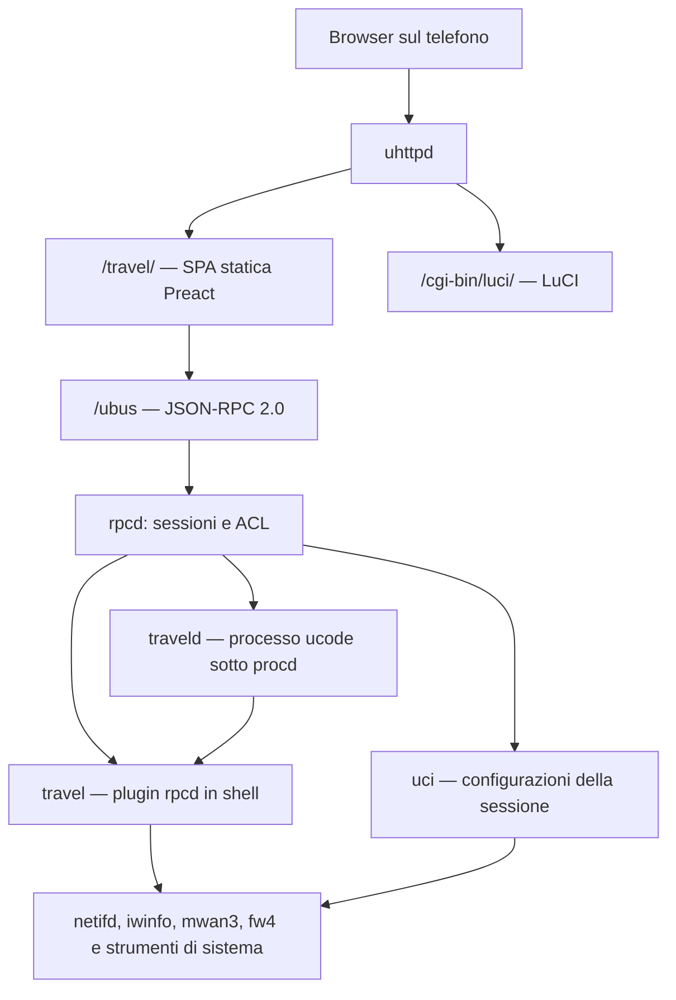

# Architettura

Il progetto realizza un'interfaccia di gestione mobile-first per un router da
viaggio GL.iNet Beryl 7 (GL-MT3600BE), con OpenWrt vanilla 25.12 come ambiente
di riferimento. Il browser carica dal router tutti gli asset necessari alla UI;
le funzioni di configurazione locale restano utilizzabili senza Internet.

Questo documento descrive l'implementazione presente nel repository. Firmware,
kernel, pacchetti installati e risorse disponibili sono dati del dispositivo,
letti a runtime: non sono costanti dell'architettura né verifiche ripetute
durante questa revisione.

## Componenti e comunicazione



La SPA viene compilata sul PC e installata in `/www/travel/`. Sul router non
girano Node.js, Vite o un server applicativo aggiuntivo. Le richieste dati e i
comandi della SPA passano da `/ubus`; non esistono endpoint REST o WebSocket
propri del progetto.

| Componente | Implementazione | Responsabilità |
|---|---|---|
| `travel` | `package/travel/files/usr/libexec/rpcd/travel` | Plugin shell di rpcd: letture filtrate, scansioni, operazioni VPN, multi-WAN, USB, profili e sistema. Usa jshn, jsonfilter, UCI, ubus locale e comandi di sistema. |
| `traveld` | `package/travel/files/usr/share/travel/traveld.uc` | Processo residente: riconnessione WiFi, campionamento del traffico, cache dei captive portal e riarmo del kill switch sospeso. |
| `uci` | Oggetto fornito da OpenWrt | Preparazione e applicazione delle modifiche della sessione del browser, con rollback dove richiesto. |

Il servizio `/etc/init.d/travel` avvia il daemon tramite procd, con respawn
`3600 5 5` e trigger di reload per `travel` e `wireless`. Prima dell'avvio prova
con `probe.uc` quale modalità di esecuzione supporta l'interprete ucode e
riapplica modalità USB, inoltro IPv4 e routing VPN. Il daemon richiede i moduli
ucode `uloop`, `ubus`, `uci` e `fs`.

Il daemon orchestra `travel.radios`, `travel.uplinks`, `travel.scan` e
`travel.portal_probe`. Scansioni e letture wireless usano gli strumenti
OpenWrt; le chiamate al plugin possono bloccare temporaneamente il ciclo del
daemon. Le connessioni configurate restano affidate a netifd anche se
`traveld` si arresta. In quel caso dashboard aggregata e automazioni non sono
disponibili, mentre il plugin continua a servire le operazioni indipendenti.

`setup.sh` conserva una volta `/www/index.html` in `/www/index.html.luci` e
installa una pagina con meta-refresh immediato verso `/travel/` e link alla SPA
e a LuCI. LuCI conserva il proprio percorso; è raggiungibile anche dal link
nelle Impostazioni, purché rete e uhttpd funzionino.

## Frontend e funzionalità implementate

<a id="fasi"></a>

Il frontend usa Preact 10, TypeScript e Vite 5. `src/app.tsx` gestisce login e
navigazione con stato locale, montando solo la schermata selezionata. La scheda
iniziale è WiFi. Le cinque schede nella barra inferiore sono:

| Scheda | Funzioni |
|---|---|
| WiFi | Radio e uplink, scansione, connessione e disconnessione, MAC e hostname DHCP, reti salvate, riconnessione automatica, impostazioni comuni e interruttori degli AP, stato dei portali. |
| LAN | Indirizzo IPv4, pool DHCP, DNS, conflitti con le WAN, ruoli delle porte ethernet, elenco dei dispositivi collegati. |
| Internet | Dashboard per WAN, traffico corrente e della sessione, stato del collegamento e dei portali, multi-WAN, regole di routing e health check. |
| VPN | Accesso e impostazioni Tailscale, nodi del tailnet, importazione e controllo WireGuard, diagnostica del routing, kill switch e sospensione temporanea. |
| Impostazioni | Stato e nome del router, periferiche e modalità USB, profili, backup e ripristino, orologio/NTP, riavvio e collegamento a LuCI. |

`src/lib/` contiene client RPC, tipi, trasformazioni, validazioni e sequenze
di scrittura UCI. `src/screens/` contiene schermate e pannelli;
`src/components/` raccoglie i controlli condivisi per hostname e stato di
apply. Lo stile è in `src/style.css`.

### Sessioni, permessi e segreti

`src/lib/ubus.ts` invia JSON-RPC 2.0 con `fetch('/ubus')`. Il login usa
`session.login` con la sessione nulla; il token viene conservato in
`sessionStorage` come `travel.session` e aggiunto alle richieste successive.
La password di login non viene salvata. All'apertura una chiamata
`travel.status` verifica la sessione; il logout cancella il token locale.
Scadenza e autorizzazioni sono gestite da rpcd.

Il client distingue errori di trasporto, codici ubus e rifiuti JSON-RPC per
sessione scaduta. Il timeout ordinario è 10 secondi; login, scansione, VPN e
altre operazioni lente possono impostarne uno specifico.

Gli ACL installati in `/usr/share/rpcd/acl.d/travel.json` elencano i metodi
consentiti. Per UCI autorizzano lettura di `wireless`, `network`, `firewall`,
`dhcp`, `system`, `travel`, e scrittura anche di `mwan3`. La UI legge lo stato
mwan3 tramite `travel.mwan`. Il progetto non pubblica un metodo di esecuzione
shell generico. Ogni metodo di `traveld` dichiara esplicitamente
`ubus_rpc_session` nella firma per le richieste inoltrate da uhttpd.

Le letture applicative `travel.ap`, `travel.networks` e `travel.wg_get`
restituiscono indicatori come `has_key` e `has_private_key`, omettendo i segreti.
Per una rete salvata, `travel.stage_connect_saved` legge la chiave sul router
e la copia nelle modifiche UCI della stessa sessione RPC. Le chiavi WiFi sono
persistite in `travel` e `wireless`; quelle WireGuard in `network`.
L'auth key Tailscale passa preferibilmente da un file temporaneo con
`umask 077`, cancellato dopo l'uso; esiste un ripiego sulla CLI per versioni
che non supportano `--auth-key=file:`.

L'omissione dei segreti riguarda le risposte applicative ordinarie: gli ACL
consentono anche letture UCI dei file che li contengono e il backup scaricato
dal browser può includerli. L'interfaccia è uno strumento di amministrazione,
non un confine di isolamento dei segreti rispetto a un utente autorizzato
a leggere UCI o esportare backup.

### Aggiornamento dello stato

`src/lib/poll.ts` programma la richiesta successiva dopo la conclusione della
precedente e sospende le richieste periodiche quando `document.hidden` è vero.
Al ritorno in primo piano richiede un aggiornamento. Ogni hook ha il proprio
timer; non esiste un unico poll globale.

| Lettura del browser | Intervallo configurato |
|---|---|
| `traveld.dashboard`, nella scheda Internet | 2 s |
| `travel.mwan`, nella scheda Internet | 10 s |
| `travel.vpn` | 4 s |
| `travel.wg_get` | 6 s |
| `travel.status` e dispositivi USB nelle Impostazioni | 5 s |
| WiFi, reti salvate, LAN e client | All'apertura, su aggiornamento o dopo un'azione |

Gli intervalli si aggiungono al tempo della richiesta. La dashboard combina
contatori in RAM con una cache degli uplink aggiornata su richiesta quando
ha almeno 5 secondi. I dati di sistema vengono letti da `/proc` e sysfs.
Una risposta dashboard può quindi richiedere letture e processi aggiuntivi.

Il daemon campiona `/proc/net/dev` ogni 2 secondi, calcola byte al secondo e
totali dalla prima osservazione del device nel processo corrente e gestisce
il reset dei contatori. Questi totali non sono uno storico persistente.
Health check e stato delle politiche sono forniti da mwan3, separatamente
dallo stato di associazione/IP e dal probe HTTP.

## Applicazione delle configurazioni

Il browser prepara molte modifiche con `uci.add`, `uci.set` e `uci.delete`,
poi le applica con `uci.apply`. LAN, porte e WiFi sono sequenze di chiamate
UCI nella sessione; non hanno un metodo applicativo unico che esegua una
transazione personalizzata e restituisca un diff.

`src/lib/apply.ts` implementa `useApply` per le modifiche che possono
interrompere l'accesso:

1. Esegue la preparazione e chiama
   `uci.apply({ rollback: true, timeout: seconds })`.
2. Ogni 2 secondi prova `travel.status` e l'eventuale verifica aggiuntiva.
3. Quando i controlli passano, chiama automaticamente `uci.confirm`.
4. Senza conferma, il rollback resta affidato a rpcd; l'annullamento prova
   `uci.rollback`.

| Operazione | Finestra | Verifica aggiuntiva |
|---|---|---|
| Connessione WiFi, reti salvate e comandi wireless pertinenti | 90 s ordinari | Stato radio/AP tramite `wirelessCameUp` |
| Modifica di SSID, cifratura e password degli AP | 240 s | `wirelessCameUp` |
| Clonazione MAC dal pannello portale | 150 s | `wirelessCameUp` |
| LAN | 300 s | Nuovo indirizzo fra quelli attivi |
| Ruolo di una porta ethernet | 90 s | Rilettura del ruolo richiesto |

`wirelessCameUp` rifiuta `retry_setup_failed` e richiede radio attive con un
device quando devono offrire un AP. Non verifica Internet sulla STA:
la schermata di connessione legge successivamente associazione, indirizzo
e portale per mostrare l'esito.

Il cambio di sottorete LAN aggiunge il nuovo indirizzo mantenendo il precedente
come secondario, permettendo di confermare nella sessione del vecchio IP.
La UI offre poi la rimozione esplicita dell'indirizzo precedente con
`dropOldAddress`, applicata senza rollback. La conferma prova che netifd ha
attivato il nuovo IP, non che il telefono abbia già rinnovato il lease.

Reti salvate, parametri delle automazioni, multi-WAN, profili e varie funzioni
di sistema usano apply ordinari o commit diretti del plugin. Tailscale e
WireGuard hanno propri controlli e comandi di applicazione.
Il progetto non aggiunge un salvataggio automatico dell'ultima configurazione
confermata né un ripristino al boot per perdita di corrente durante apply.

## WiFi e piano radio

Il dispositivo di riferimento ha due bande, 2,4 e 5 GHz, esposte come due radio
sulla stessa phy. AP e STA sulla stessa radio condividono il canale; una
riconfigurazione della STA può interrompere anche quell'AP. Il codice ricava
i nomi dei device dallo stato OpenWrt e da sysfs, senza presupporre `wlanN`.

| Radio di riferimento | AP | STA | Interfaccia DHCP dell'uplink |
|---|---|---|---|
| `radio0`, 2,4 GHz | `ap_radio0` | `sta_radio0` | `wwan_radio0` |
| `radio1`, 5 GHz | `ap_radio1` | `sta_radio1` | `wwan_radio1` |

`tools/setup-ap.ps1` e `tools/setup-ap.sh` inizializzano gli AP sulle radio,
con SSID e password comuni e country code configurabile, predefinito `IT`.
Provano `sae-mixed`, con ripiego a `psk2` se non compare alcun AP.
È un'inizializzazione separata dal deploy: disabilita anche le wifi-iface
non `ap_*` già presenti e ricarica il wireless.

La UI modifica le credenziali comuni e accende/spegne esplicitamente gli AP.
Le cifrature offerte sono `sae-mixed`, `sae` e `psk2`.
Una connessione client sceglie la radio dalla banda della rete e ricrea solo
`sta_<radio>`, più l'hostname DHCP dell'interfaccia corrispondente.
Non sposta gli AP né ne cambia l'abilitazione. Avere un AP anche sull'altra
radio offre un ulteriore accesso, la cui disponibilità dipende comunque
dalla configurazione e dagli uplink attivi su quella radio.

### Scansione e connessione manuale

`travel.scan` è sincrono. Valida la radio, trova un device utilizzabile e
invoca `ubus call iwinfo scan`; se manca un device ne crea uno managed
temporaneo con `iw`, rimuovendolo al termine e tramite trap. Il frontend
concede 30 secondi, filtra la banda, normalizza la sicurezza e raggruppa
i risultati. Gli SSID vuoti sono mostrati come reti nascoste ma non selezionabili.

La connessione supporta reti aperte, WPA2, WPA3 e modalità di transizione.
Il MAC può essere quello del device, casuale, manuale o clonato da un client
LAN. Il MAC casuale è generato nel browser; salvandolo nella rete viene
riutilizzato nelle riconnessioni. La clonazione riguarda la STA WiFi.

L'hostname DHCP ha tre modalità: nessun nome (`hostname='*'`), nome del router
(opzione rimossa), nome personalizzato. È configurabile per WAN e ricordato
per rete WiFi salvata.

### Reti salvate e riconnessione automatica

Le reti sono sezioni `network` in `/etc/config/travel`. L'identità usata dalla
UI comprende SSID e banda; una voce senza banda vale per entrambe.
Sono implementati modifica, eliminazione, abilitazione, note, riordino delle
priorità e connessione con credenziali salvate. `mark_used` registra
`last_used` e `last_result` per le azioni che lo invocano dalla UI.

Il motore automatico è disabilitato per default (`autoreconnect=0`) e valuta
la situazione ogni 10 secondi. Ordina le reti abilitate per priorità
decrescente, le confronta con gli SSID visibili sulla radio e applica una
soglia RSSI di default -78 dBm. Penalità e blacklist sono per sezione salvata
e restano in RAM.

- Backoff da 30 a 900 secondi; dopo 3 fallimenti, per default, la blacklist
  dura 600 secondi.
- Dopo un tentativo proprio attende 25 secondi di assestamento più 30 secondi
  di cooldown prima di rivalutare la radio.
- Con `roam_mode=stay` mantiene un uplink con indirizzo. Con `best` cerca una
  rete di priorità superiore rispettando `scan_interval` (60 s predefiniti)
  e richiedendo RSSI almeno pari a `rssi_min + roam_hysteresis` (8 dB).
- Il successo è lo stato `addressed`; il probe captive portal non determina
  la selezione della rete.
- `traveld.reset` azzera penalità e blacklist. Gli eventi recenti sono
  limitati a 60 elementi in RAM e inviati anche al log di sistema.

Il daemon committa `wireless.sta_<radio>`, applica l'hostname in
`network.wwan_<radio>` se cambia, quindi esegue `wifi up <radio>`.
Il cambio di hostname comporta anche un reload di netifd. Queste azioni
automatiche non usano apply con conferma.

## WAN, multi-WAN e tethering USB

Gli uplink vengono individuati dalla zona firewall `wan`, escludendo
interfacce IPv6, interfacce disabilitate e device usati come porte LAN.
Il backend ricostruisce IP, gateway, DNS, metrica e stato runtime attraverso
netifd, iwinfo e sysfs, distinguendo assenza di associazione WiFi, assenza di
carrier ethernet e mancanza di indirizzo.

Il setup inizializza una volta `eth0` come WAN e `eth1` nel bridge `br-lan`,
crea una DHCP `wwan_<radio>` per radio e `wan_usb`, inizialmente disabilitata.
Le nuove WAN gestite nascono con `ipv6=0` e senza hostname DHCP.
Il percorso multi-WAN del progetto è IPv4; non esiste una gestione completa
IPv6 o un suo interruttore per WAN nella UI.

### Configurazione mwan3

`mwan3-setup.sh` installa, se necessario, `mwan3` e `ip-full`, disattiva flow
offload software/hardware se abilitato e prepara `/etc/config/mwan3`.

| Sezione | Ruolo |
|---|---|
| `network.<wan>.metric` | Metrica della rotta dell'interfaccia |
| `mwan3.<wan>` | Abilitazione al multi-WAN e parametri di tracking |
| `mwan3.<wan>_f` | Membro failover: metrica di priorità, peso 1 |
| `mwan3.<wan>_b` | Membro bilanciamento: metrica 1, peso configurabile |
| `travel_failover`, `travel_balance` | Politiche generali con i rispettivi membri |
| `o_<wan>`, `p_<wan>` | Politiche dedicate: WAN obbligatoria oppure preferita |
| `travel_default` | Regola generale che seleziona politica e sticky |

Le metriche iniziali, se mancanti, privilegiano `wan` (10), altre porte WAN
(15), WiFi 5 GHz (20), WiFi 2,4 GHz (30), USB (40). Il setup evita collisioni
con le metriche già incontrate nell'assegnazione. Il riordino dalla UI
riallinea metriche di rete e membri failover a intervalli di dieci.

Gli health check predefiniti usano ping IPv4, due destinazioni per WAN
selezionate a rotazione da otto resolver, reliability 1, count 1, timeout 2 s,
intervallo 5 s e soglie up/down pari a 3. La UI permette di modificarli.
L'esclusione da mwan3 non spegne l'interfaccia.

Le regole personalizzate combinano sorgente/destinazione IPv4 o CIDR,
protocollo, porta/intervallo di destinazione, WAN e sticky. `o_<wan>` usa
`last_resort=unreachable`, `p_<wan>` usa `default`. La regola generale viene
ricreata in coda quando si salva una regola specifica. Le modifiche passano
da UCI e poi da `travel.mwan_apply`, che ricarica rete e mwan3 e controlla
le incompatibilità VPN.

Il setup crea sezioni mancanti e riallinea i membri delle politiche generali,
conservando pesi e impostazioni esistenti dove previsto. La commutazione
di una porta dalla UI aggiorna solo l'eventuale sezione mwan3 già presente:
creare le sezioni per una nuova WAN resta compito del setup.

### USB

L'hotplug `/etc/hotplug.d/net/30-travel-usb` identifica il tethering dal driver
sysfs: riconosce `cdc_ncm`, `cdc_mbim`, `cdc_ether`, `cdc_eem`, `rndis_host` e
`ipheth`. Assegna il device a `wan_usb`, abilita l'interfaccia, committa UCI,
ricarica netifd e avvia DHCP. Alla rimozione la disabilita conservando il nome
del device. Se un altro tethering è già presente, non lo sostituisce.

L'installazione automatica copre `kmod-usb-net`, `kmod-usb-net-cdc-ncm`,
`kmod-usb-net-rndis` e `kmod-usb-net-cdc-ether`, verificando il caricamento
dei moduli. L'hotplug riconosce quindi più driver di quelli installati dal setup.

`travel.usb_devices` elenca periferiche, velocità, funzioni USB, driver,
moduli e device di rete. `travel.usb_reset` riassocia il controller USB tramite
sysfs. `usb-mode.sh` può disabilitare le porte SuperSpeed del root hub per
forzare USB 2.0; il default è velocità piena (`travel.usb.force_usb2=0`).
La preferenza si riapplica all'avvio del servizio e all'hotplug USB.
Il supporto dipende dall'attributo `disable` del kernel.

## LAN, porte ethernet e client

La UI configura la LAN come IPv4 `/24`, valida indirizzo e pool DHCP e
confronta le sottoreti degli uplink con quella locale. In caso di sovrapposizione
può proporre un altro indirizzo. I DNS annunciati ai client sono scritti
nell'opzione DHCP 6, conservando le altre opzioni; i DNS del router nella lista
`server` della sezione dnsmasq. Liste vuote vengono rimosse tramite UCI.

Le porte fisiche sono enumerate dal backend; il ruolo è dedotto dalla
configurazione reale. `stageEthPort` aggiunge o rimuove la porta da `br-lan`,
crea o riattiva la WAN DHCP e la aggiunge alla zona firewall quando necessario.
Nel ritorno a LAN disabilita la WAN senza cancellarla. Il pool DHCP resta
quello del bridge. Il backend restituisce i nomi effettivi delle sezioni
anonime per le scritture ubus.

`travel.clients` combina lease DHCP, vicini IPv4, associazioni degli AP e
FDB del bridge. Usa `bridge fdb` oppure `brctl showmacs`; se queste informazioni
mancano lascia il punto d'ingresso sconosciuto. Mostra anche client associati
senza IP e usa i nomi delle prenotazioni DHCP dove disponibili.
L'elenco alimenta LAN e il selettore del MAC da clonare; non misura il traffico
per dispositivo.

## Captive portal

`travel.portal_probe` esegue il probe HTTP; il daemon ne decide la cadenza
e conserva gli esiti per WAN. Il controllo automatico nasce abilitato,
indipendentemente dalla riconnessione WiFi.

Ogni 15 secondi il daemon sceglie al massimo una WAN da verificare,
privilegiando quelle senza esito o con esito più vecchio. Ripete dopo almeno
300 secondi per `online` e 60 secondi negli altri casi. I cambi di disponibilità
sono rilevati nelle letture degli uplink, con cache fino a 60 secondi per
questo ciclo; non c'è una sottoscrizione rtnetlink.
`traveld.portal_check` verifica su richiesta e aggiorna la stessa cache.

Il probe usa di default `http://detectportal.firefox.com/success.txt` e il
marker `success`, sostituibili tramite `travel.globals.portal_url` e
`portal_marker`. Risolve l'endpoint con il resolver del router, poi installa
una rotta host temporanea nella tabella 97 e una regola a priorità 90 verso
quell'IP attraverso la WAN scelta, senza modificare le politiche mwan3.
Un lock in `/tmp` serializza i probe; trap e cleanup rimuovono le regole
e recuperano i lock abbandonati.

La richiesta usa `nc`, con timeout 5 secondi e lettura limitata della risposta;
il ripiego è `uclient-fetch`. Il primo permette di leggere codice HTTP e
`Location`, il secondo può seguire redirect.

| Esito | Significato nell'implementazione |
|---|---|
| `online` | Il marker atteso compare nella risposta |
| `portal` | È arrivato contenuto senza il marker |
| `blocked` | I client HTTP disponibili non hanno ottenuto una risposta |
| `unknown` | Misura non eseguibile, con motivo: DNS, indirizzo assente, strumenti mancanti, probe occupato o altro errore |

La UI apre il portale nel browser e permette di riprovare la verifica o
clonare un MAC autorizzato sulla STA. Non esegue il login automatico.
Il link aperto dal telefono segue il routing corrente dei client: la rotta
temporanea del probe non vincola quella navigazione.

Le sezioni `portal` memorizzano rete, URL, ultimo avvistamento e ultimo
accesso dedotto dal ritorno a `online`. La chiave è l'SSID per WiFi, il nome
dell'interfaccia negli altri casi. L'avvistamento viene riscritto al massimo
ogni 300 secondi; l'accesso è registrato se il portale era stato visto
nell'ultima ora e non era già stato seguito da un accesso registrato.

## VPN e routing

Tailscale è comandato tramite CLI e stato JSON; WireGuard tramite netifd
e `wg`. `travel.vpn` e `travel.wg_get` distinguono configurazione, stato
dei tunnel e componenti del routing presenti. La UI usa questi dati per
spiegare un tunnel che esiste ma non trasporta il traffico atteso.

### Compatibilità delle modalità

I metodi applicativi sul router controllano un vincolo: al massimo uno fra
bilanciamento mwan3, uso di un exit node Tailscale remoto e WireGuard abilitato.
La risposta `policy` comunica alla UI blocchi e ragioni. Un profilo che
richiede bilanciamento con una VPN incompatibile viene applicato in failover
con una nota; gli altri comandi rifiutano o correggono la richiesta secondo
il rispettivo metodo.

Il collegamento ordinario al tailnet e l'annuncio del router come subnet router
o exit node possono convivere con WireGuard. Il router può offrire ai propri
nodi Tailscale un'uscita attraverso WireGuard. Offrire un exit node è distinto
dal selezionarne uno remoto.

### Tailscale

L'accesso avviene tramite link di autorizzazione o auth key. Il servizio viene
avviato e abilitato al boot al primo accesso. Sono disponibili connessione,
disconnessione, logout, scelta dell'exit node, `accept_routes`, `accept_dns`,
annuncio della LAN e annuncio come exit node. Autorizzazioni e approvazioni
del tailnet restano gestite da Tailscale.

Le preferenze applicative stanno in `travel.tailscale`; lo stato autenticato
è gestito dal servizio Tailscale. Il plugin avvia il login via link in
background, conserva esito/output temporanei e normalizza nodi, nomi e presenza.

### WireGuard

È gestito un tunnel `network.travel_wg` e un peer `network.travel_wg_peer`,
di tipo `wireguard_travel_wg`. L'import legge i campi riconosciuti di
`[Interface]` e `[Peer]`: chiavi, indirizzi, DNS, MTU, endpoint, AllowedIPs
e keepalive. Verifica la presenza dei campi essenziali e non esegue direttive
shell del file.

L'import riscrive le due sezioni e lascia il tunnel disabilitato. Il keepalive
predefinito è 25 secondi e AllowedIPs, se assente, è `0.0.0.0/0`.
Il tunnel usa `fwmark=0x1000000` e `route_allowed_ips=0`; il routing applicativo
installa una default IPv4 in una tabella dedicata. L'accensione attende fino
a 15 secondi la comparsa del device prima di riapplicare il routing.

### Tabelle, regole e firewall

`vpn-setup.sh runtime` riapplica inoltro IPv4, rotte e regole. Lo invocano
l'init di travel, i comandi VPN pertinenti e l'hotplug
`/etc/hotplug.d/net/40-travel-vpn` quando compare `tailscale0` o `travel_wg`.

| Priorità | Regola |
|---|---|
| 899, con device WireGuard presente | Consulta `main` con `suppress_prefixlength 0`, conservando le rotte specifiche locali |
| 900 | Consulta tabella Tailscale 52, esclusi i pacchetti marcati `0x80000/0xff0000` |
| 901, con device WireGuard presente | Consulta tabella 53, esclusi i pacchetti marcati `0x1000000/0x1000000` |

La tabella 53 contiene `default dev travel_wg`. Il traffico UDP esterno di
WireGuard porta il mark e prosegue verso il routing WAN: il progetto non
mantiene una rotta host all'endpoint ad ogni failover. Il setup installa
anche `100.64.0.0/10 dev tailscale0` nella tabella 52 quando il device esiste.
Prima di mantenere il routing WireGuard prova una destinazione LAN con
`ip route get` e rimuove le proprie regole se la risposta punta al tunnel.

L'inoltro IPv4 viene impostato a runtime e persistito in
`/etc/sysctl.d/30-travel-forwarding.conf`. Il firewall usa:

| Sezione | Effetto |
|---|---|
| `travel_vpn` | Zona vpn: `tailscale0` e rete `travel_wg` dopo l'import; input/forward REJECT, output ACCEPT, masquerade e MSS clamping |
| `travel_vpn_fwd` | Inoltro LAN → VPN |
| `travel_vpn_out` | Inoltro VPN → WAN, legato all'annuncio exit node |
| `travel_vpn_lan` | Inoltro VPN → LAN, legato all'annuncio della LAN |
| `travel_vpn_wg` | Regola IPv4 VPN → VPN per sorgenti `100.64.0.0/10`, legata all'annuncio exit node |
| `travel_killswitch` | REJECT LAN → WAN quando abilitata |

Il kill switch nasce spento. `travel.vpn.killswitch` conserva la scelta
dell'utente, `firewall.travel_killswitch.enabled` lo stato configurato della
regola e `resume_at` la scadenza di una sospensione. Ogni 20 secondi il daemon
controlla se deve riarmare la regola, committare e ricaricare fw4.

La sospensione per accedere a un portale disabilita temporaneamente l'intera
regola LAN → WAN. Non esiste bypass per singolo client o dominio. La regola
non blocca l'output originato dal router o l'inoltro VPN → WAN e non
costituisce una gestione autonoma delle perdite DNS.

## Configurazione persistente e stato volatile

`network`, `wireless`, `dhcp`, `firewall`, `mwan3` e `system` sono le
configurazioni canoniche dei servizi. `/etc/config/travel` contiene:

| Tipo/sezione | Campi utilizzati |
|---|---|
| `globals 'globals'` | `autoreconnect`, `rssi_min`, `roam_mode`, `roam_hysteresis`, `blacklist_after`, `blacklist_ttl`, `scan_interval`, `portal_check`, override `portal_url`/`portal_marker` e marcatori di inizializzazione/migrazione |
| `network` | `ssid`, `key`, `encryption`, `band`, `mac_mode`, `mac_value`, `hostname_mode`, `hostname_value`, `note`, `priority`, `disabled`, `last_used`, `last_result` |
| `portal` | `key`, `label`, `network`, `url`, `last_seen`, `last_login` |
| `usb 'usb'` | `force_usb2` |
| `tailscale 'tailscale'` | `exit_node`, `accept_routes`, `accept_dns`, `advertise_lan`, `advertise_exit` |
| `vpn 'vpn'` | `killswitch`, `resume_at` |
| `profile` | `name`, `saved`, `autoreconnect`, `rssi_min`, `roam_mode`, `scan_interval`, `portal_check`, `killswitch`, `mode`, `sticky`, `timeout`, lista `wans` |

Non ci sono sezioni WAN o tunnel WireGuard in `travel`: i loro parametri
operativi risiedono in `network` e `mwan3`. Penalità, eventi, contatori di
traffico e cache dei probe vivono in RAM. UCI viene scritto per configurazioni,
tentativi automatici, hotplug e memoria delle reti/portali; non esiste un
intervallo globale che raggruppi tutte le scritture in flash.

### Profili

Un profilo memorizza automazioni WiFi/portali, kill switch, modalità/sticky
multi-WAN e lista `<rete>|<abilitata>|<metrica>|<peso>`. Non include LAN, AP,
ruoli ethernet, reti salvate o chiavi VPN. Il profilo corrente è riconosciuto
dal backend confrontando i valori salvati con quelli effettivi.

L'applicazione committa i file coinvolti, riallinea metriche, ricarica
rete/firewall e riavvia mwan3. Azzera una sospensione del kill switch e
applica il valore del profilo. Non usa rollback e non ripristina ogni
parametro: health check, regole personalizzate e parametri di blacklist,
per esempio, non fanno parte dello snapshot.

### Backup, orologio e riavvio

Il backup è l'archivio OpenWrt di `sysupgrade -b`, restituito in base64 tramite
ubus e scaricato come `.tar.gz`. L'esportazione rifiuta archivi oltre 512 KiB.
Il ripristino invia blocchi di 24 KiB di testo base64, con flag `first` e
`last`; il router li decodifica in `/tmp/travel-restore.tar.gz`.
Prima di `sysupgrade -r` controlla che il tar sia leggibile e contenga voci
`etc/config/`, quindi risponde e programma un reboot dopo 2 secondi.
È un backup di configurazione secondo le regole di sysupgrade, non
un'immagine del firmware o una copia completa dei file installati dal deploy.

La gestione dell'orologio legge ora, fuso, presenza RTC e processo NTP.
`plausible` verifica soltanto che l'epoch superi il 1° gennaio 2025: non prova
una sincronizzazione NTP riuscita. Le impostazioni scrivono nome del fuso e
stringa POSIX in `system`, validano da uno a otto server e riavviano `sysntpd`.

Il riavvio pianificato è una riga in `/etc/crontabs/root` con tag
`travel-reboot`, ogni giorno o un giorno della settimana, nell'ora locale.
Le altre righe vengono conservate e cron è abilitato quando si attiva la
pianificazione. Anche il riavvio immediato risponde prima di eseguire
`reboot` dopo 2 secondi. Queste funzioni non dipendono dal timer di `traveld`.

## Superficie RPC implementata

Le firme sono definite nel ramo `list` del plugin e in `conn.publish` del
daemon. I metodi applicativi sono distinti dai metodi UCI usati direttamente
dal frontend.

| Oggetto | Area | Metodi |
|---|---|---|
| `travel` | Stato e dispositivo | `status`, `system`, `usb`, `usb_devices`, `usb_mode`, `usb_reset` |
| `travel` | WiFi | `radios`, `uplinks`, `ap`, `scan`, `networks`, `stage_connect_saved`, `mark_used` |
| `travel` | LAN e multi-WAN | `lan`, `ethports`, `clients`, `mwan`, `mwan_apply` |
| `travel` | Portali | `portal_probe`, `portal_networks`, `portal_forget` |
| `travel` | VPN | `vpn`, `ts_login`, `ts_apply`, `ts_down`, `ts_logout`, `wg_get`, `wg_toggle`, `wg_import` |
| `travel` | Profili | `profile_list`, `profile_save`, `profile_apply`, `profile_delete` |
| `travel` | Sistema | `backup_export`, `backup_import`, `time_get`, `time_set`, `reboot_get`, `reboot_set`, `reboot_now` |
| `traveld` | Stato e automazioni | `status`, `dashboard`, `reset`, `portal`, `portal_check` |

Le risposte possono contenere errori applicativi nel campo `error`, oltre
ai codici ubus. Non tutti i metodi restituiscono un diff, sono idempotenti
o condividono lo stesso meccanismo di rollback.

## Build, installazione e dipendenze

```text
frontend/                  sorgenti e build della SPA
package/travel/files/      albero copiato nel filesystem del router
  etc/init.d/              servizio procd
  etc/hotplug.d/           gestione USB e comparsa dei tunnel
  usr/libexec/rpcd/        plugin travel
  usr/share/rpcd/acl.d/    ACL
  usr/share/travel/        daemon, setup, helper e versione
tools/                     deploy, inizializzazione AP, misura della scansione
docs/                      documentazione
```

In sviluppo, `npm run dev` attiva `src/lib/mock.ts` quando manca
`VITE_ROUTER`. Con la variabile impostata, Vite inoltra `/ubus` al router
indicato, accettando il certificato self-signed nel proxy di sviluppo.
La build di produzione usa sempre il router reale. Il simulatore comprende
blackout da apply, DHCP, portali, VPN e vincoli fra modalità; è un ambiente
interattivo, non una prova del kernel o dei servizi reali.

`npm run typecheck` esegue `tsc --noEmit`; `npm run build` produce `dist/`
con base `/travel/` e target ES2020. Il deploy PowerShell esegue la build
salvo `-SkipBuild`, prepara un tar ustar, lo trasferisce nello stdin SSH,
sostituisce `/www/travel/`, copia il backend e lancia `setup.sh`.
Accetta `-Router`, `-User` e `-WithTtyd`. Non costruisce un pacchetto APK
`travel`: `package/travel` è un albero di file da copiare.

`setup.sh` inizializza configurazioni mancanti, esegue migrazioni mirate,
installa le dipendenze previste, riavvia travel e rpcd e prova `travel.status`
e `traveld.status`. `online.sh` verifica la connettività e limita le attese
delle installazioni `apk`. Alcuni errori di installazione producono avvisi
e consentono di proseguire: un deploy terminato non prova da solo che tutte
le funzioni opzionali siano operative.

| Gruppo | Dipendenze |
|---|---|
| Base attesa | uhttpd con accesso ubus, rpcd/UCI, netifd, fw4, iw/iwinfo, jshn, jsonfilter, ucode con `uloop`, `ubus`, `uci`, `fs` |
| Multi-WAN | `mwan3`, `ip-full`, richiesti dal setup se mwan3 manca |
| Tethering installato | `kmod-usb-net`, `kmod-usb-net-cdc-ncm`, `kmod-usb-net-rndis`, `kmod-usb-net-cdc-ether` |
| VPN | `tailscale`, `wireguard-tools`, `luci-proto-wireguard`, con le rispettive dipendenze |
| Portali e sistema | `nc` o `uclient-fetch`, `nslookup`, `base64`, `tar`, `sysupgrade`, `sysntpd`, `cron` |
| Terminale web opzionale | `luci-app-ttyd`, richiesto da `-WithTtyd` |

Gli AP usano il wpad del firmware; il setup non installa automaticamente una
variante full. La descrizione dei client ethernet è più completa con
`bridge` o `brctl`. LuCI e l'accesso LAN cablato restano strumenti di
recupero nei limiti della configurazione effettiva; la procedura separata
è in [recovery.md](recovery.md).

## Sviluppi mancanti

Le voci seguenti distinguono funzionalità assenti, debiti riscontrabili
nel codice e possibili estensioni. Non descrivono capacità già disponibili
né una roadmap approvata.

### Funzionalità previste ma non realizzate

- **SSID nascosti e WiFi avanzato:** manca l'inserimento manuale dell'SSID;
  le reti nascoste in scansione non sono selezionabili. Non ci sono gestione
  BSSID lock o rete ospiti isolata. L'autenticazione Enterprise non ha un
  percorso di configurazione nella UI.
- **Recupero persistente da apply interrotto:** mancano snapshot dell'ultima
  configurazione confermata e ripristino al boot. Il rollback implementato
  è quello di rpcd durante la sessione di apply.
- **IPv6 gestito dall'app:** mancano configurazione per WAN, routing multi-WAN,
  probe e integrazione VPN coerenti per IPv6. Le impostazioni attuali non
  equivalgono a una disabilitazione globale di IPv6 nel firmware.
- **Gestione avanzata dei client:** l'elenco è in lettura; non offre blocco
  dei dispositivi, creazione di prenotazioni DHCP o traffico per client.

### Debiti tecnici e verifiche da completare

- **Documentazione operativa:** `README.md` conserva riferimenti alle fasi;
  `recovery.md` descrive ancora spostamento automatico degli AP, timeout
  uniforme di 90 secondi, un archivio `lastgood` non creato dal codice e
  disinstallazione come pacchetto. La procedura va riallineata prima di
  usarla come riferimento operativo.
- **Coordinamento delle scritture:** UI, plugin, daemon e hotplug scrivono
  gli stessi file UCI con meccanismi diversi. Manca una serializzazione
  applicativa comune fra apply con rollback e commit automatici; occorre
  verificare concorrenza e rollback durante riconnessioni, hotplug e azioni
  da più sessioni. Errori nello staging non comportano una pulizia esplicita
  di tutte le modifiche già preparate.
- **Permessi e validazione:** letture UCI accedono ai file con segreti e
  scritture dirette possono aggirare i controlli applicativi. La validazione
  va completata sul router dove oggi è solo nella UI o parziale, per esempio
  sui campi WireGuard. I vincoli VPN/multi-WAN non sono un controllo continuo
  delle modifiche effettuate da LuCI o shell.
- **Ripristino backup:** l'upload usa un file temporaneo condiviso, senza
  identificatore per sessione, limite cumulativo applicato all'import o
  controllo completo dei percorsi e della compatibilità dell'archivio.
  Questi controlli servono per upload concorrenti e ripristini più generali.
- **Responsività e polling:** scansioni e probe sincroni possono ritardare
  campionamenti e riarmo del kill switch; possono essere separati dal ciclo
  uloop. L'hook di polling non ha un blocco esplicito per richieste già in
  corso quando arriva `visibilitychange` o un refresh.
- **Riconnessione:** il successo si ferma all'indirizzo IP e non valuta
  Internet. Vanno verificati il conteggio dei fallimenti quando resta la
  stessa `lastAction`, l'interazione con scelte manuali e l'aggiornamento
  dell'ultimo esito delle reti nelle azioni automatiche.
- **Nuove WAN e prerequisiti:** la UI non crea tutte le sezioni mwan3 per
  una porta appena commutata. L'installazione di `ip-full` è legata
  all'assenza di mwan3 e non verifica autonomamente le capacità richieste
  dalle regole VPN. Rilevamento e riparazione delle dipendenze sono migliorabili.
- **Portali:** DNS usa il resolver globale e la classificazione si basa su
  un solo endpoint/marker; un contenuto inatteso può risultare un portale.
  Il login del browser non è vincolato alla WAN misurata. Sono possibili
  verifiche con più endpoint e un percorso esplicito per la WAN scelta.
- **VPN:** l'import gestisce un solo peer e il routing installa una default
  IPv4 anche con AllowedIPs più restrittivi. Split tunnel, più tunnel e DNS
  coerente richiedono altro lavoro. Vanno verificati failover con traffico
  reale, riavvio dei servizi, rotte Tailscale e ambito effettivo del kill
  switch, incluse connessioni già stabilite.
- **Verifiche ripetibili:** non sono presenti una suite automatica o una
  pipeline CI; il simulatore non sostituisce test su OpenWrt. Servono prove
  riproducibili di rollback, rinnovo DHCP dopo cambio LAN, USB, routing VPN
  e ripristino backup. Gli script di misura della scansione non costituiscono
  una regressione automatica.

### Possibili miglioramenti futuri

- Controllo della configurazione e delle dipendenze dopo il deploy, con esito
  per funzione, e disinstallazione completa dei file copiati e delle
  configurazioni generate.
- Versione della UI/plugin e del daemon unificata, oggi mantenuta separatamente,
  e pulizia dei commenti che riportano fasi o comportamenti superati.
- Country code e altre impostazioni radio dalla UI, mantenendo i controlli
  dell'accesso locale durante le riconfigurazioni.
- Eventuali storico del traffico, vista conntrack/top talker, registro eventi
  dedicato e test di velocità sarebbero estensioni del prodotto. Non fanno
  parte delle schermate o API finali implementate e non sono attività
  necessarie per completare le funzioni attuali.
