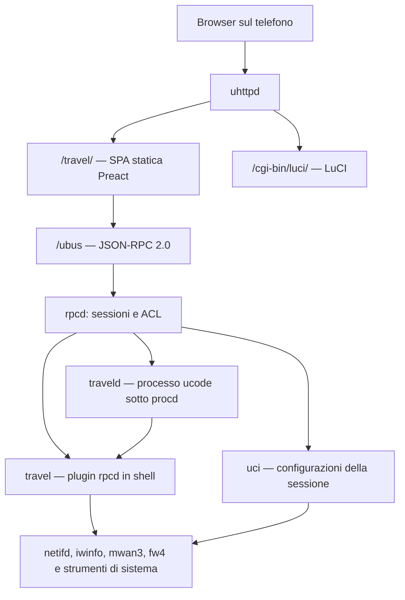

# Architettura

Il progetto realizza un'interfaccia di gestione mobile-first per un router da
viaggio GL.iNet Beryl 7 (GL-MT3600BE), con OpenWrt vanilla 25.12 come ambiente
di riferimento. Il browser carica dal router tutti gli asset necessari alla UI;
le funzioni di configurazione locale restano utilizzabili senza Internet.

Questo documento descrive l'implementazione presente nel repository. Firmware,
kernel, pacchetti installati e risorse disponibili sono dati del dispositivo,
letti a runtime: non sono costanti dell'architettura né verifiche ripetute
durante questa revisione.

## Componenti e comunicazione



La SPA viene compilata sul PC e installata in `/www/travel/`. Sul router non
girano Node.js, Vite o un server applicativo aggiuntivo. Le richieste dati e i
comandi della SPA passano da `/ubus`; non esistono endpoint REST o WebSocket
propri del progetto.

| Componente | Implementazione | Responsabilità |
|---|---|---|
| `travel` | `package/travel/files/usr/libexec/rpcd/travel` | Plugin shell di rpcd: letture filtrate, scansioni, operazioni VPN, multi-WAN, USB, profili e sistema. Usa jshn, jsonfilter, UCI, ubus locale e comandi di sistema. |
| `traveld` | `package/travel/files/usr/share/travel/traveld.uc` | Processo residente: riconnessione WiFi, campionamento del traffico, cache dei captive portal e riarmo del kill switch sospeso. |
| `uci` | Oggetto fornito da OpenWrt | Preparazione e applicazione delle modifiche della sessione del browser, con rollback dove richiesto. |

Il servizio `/etc/init.d/travel` avvia il daemon tramite procd, con respawn
`3600 5 5` e trigger di reload per `travel` e `wireless`. Prima dell'avvio prova
con `probe.uc` quale modalità di esecuzione supporta l'interprete ucode e
riapplica modalità USB, inoltro IPv4 e routing VPN. Il daemon richiede i moduli
ucode `uloop`, `ubus`, `uci` e `fs`.

Il daemon orchestra `travel.radios`, `travel.uplinks`, `travel.scan` e
`travel.portal_probe`. Scansioni e letture wireless usano gli strumenti
OpenWrt; le chiamate al plugin possono bloccare temporaneamente il ciclo del
daemon. Le connessioni configurate restano affidate a netifd anche se
`traveld` si arresta. In quel caso dashboard aggregata e automazioni non sono
disponibili, mentre il plugin continua a servire le operazioni indipendenti.

`setup.sh` conserva una volta `/www/index.html` in `/www/index.html.luci` e
installa una pagina con meta-refresh immediato verso `/travel/` e link alla SPA
e a LuCI. LuCI conserva il proprio percorso; è raggiungibile anche dal link
nelle Impostazioni, purché rete e uhttpd funzionino.

## Frontend e funzionalità implementate

<a id="fasi"></a>

Il frontend usa Preact 10, TypeScript e Vite 5. `src/app.tsx` gestisce login e
navigazione con stato locale, montando solo la schermata selezionata. La scheda
iniziale è WiFi. Le cinque schede nella barra inferiore sono:

| Scheda | Funzioni |
|---|---|
| WiFi | Radio e uplink, scansione, connessione e disconnessione, aggiunta manuale di reti nascoste, MAC e hostname DHCP, riconnessione automatica, impostazioni comuni e interruttori degli AP, stato dei portali. Le reti salvate hanno una pagina dedicata, aperta dalla voce "Gestione reti salvate" col totale accanto. |
| LAN | Indirizzo IPv4, pool DHCP, DNS, conflitti con le WAN, ruoli e indirizzo MAC delle porte ethernet, elenco dei dispositivi collegati. |
| Internet | Dashboard per WAN, traffico corrente e della sessione, stato del collegamento e dei portali, multi-WAN, regole di routing e health check. |
| VPN | Accesso e impostazioni Tailscale, nodi del tailnet, importazione e controllo WireGuard, diagnostica del routing, kill switch e sospensione temporanea. |
| Impostazioni | Stato e nome del router, interruttore del LED di stato e funzione della levetta fisica, periferiche e modalità USB, profili, backup e ripristino, orologio/NTP, riavvio e collegamento a LuCI. |

`src/lib/` contiene client RPC, tipi, trasformazioni, validazioni e sequenze
di scrittura UCI. `src/screens/` contiene schermate e pannelli;
`src/components/` raccoglie i controlli condivisi per hostname e stato di
apply. Lo stile è in `src/style.css`.

### Lingue

L'interfaccia è in italiano e in inglese. `src/i18n/index.ts` tiene la lingua
corrente: al primo accesso è la prima di `navigator.languages` che sia `it` o
`en`, altrimenti l'inglese; una scelta fatta dal menu (pagina di accesso o
Impostazioni) si salva in `localStorage` (`travel.lang`) e vince sul browser.
Il cambio aggiorna `<html lang>` e fa ridisegnare l'albero da `main.tsx`, senza
perdere lo stato delle schermate. Date e orari usano il locale della lingua
scelta.

I testi sono oggetti TypeScript, uno per area (`common`, `wifi`, `lan`, `vpn`,
`settings`, …), definiti con `defineText({ it, en })`: il tipo dell'inglese è
quello dell'italiano, quindi una chiave dimenticata non compila. Le funzioni di
`src/lib/` che producono testi (etichette, validazioni, motivi) leggono gli
stessi dizionari, nella lingua del momento. Nessuna libreria esterna: il
pacchetto resta piccolo per la flash del router.

Il router continua a scrivere le sue frasi in italiano, che restano nei log e
per i frontend più vecchi. Accanto alla frase manda un codice stabile:

- il plugin rpcd risponde con `error`, `error_code` ed `error_params`
  (`fail_code`); gli helper `led.sh`, `toggle.sh`, `wg.sh` e `ap.sh` scrivono
  il codice nel file indicato da `TRAVEL_ERR_FILE`, e `fail_helper` lo aggiunge
  alla risposta;
- `profile_apply` accompagna la `note` con `note_code` e `note_params`;
- `traveld` aggiunge `code` e `params` agli eventi e `last_error_code` /
  `last_error_params` all'ultimo errore.

Il frontend ricompone la frase dal codice (`src/i18n/backend.ts`,
`src/i18n/auto.ts`); un codice sconosciuto ricade sulla frase originale. Anche
i motivi per cui un'opzione VPN è bloccata si ricompongono da `blocked_by`.

### Sessioni, permessi e segreti

`src/lib/ubus.ts` invia JSON-RPC 2.0 con `fetch('/ubus')`. Il login usa
`session.login` con la sessione nulla; il token viene conservato in
`sessionStorage` come `travel.session` e aggiunto alle richieste successive.
La password di login non viene salvata. All'apertura una chiamata
`travel.status` verifica la sessione; il logout cancella il token locale.
Scadenza e autorizzazioni sono gestite da rpcd.

Il client distingue errori di trasporto, codici ubus e rifiuti JSON-RPC per
sessione scaduta. Il timeout ordinario è 10 secondi; login, scansione, VPN e
altre operazioni lente possono impostarne uno specifico.

Gli ACL installati in `/usr/share/rpcd/acl.d/travel.json` elencano i metodi
consentiti. Per UCI autorizzano lettura e scrittura di `wireless`, `network`,
`firewall`, `dhcp`, `system`, `travel` e `mwan3`. La UI legge lo stato mwan3 tramite `travel.mwan`;
la lettura UCI di `mwan3` serve solo a sapere se esistono le sezioni gemelle
IPv6 (`<wan>6`, `<wan>6_f`, `travel_default6`) prima di allinearle: senza,
`uci get` veniva rifiutato e le gemelle non venivano mai aggiornate. Il progetto non pubblica un metodo di esecuzione
shell generico. Ogni metodo di `traveld` dichiara esplicitamente
`ubus_rpc_session` nella firma per le richieste inoltrate da uhttpd.

Le letture applicative `travel.ap`, `travel.networks` e `travel.wg_get`
restituiscono indicatori come `has_key` e `has_private_key`, omettendo i segreti.
Per una rete salvata, `travel.stage_connect_saved` legge la chiave sul router
e la copia nelle modifiche UCI della stessa sessione RPC. Le chiavi WiFi sono
persistite in `travel` e `wireless`; quelle WireGuard in `network`.
L'auth key Tailscale passa preferibilmente da un file temporaneo con
`umask 077`, cancellato dopo l'uso; esiste un ripiego sulla CLI per versioni
che non supportano `--auth-key=file:`.

L'omissione dei segreti riguarda le risposte applicative ordinarie: gli ACL
consentono anche letture UCI dei file che li contengono e il backup scaricato
dal browser può includerli. L'interfaccia è uno strumento di amministrazione,
non un confine di isolamento dei segreti rispetto a un utente autorizzato
a leggere UCI o esportare backup.

### Aggiornamento dello stato

`src/lib/poll.ts` programma la richiesta successiva dopo la conclusione della
precedente e sospende le richieste periodiche quando `document.hidden` è vero.
Al ritorno in primo piano richiede un aggiornamento. Ogni hook ha il proprio
timer; non esiste un unico poll globale.

| Lettura del browser | Intervallo configurato |
|---|---|
| `traveld.dashboard`, nella scheda Internet | 2 s |
| `travel.mwan`, nella scheda Internet | 10 s |
| `travel.vpn` | 4 s |
| `travel.wg_get` | 6 s |
| `travel.status` e dispositivi USB nelle Impostazioni | 5 s |
| WiFi, reti salvate, LAN e client | All'apertura, su aggiornamento o dopo un'azione |

Gli intervalli si aggiungono al tempo della richiesta. La dashboard combina
contatori in RAM con una cache degli uplink aggiornata su richiesta quando
ha almeno 5 secondi. I dati di sistema vengono letti da `/proc` e sysfs.
Una risposta dashboard può quindi richiedere letture e processi aggiuntivi.

Il daemon campiona `/proc/net/dev` ogni 2 secondi, calcola byte al secondo e
totali dalla prima osservazione del device nel processo corrente e gestisce
il reset dei contatori. Questi totali non sono uno storico persistente.
Health check e stato delle politiche sono forniti da mwan3, separatamente
dallo stato di associazione/IP e dal probe HTTP.

## Applicazione delle configurazioni

Il browser prepara molte modifiche con `uci.add`, `uci.set` e `uci.delete`,
poi le applica con `uci.apply`. LAN, porte e WiFi sono sequenze di chiamate
UCI nella sessione; non hanno un metodo applicativo unico che esegua una
transazione personalizzata e restituisca un diff.

`src/lib/apply.ts` implementa `useApply` per le modifiche che possono
interrompere l'accesso:

1. Esegue la preparazione e chiama
   `uci.apply({ rollback: true, timeout: seconds })`.
2. Ogni 2 secondi prova `travel.status` e l'eventuale verifica aggiuntiva.
3. Quando i controlli passano, chiama automaticamente `uci.confirm`.
4. Senza conferma, il rollback resta affidato a rpcd; l'annullamento prova
   `uci.rollback`.

| Operazione | Finestra | Verifica aggiuntiva |
|---|---|---|
| Connessione WiFi, reti salvate e comandi wireless pertinenti | 90 s ordinari | Stato radio/AP tramite `wirelessCameUp` |
| Modifica di SSID, cifratura e password degli AP | 240 s | `wirelessCameUp` |
| Clonazione MAC dal pannello portale | 150 s | `wirelessCameUp` |
| MAC di una porta ethernet | 150 s | Rilettura del MAC in uso sulla porta |
| LAN | 300 s | Nuovo indirizzo fra quelli attivi **e** modalità di annuncio IPv6 applicata |
| Ruolo di una porta ethernet | 90 s | Rilettura del ruolo richiesto |

`wirelessCameUp` rifiuta `retry_setup_failed` e richiede radio attive con un
device quando devono offrire un AP. Non verifica Internet sulla STA:
la schermata di connessione legge successivamente associazione, indirizzo
e portale per mostrare l'esito.

Il cambio di sottorete LAN aggiunge il nuovo indirizzo mantenendo il precedente
come secondario, permettendo di confermare nella sessione del vecchio IP.
La UI offre poi la rimozione esplicita dell'indirizzo precedente con
`dropOldAddress`, applicata senza rollback. La conferma prova che netifd ha
attivato il nuovo IP, non che il telefono abbia già rinnovato il lease.

Reti salvate, parametri delle automazioni, multi-WAN, profili e varie funzioni
di sistema usano apply ordinari o commit diretti del plugin. Tailscale e
WireGuard hanno propri controlli e comandi di applicazione.
Il progetto non aggiunge un salvataggio automatico dell'ultima configurazione
confermata né un ripristino al boot per perdita di corrente durante apply.

## WiFi e piano radio

Il dispositivo di riferimento ha due bande, 2,4 e 5 GHz, esposte come due radio
sulla stessa phy. AP e STA sulla stessa radio condividono il canale; una
riconfigurazione della STA può interrompere anche quell'AP. Il codice ricava
i nomi dei device dallo stato OpenWrt e da sysfs, senza presupporre `wlanN`.

| Radio di riferimento | AP | STA | Interfaccia DHCP dell'uplink |
|---|---|---|---|
| `radio0`, 2,4 GHz | `ap_radio0` | `sta_radio0` | `wwan_radio0` |
| `radio1`, 5 GHz | `ap_radio1` | `sta_radio1` | `wwan_radio1` |

`tools/setup-ap.ps1` e `tools/setup-ap.sh` inizializzano gli AP sulle radio,
con SSID e password comuni e country code configurabile, predefinito `IT`.
Provano `sae-mixed`, con ripiego a `psk2` se non compare alcun AP.
È un'inizializzazione separata dal deploy: disabilita anche le wifi-iface
non `ap_*` già presenti e ricarica il wireless.

La UI modifica le credenziali comuni e accende/spegne esplicitamente gli AP.
Le cifrature offerte sono `sae-mixed`, `sae` e `psk2`.
Quale sezione conta su una radio è scritto una volta sola in
`usr/share/travel/ap.sh`, che `travel.radios`, `travel.ap` e l'interruttore
fisico leggono tutti da lì: tre copie della regola sceglierebbero prima o poi
sezioni diverse, cioè racconterebbero o accenderebbero access point diversi.
Le regole sono due. **Vince quello acceso**, che è quello davvero in onda.
**Fra quelli spenti vince il nostro**, `ap_<radio>`: finché il nostro è acceso
la prima regola basta, ma la levetta lo spegne per mestiere, e a radio tutta
spenta si sarebbe ripresa la prima sezione nell'ordine di `uci show` — cioè
possibilmente la `wifi-iface` di default di OpenWrt, che è lì spenta, **aperta
e senza password**. Come rete di sicurezza indipendente dal nome, `ap_switch`
si rifiuta comunque di accendere una sezione senza cifratura: spegnere resta
sempre lecito, il verso pericoloso è uno solo.
Lo stesso file contiene `ap_switch`, l'unico punto in cui un AP cambia stato
dal router.
La UI invece scrive `disabled` con l'oggetto `uci` e passa da applica-e-conferma:
spegnere l'AP da cui si è collegati chiude fuori chi lo sta facendo, e il ritorno
indietro automatico è l'unica rete di sicurezza che ci sia.
Una connessione client sceglie la radio dalla banda della rete e ricrea solo
`sta_<radio>`, più l'hostname DHCP dell'interfaccia corrispondente.
Non sposta gli AP né ne cambia l'abilitazione. Avere un AP anche sull'altra
radio offre un ulteriore accesso, la cui disponibilità dipende comunque
dalla configurazione e dagli uplink attivi su quella radio.

### Scansione e connessione manuale

`travel.scan` è sincrono. Valida la radio, trova un device utilizzabile e
invoca `ubus call iwinfo scan`; se manca un device ne crea uno managed
temporaneo con `iw`, rimuovendolo al termine e tramite trap. Il frontend
concede 30 secondi, filtra la banda, normalizza la sicurezza e raggruppa
i risultati. Gli SSID vuoti sono mostrati come reti nascoste: non si possono
selezionare, perché non c'è un nome da mettere in configurazione, ma toccarli
apre il modulo che lo chiede.

Ogni riga porta le targhette che la riguardano: *collegata*, *aperta* e
***salvata*** quando quella rete è già configurata. L'ultima è muta come
*nascosta* nell'elenco delle reti salvate — è un fatto sulla configurazione, non
sullo stato di adesso, e in verde competerebbe con *collegata*. Dice anche la
banda quando non è questa (*salvata · 5 GHz*): quella rete è la stessa e il
popup ne riuserà la password, ma su questa radio non è ancora configurata, e la
sola parola "salvata" lo nasconderebbe. Le righe senza nome non ne hanno mai
una: un SSID vuoto non è "la rete salvata senza nome", e confrontarlo
marcherebbe righe a caso.

La connessione supporta reti aperte, WPA2, WPA3 e modalità di transizione.

Il MAC può essere quello del device, casuale, manuale o clonato da un client
LAN. Le quattro modalità stanno in un unico controllo condiviso,
`components/MacPicker.tsx`, usato dalla connessione WiFi e dalle porte
ethernet: è la stessa scelta, e vederla in due forme diverse farebbe pensare a
due impostazioni diverse — la stessa ragione per cui esiste `HostnamePicker`.
Il pannello dei portali resta con la sua lista di client, perché lì la scelta è
solo la clonazione e vive dentro un flusso suo. Il MAC casuale è generato nel
browser, unicast e localmente amministrato; salvandolo nella rete viene
riutilizzato nelle riconnessioni.

I tre modi che scrivono un indirizzo — `random`, `manual`, `clone` — vanno
elencati identici ovunque si riscriva la STA da una rete salvata:
`travel.stage_connect_saved` e `applyConnection` di travelD. Omettere `clone` da
uno dei due significa agganciare la rete con l'indirizzo di fabbrica proprio nel
caso in cui il MAC scelto era l'unica cosa che contava — un portale che
autorizza gli indirizzi — e senza dirlo a nessuno.

Sulla STA WiFi il MAC si scrive nella sezione `wifi-iface`. Sulle porte
ethernet si scrive invece in una sezione `device` di `/etc/config/network`
(`option macaddr`): da OpenWrt 21.02 netifd lo legge solo da lì, e messo
sull'interfaccia verrebbe ignorato in silenzio. La sezione viene creata al
primo uso con nome `dev_<porta>` e poi riusata, per non lasciarne due sullo
stesso device. Tornare all'indirizzo di fabbrica significa **cancellare**
l'opzione, non scriverla vuota: `macaddr=` verrebbe passato al kernel così
com'è. La sezione invece resta, perché può portare altre impostazioni della
porta. L'indirizzo di fabbrica non viene letto da nessuna parte: si ritrova
togliendo l'opzione.

La conferma rilegge l'indirizzo **in uso** e non quello scritto: la scrittura
l'ha già garantita `uci apply`, mentre quello che conta è che netifd l'abbia
applicato alla porta. Cambiare il MAC di una porta WAN fa ripartire il DHCP a
monte e invalida un eventuale login a un captive portal — è anche il motivo per
cui lo si cambia; su una porta del bridge può cambiare anche l'indirizzo di
`br-lan`, che prende il proprio da una delle porte che lo compongono.

L'hostname DHCP ha tre modalità: nessun nome (`hostname='*'`), nome del router
(opzione rimossa), nome personalizzato. È configurabile per WAN e ricordato
per rete WiFi salvata.

### Reti salvate e riconnessione automatica

Le reti sono sezioni `network` in `/etc/config/travel`. **Una rete salvata è una
configurazione sola, valida su una banda o su tutte e due**: l'identità usata
dalla UI è il solo SSID, e le bande sono una proprietà della rete.

La scelta si scrive nel campo `band`, che ha sempre avuto esattamente i tre
valori che servono: `2.4`, `5` e vuoto per entrambe. Non c'è quindi nessun
formato nuovo da introdurre, le configurazioni esistenti si leggono come sono, e
un router con il pacchetto vecchio continua a capire quello che la UI scrive.
La forma canonica — due booleani — si ottiene in `lib/networks.ts`, al confine,
e non nei componenti: è lo stesso posto in cui i campi che un router non ancora
aggiornato non manda ricevono la loro risposta. Un valore di `band` che non è
nessuno dei tre viene letto come "nessuna banda", perché è così che si comporta
già travelD, che non lo fa corrispondere a nessuna radio.

Quasi tutto è condiviso fra le due bande — password, cifratura, nome DHCP, nota,
priorità, esito dell'ultimo tentativo. L'unico parametro che resta separato è il
**MAC**, in `mac_mode_24`/`mac_value_24` e `mac_mode_5`/`mac_value_5`: appartiene
alla stazione, e le stazioni sono due, una per radio. Chi non ha quei campi usa
`mac_mode`/`mac_value`, che restano scritti come specchio della prima banda
attiva per i router non ancora aggiornati. Abilitando una banda nuova il modo si
eredita e un indirizzo casuale si rigenera: lo stesso MAC casuale su due radio
verso lo stesso AP sarebbe un conflitto.

Clonando un MAC per un portale si scrive invece **solo la banda della WAN**, e
lo specchio prende quell'indirizzo — è il solo campo che un router non ancora
aggiornato legga, e lasciandolo com'era la prima riconnessione automatica
rimetterebbe il MAC di prima. Ma su una voce che ha solo lo specchio l'altra
banda ci ripiega sopra, quindi verrebbe spostata di riflesso: prima di scrivere
la si fissa nel proprio campo sul valore che sta usando — e una sezione senza
alcun campo MAC vale `device`, cioè l'indirizzo della radio, non "non so".
Quel valore si legge con `uci get` sulla sezione e non dall'elenco, perché
`travel.networks` di un pacchetto vecchio non riporta i campi per banda anche
quando in configurazione ci sono, e fidarsi dell'elenco significherebbe
riscriverci sopra. Se quella lettura non riesce, lo specchio **non** viene
toccato: muoverlo alla cieca sposterebbe l'altra banda di una voce che ci
ripiega sopra, e perdere una comodità di compatibilità è meglio che cambiare una
configurazione che nessuno ha chiesto di toccare.

Prima di abilitare una banda si controlla che nessun'altra voce con lo stesso
SSID la copra già: sulla radio c'è una stazione sola, quindi un doppione non
verrebbe mai provato. In quel caso la UI lo dice, non salva e non tocca la voce
esistente.

Sono implementati modifica, eliminazione, abilitazione, note, riordino delle
priorità e connessione con credenziali salvate. `mark_used` registra
`last_used` e `last_result` per le azioni che lo invocano dalla UI.

L'elenco vive in una pagina dedicata, non nella scheda WiFi: cresce con i
viaggi e in coda alla scheda spingeva in basso radio e scansione. La scheda ne
mostra solo la voce di accesso con il totale; la pagina è una vista di
`screens/Wifi.tsx`, quindi riusa reti, radio e uplink già letti e non è una
sesta scheda della barra. Dentro c'è **una lista sola**, ordinata per priorità:
ogni riga porta cifratura, ultimo utilizzo, esito dell'ultimo tentativo se
diverso da "ok" e nota, più le targhette delle bande abilitate e quelle
*collegata*, *nascosta* e *disattivata*. Da sei reti in su compare una ricerca
per SSID o nota; il numero di priorità mostrato resta quello dell'elenco intero
anche mentre si filtra. Aprendo una rete si scelgono le bande con due caselle —
almeno una — e, quando sono attive entrambe, con quale radio collegarsi.

La scansione resta invece divisa per banda ed è rimasta identica: la sezione
2,4 GHz mostra ciò che vede quella radio, la 5 GHz ciò che vede l'altra. La
scelta delle bande avviene solo al salvataggio, e lì la banda da cui la rete è
stata vista è obbligatoria: è l'unica su cui si sa che quella rete c'è e che la
password è quella. L'altra si può aggiungere subito, ed è modificabile dopo.
Collegandosi a una rete già salvata sull'altra banda non si crea una seconda
voce: si propone di aggiungere la banda a quella che c'è, e succede solo se la
connessione riesce.

### Una rete già salvata, ritrovata cercando

Il popup di connessione è lo stesso per tutte le reti trovate cercando, ma
quando quella scelta è già salvata — sulla banda della scansione o sull'altra —
parte dalla **configurazione memorizzata** invece che da zero: MAC della banda
interessata e nome DHCP arrivano da lì e restano modificabili, perché la
configurazione salvata è il valore iniziale del modulo, non una gabbia.

La password è l'eccezione, e per una ragione strutturale: non esce mai dal
router, quindi non c'è niente da precompilare. Il campo resta vuoto ed è
**facoltativo**, **Connetti** è subito premibile, e da lì si separano le due
strade:

- campo vuoto → la configurazione la prepara il router con
  `travel.stage_connect_saved`, che legge la chiave da `/etc/config/travel`
  senza farla passare dal browser. I valori del modulo che divergono da quelli
  salvati — MAC, nome DHCP — vengono riscritti sopra la sezione appena
  preparata, nello stesso lotto di modifiche in sospeso; se non è cambiato
  niente le chiamate sono esattamente quelle di "Connetti" dalla pagina delle
  reti salvate. Il confronto sul MAC è fra **indirizzi**, non fra modalità:
  quello che il router ha scritto è il MAC salvato per quella banda, vuoto se è
  quello della radio;
- campo compilato → percorso normale `stageConnection`, e la nuova password
  viene scritta nella voce salvata **dopo** che la rete si è agganciata, con la
  stessa regola di sempre: non si salva una credenziale che non ha funzionato.

Un campo vuoto non è mai una cancellazione. Su una rete non ancora salvata la
regola resta invariata: senza password **Connetti** è disabilitato, perché lì
non c'è nessuna chiave da riusare. L'unico caso in cui la password torna
necessaria su una rete conosciuta è salvarla come **voce separata** dopo aver
rifiutato di estendere quella esistente: per collegarsi basta la chiave del
router, ma una voce nuova nascerebbe senza, e sarebbe una rete salvata che non
si aggancia.

### Condivisione delle reti salvate

Il menu di ogni rete salvata offre **Condividi**, anche quando la rete è
disattivata, non connessa o non è disponibile alcuna radio. A ogni apertura,
`uci.get` legge la sola sezione selezionata di `travel`: SSID, cifratura,
password, banda e stato nascosto vengono dalla stessa risposta aggiornata.
Le letture degli elenchi continuano a omettere le password; i permessi ACL
esistenti consentono già questa lettura amministrativa.

La password resta mascherata finché si preme **Mostra password** e viene
nuovamente nascosta alla riapertura. I dati risiedono solo nello stato della
schermata e vengono rimossi alla chiusura. Il QR viene generato localmente
con `qrcode-generator`, codifica UTF-8 e margine bianco di quattro moduli,
senza inviare credenziali a servizi esterni.

Il contenuto segue il [formato WiFi ZXing](https://github.com/zxing/zxing/wiki/Barcode-Contents#wi-fi-network-config-android-ios-11):
`WIFI:T:WPA;S:SSID;P:password;;`, con escape dei caratteri speciali,
`H:true` per reti nascoste e `T:nopass` senza password per quelle aperte.
WPA/WPA2 e WPA2/WPA3 misto usano `WPA`; WPA3 puro usa `SAE` e richiede
un lettore e un dispositivo compatibili. Errori di lettura, credenziali
mancanti o cifrature non supportate impediscono la visualizzazione del QR.

`npm test` verifica il contenuto e la decodifica dei QR con un lettore
indipendente, oltre a mascheramento, riapertura, dati aggiornati, errori,
risposte asincrone e comportamento del simulatore. La connessione effettiva
da fotocamere Android/iPhone resta da verificare su dispositivi fisici.

### Reti nascoste

Una rete che non annuncia il proprio SSID non compare in nessuna scansione, e
quindi non c'è una riga da toccare per collegarsi: si aggiunge a mano dalla
scheda della radio, con "Aggiungi rete nascosta", oppure toccando la riga
"rete nascosta" nei risultati della scansione. Il modulo chiede SSID, bande e
tipo di sicurezza, e la password solo per le cifrature che ne hanno una
(`psk2`, `sae`, `sae-mixed`; `none` non la chiede). SSID da 1 a 32 byte e
passphrase da 8 a 63 caratteri sono validati prima del salvataggio.

Salvare scrive solo in `/etc/config/travel`, che non tocca la rete in
funzione: una rete nascosta si configura anche se in quel momento non è
raggiungibile. `hidden='1'` resta nella sezione insieme agli altri parametri —
non è uno stato del modulo — ed è ciò che distingue la voce nell'elenco e ciò
che il motore automatico consulta. Da lì in poi la rete si modifica, si
riordina, si disattiva e si elimina come qualsiasi altra rete salvata. Le bande
si scelgono con le stesse due caselle delle altre reti e qui nessuna è
obbligatoria: nessuno l'ha vista da nessuna parte, è un nome scritto a mano,
quindi non c'è una banda che valga come testimone.

Per collegarsi non serve nessuna scansione: la STA viene scritta con l'SSID
salvato e OpenWrt genera sempre `scan_ssid=1` per `mode=sta`, quindi
wpa_supplicant sonda direttamente quel nome invece di aspettare un beacon. Non
serve quindi nessuna opzione `hidden` nella sezione `wireless`: l'opzione uci
con quel nome riguarda solo la modalità AP.

Il motore automatico salta per le reti nascoste il controllo di visibilità e la
soglia RSSI — non c'è un segnale da misurare finché non ci si aggancia — e le
prova in ordine di priorità come le altre; il backoff e la blacklist esistenti
frenano i tentativi a vuoto. Restano invece escluse dal roaming: si passa a una
rete migliore confrontando i segnali, e quello di una rete mai vista non è
confrontabile.

### Perché una connessione non riesce

Dall'esterno la password sbagliata e la rete che non c'è si vedono uguali:
nessuna associazione, nessun indirizzo. Nessuno stato di netifd le distingue,
perché in entrambi i casi la configurazione è valida ed è stata applicata senza
errori — per questo `wirelessCameUp` conferma comunque l'apply. La differenza
la sa solo wpa_supplicant, che la scrive nel log: `travel.sta_diagnose` filtra
`logread` sull'interfaccia della radio e restituisce `wrong-key`,
`not-found`, `rejected` o vuoto, con la riga che lo dice.

Il log però è la storia di tutta la radio, e il nome dell'interfaccia non
cambia da una rete all'altra: una riga `WRONG_KEY` di un tentativo precedente
corrisponderebbe ancora e verrebbe data come il motivo di quello attuale, cioè
manderebbe a correggere la password quando il problema è che la rete non c'è.
Per questo il metodo legge solo ciò che segue un segnalibro: la schermata ne
chiede uno (`sta_diagnose` senza `after`, che risponde solo con `mark` e
nessun verdetto) prima di toccare la radio, e lo ripassa dopo. Se il buffer
circolare nel frattempo ha girato non si trova nulla e la risposta è vuota —
un motivo mancante, mai uno sbagliato.

Dopo l'apply la schermata guarda l'uplink per 30 secondi, **confrontando
l'SSID**: cambiando rete sulla stessa radio l'associazione precedente può
essere ancora in piedi e con indirizzo, e un controllo sul solo stato darebbe
per riuscita una connessione non ancora cominciata.

Di quelle letture conta **l'ultima, non la migliore**. Con una password
sbagliata la stazione si associa comunque e cade subito dopo, quando fallisce
l'handshake a quattro vie: per un paio di secondi l'uplink mostra l'SSID senza
indirizzo, indistinguibile da un DHCP lento. Tenendo la prima lettura buona
quel momento rappresenterebbe tutto il tentativo e l'esito sarebbe
`no-address` — cioè "la password è giusta, non risponde il DHCP" — proprio nel
caso in cui la password è l'unico problema, e per giunta saltando la lettura
del log che avrebbe detto `wrong-key`. Il simulatore riproduce quella finestra
di associazione apposta.

Se nessuna lettura riesce, o l'ultima riuscita è più vecchia di circa tre giri
di polling, l'esito è `unknown`: non un fallimento, ma l'assenza di una
misura. Non viene scritto in `last_result`, perché sostituirebbe una storia
vera con un guasto che nessuno ha osservato. Gli altri
esiti ci finiscono tramite `mark_used`, che ora accetta anche `wrong-key` e
`not-found`. In nessun caso un fallimento cancella la rete salvata: resta
configurata e modificabile, e il foglio offre "Modifica" accanto all'errore —
per una rete nascosta anche sull'SSID, che è la causa più probabile di
`not-found`.

Il motore automatico è disabilitato per default (`autoreconnect=0`) e valuta
la situazione ogni 10 secondi. Per ogni radio ordina per priorità decrescente
le reti abilitate **su quella banda**, le confronta con gli SSID visibili sulla
radio e applica una soglia RSSI di default -78 dBm. Il MAC scritto è quello
della banda della radio.

Penalità e blacklist restano in RAM e sono per **rete e banda**, con chiave
`sezione@banda`: "non si aggancia" è un fatto della radio, e la stessa rete può
essere fuori portata a 5 GHz e funzionare a 2,4. Con le due bande in due sezioni
separate i contatori erano già due, e la lista unica non li ha uniti — l'elenco
delle reti messe da parte mostra quindi rete e banda.

- Backoff da 30 a 900 secondi; dopo 3 fallimenti, per default, la blacklist
  dura 600 secondi.
- Dopo un tentativo proprio attende 25 secondi di assestamento più 30 secondi
  di cooldown prima di rivalutare la radio.
- Con `roam_mode=stay` mantiene un uplink con indirizzo. Con `best` cerca una
  rete di priorità superiore rispettando `scan_interval` (60 s predefiniti)
  e richiedendo RSSI almeno pari a `rssi_min + roam_hysteresis` (8 dB).
- Il successo è lo stato `addressed`; il probe captive portal non determina
  la selezione della rete.
- `traveld.reset` azzera penalità e blacklist. Gli eventi recenti sono
  limitati a 60 elementi in RAM e inviati anche al log di sistema.

Il daemon committa `wireless.sta_<radio>`, applica l'hostname in
`network.wwan_<radio>` se cambia, quindi esegue `wifi up <radio>`.
Il cambio di hostname comporta anche un reload di netifd. Queste azioni
automatiche non usano apply con conferma.

## WAN, multi-WAN e tethering USB

Gli uplink vengono individuati dalla zona firewall `wan`, escludendo
interfacce disabilitate e device usati come porte LAN. Le interfacce logiche
IPv6 restano escluse **dall'elenco**, ma non dalla lettura: i loro indirizzi si
uniscono alla riga della sorella IPv4 invece di aprire una voce nuova, perché
dual-stack significa una porta sola con due famiglie. L'appaiamento si fa sul
`l3_device` e non sul nome, che non è indovinabile.

Il backend ricostruisce IP, gateway, DNS, metrica e stato runtime attraverso
netifd, iwinfo e sysfs, distinguendo assenza di associazione WiFi, assenza di
carrier ethernet e mancanza di indirizzo. Un uplink conta come indirizzato
quando ha un indirizzo di **una qualunque** delle due famiglie: una rete mobile
v6-only (464XLAT) funziona, e segnalarla come priva di indirizzo manderebbe a
cercare un guasto che non esiste.

Il setup inizializza una volta `eth0` come WAN e `eth1` nel bridge `br-lan`,
crea una DHCP `wwan_<radio>` per radio e `wan_usb`, inizialmente disabilitata.
Le nuove WAN nascono senza hostname DHCP e **senza l'opzione `ipv6`**: su
OpenWrt 25.12 quell'opzione non viene letta da nessuno per una interfaccia
`proto dhcp`, e IPv6 su una WAN si ottiene solo con una `config interface`
dedicata. Vedi la sezione IPv6 più avanti.

### Configurazione mwan3

`mwan3-setup.sh` installa, se necessario, `mwan3` e `ip-full`, disattiva flow
offload software/hardware se abilitato e prepara `/etc/config/mwan3`.

| Sezione | Ruolo |
|---|---|
| `network.<wan>.metric` | Metrica della rotta dell'interfaccia |
| `mwan3.<wan>` | Abilitazione al multi-WAN e parametri di tracking |
| `mwan3.<wan>_f` | Membro failover: metrica di priorità, peso 1 |
| `mwan3.<wan>_b` | Membro bilanciamento: metrica 1, peso configurabile |
| `travel_failover`, `travel_balance` | Politiche generali con i rispettivi membri |
| `o_<wan>`, `p_<wan>` | Politiche dedicate: WAN obbligatoria oppure preferita |
| `travel_default` | Regola generale che seleziona politica e sticky |

Le metriche iniziali, se mancanti, privilegiano `wan` (10), altre porte WAN
(15), WiFi 5 GHz (20), WiFi 2,4 GHz (30), USB (40). Il setup evita collisioni
con le metriche già incontrate nell'assegnazione. Il riordino dalla UI
riallinea metriche di rete e membri failover a intervalli di dieci.

Gli health check predefiniti usano ping IPv4, due destinazioni per WAN
selezionate a rotazione da otto resolver, reliability 1, count 1, timeout 2 s,
intervallo 5 s e soglie up/down pari a 3. La UI permette di modificarli.
L'esclusione da mwan3 non spegne l'interfaccia.

Le regole personalizzate combinano sorgente/destinazione IPv4 o CIDR,
protocollo, porta/intervallo di destinazione, WAN e sticky. `o_<wan>` usa
`last_resort=unreachable`, `p_<wan>` usa `default`. La regola generale viene
ricreata in coda quando si salva una regola specifica. Le modifiche passano
da UCI e poi da `travel.mwan_apply`, che ricarica rete e mwan3 e controlla
le incompatibilità VPN.

Il setup crea sezioni mancanti e riallinea i membri delle politiche generali,
conservando pesi e impostazioni esistenti dove previsto. La commutazione
di una porta dalla UI aggiorna solo l'eventuale sezione mwan3 già presente:
creare le sezioni per una nuova WAN resta compito del setup.

### USB

L'hotplug `/etc/hotplug.d/net/30-travel-usb` identifica il tethering dal driver
sysfs: riconosce `cdc_ncm`, `cdc_mbim`, `cdc_ether`, `cdc_eem`, `rndis_host` e
`ipheth`. Assegna il device a `wan_usb`, abilita l'interfaccia, committa UCI,
ricarica netifd e avvia DHCP. Alla rimozione la disabilita conservando il nome
del device. Se un altro tethering è già presente, non lo sostituisce.

L'installazione automatica copre `kmod-usb-net`, `kmod-usb-net-cdc-ncm`,
`kmod-usb-net-rndis` e `kmod-usb-net-cdc-ether`, verificando il caricamento
dei moduli. L'hotplug riconosce quindi più driver di quelli installati dal setup.

`travel.usb_devices` elenca periferiche, velocità, funzioni USB, driver,
moduli e device di rete. `travel.usb_reset` riassocia il controller USB tramite
sysfs. `usb-mode.sh` può disabilitare le porte SuperSpeed del root hub per
forzare USB 2.0; il default è velocità piena (`travel.usb.force_usb2=0`).
La preferenza si riapplica all'avvio del servizio e all'hotplug USB.
Il supporto dipende dall'attributo `disable` del kernel.

## LAN, porte ethernet e client

La UI configura la LAN come IPv4 `/24`, valida indirizzo e pool DHCP e
confronta le sottoreti degli uplink con quella locale. In caso di sovrapposizione
può proporre un altro indirizzo. L'indirizzo IPv4 resta un `/24` fisso: il
controllo dei conflitti è IPv4-only di proposito, perché la collisione è un
problema degli indirizzi privati IPv4 e il prefisso v6 della LAN non lo sceglie
nessuno — arriva dalla delega, quindi non ci sarebbe niente da proporre.

Gli indirizzi IPv6 della LAN e il prefisso ULA si **mostrano** e non si
configurano, e la schermata offre la scelta della modalità di annuncio (RA e
DHCPv6). Vedi la sezione IPv6.

I DNS annunciati ai client sono scritti nell'opzione DHCP 6 per IPv4 e nella
lista `dhcp.lan.dns` per IPv6 — **sono due meccanismi diversi**, e la distinzione
è spiegata nella sezione IPv6. I DNS del router vanno nella lista `server` della
sezione dnsmasq, che accetta entrambe le famiglie in un elenco solo. Liste vuote
vengono rimosse tramite UCI. Un elenco scelto a mano più lungo di due voci non
entra nei due campi della schermata: viene mostrato e **non riscritto**, invece
di essere troncato in silenzio.

Le porte fisiche sono enumerate dal backend; il ruolo è dedotto dalla
configurazione reale. `stageEthPort` aggiunge o rimuove la porta da `br-lan`,
crea o riattiva la WAN DHCP e la aggiunge alla zona firewall quando necessario.
Nel ritorno a LAN disabilita la WAN senza cancellarla. Il pool DHCP resta
quello del bridge. Il backend restituisce i nomi effettivi delle sezioni
anonime per le scritture ubus.

`travel.clients` combina lease DHCP, vicini IPv4 **e IPv6**, associazioni degli
AP e FDB del bridge. Usa `bridge fdb` oppure `brctl showmacs`; se queste
informazioni mancano lascia il punto d'ingresso sconosciuto. Mostra anche client
associati senza IP e usa i nomi delle prenotazioni DHCP dove disponibili.

L'elenco ha **una riga per dispositivo, non per indirizzo**: con le estensioni
di privacy un telefono ha tre o quattro indirizzi IPv6 insieme, e triplicare la
riga renderebbe più difficile — non più facile — l'unica domanda a cui l'elenco
serve, cioè chi c'è. Gli indirizzi oltre il primo si contano (`+2 IPv6`). I
link-local `fe80::` non si mostrano — ce l'hanno tutti e non informano — ma
servono a stabilire la **presenza** di un dispositivo che non ha un IPv6 globale
e nemmeno un lease IPv4.

Il lease file di odhcpd **non viene analizzato**, ed è una scelta con un motivo
preciso: la sua seconda colonna è un DUID, e un DUID non è un MAC. Quelli di
tipo `0001` (DUID-LLT) il MAC ce l'hanno in coda, quindi l'unione *sembra*
funzionare sul primo dispositivo che si guarda; quelli di tipo `0004`
(DUID-UUID) — il tipo che questo stesso router usa per sé — non ne contengono
nessuno. Un'estrazione scritta su quella base funzionerebbe in laboratorio e
fallirebbe altrove. Gli indirizzi v6 arrivano da `ip -6 neigh`, che dà la stessa
chiave MAC su cui l'elenco è già costruito.
L'elenco alimenta LAN e il selettore del MAC da clonare; non misura il traffico
per dispositivo.

## IPv6

IPv6 è attivo su tutto il percorso: WAN, LAN, firewall, VPN, WireGuard e
multi-WAN. Non c'è un interruttore globale, e non deve essercene uno: una
funzione che copre una famiglia sola perde traffico senza dirlo.

### Le WAN: una `config interface` per famiglia

**`option ipv6` su una interfaccia `proto dhcp` non fa niente.** Verificato su
OpenWrt 25.12: `/lib/netifd/proto/dhcp.sh` non nomina quell'opzione, e nessuno
script in `/lib/netifd/proto/` crea alias `<net>_6` al volo. È un residuo che
altre versioni leggevano, e scriverlo o toglierlo non cambia nulla.

IPv6 su una WAN si ottiene in un modo solo: una **`config interface '<net>6'`
esplicita** con `proto dhcpv6`. È il motivo per cui l'immagine di fabbrica porta
già un `wan6` accanto a `wan`, e `setup.sh` fa lo stesso per le altre WAN:

    config interface 'wwan_radio06'
        option proto 'dhcpv6'
        option device '@wwan_radio0'
        option metric '30'

`device '@<net>'` è un riferimento simbolico e non il nome di un device: per una
STA WiFi il device in uci non esiste — glielo assegna la sezione wireless — e
cambia a ogni riassociazione. La **metrica è copiata dalla sorella IPv4**: se le
due famiglie preferissero WAN diverse, metà del web caricherebbe, che è molto
più difficile da diagnosticare di un guasto pulito.

Per spegnere IPv6 su una WAN si mette `disabled 1` sulla sua `<net>6`: quella
sopravvive a un nuovo `setup.sh`, mentre cancellare la sezione la farebbe solo
ricreare.

#### «Indirizzo IPv6 sì, gateway IPv6 no»

È il caso che sembra un guasto senza esserlo, e va saputo riconoscere. Un router
a monte può annunciare un prefisso **ULA** (`fd00::/8`) e **nessuna rotta
predefinita**, cioè un Router Advertisement con *router lifetime* a zero. Il
nostro router prende un indirizzo valido, `ipv6-address` si popola, e il gateway
resta vuoto: non è un errore di lettura, è il router a monte che dichiara di non
essere un gateway IPv6.

Succede quando quel router IPv6 dal provider non ce l'ha: distribuisce un ULA
perché i dispositivi della rete locale si parlino fra loro, e non si annuncia
come uscita. Osservato su una FRITZ!Box, dove la tabella di instradamento
conteneva solo prefissi `fd…`, nessuna `default`, e `ping6` verso Internet
rispondeva *Network unreachable*.

`ipv6Reach()` distingue quindi tre casi — nessun IPv6, IPv6 solo locale, IPv6 che
esce — e a deciderlo è **il gateway, non la forma dell'indirizzo**: un ULA
instradato esce, una GUA senza rotta predefinita no. Le schede lo scrivono al
posto di un trattino, che invita alla conclusione sbagliata.

Quello che quelle righe **non** dicono è come vada IPv4, e l'omissione è
voluta: un uplink può non avere affatto un indirizzo IPv4, e anche averlo non
basta — dietro un captive portal non si esce lo stesso. «Si esce davvero» è una
domanda separata, ed è quella a cui risponde la verifica dell'uscita.

Una migrazione una tantum, sotto il marcatore `travel.globals.ipv6_init`,
**cancella** i vecchi `ipv6 '0'` dalle WAN esistenti. Cancella e non scrive `1`:
si torna al default della distribuzione invece di imporre un valore, ed è la
stessa distinzione del `macaddr` in `stageEthMac`.

### La LAN: modalità di annuncio, non sette manopole

La LAN prende il proprio `/64` dalla delega DHCPv6-PD e dall'ULA di OpenWrt. Non
c'è un campo per il prefisso, perché non lo sceglie nessuno.

Come il router annuncia IPv6 ai dispositivi è **una scelta a tre**, non sette
opzioni indipendenti:

| Scelta | `ra` | `dhcpv6` | `ra_flags` | `ra_slaac` |
|---|---|---|---|---|
| **Automatico** (consigliato) | `server` | `server` | `managed-config`, `other-config` | `1` |
| **Solo SLAAC** | `server` | `disabled` | `other-config` | `1` |
| **Spento** | `disabled` | `disabled` | *(cancellata)* | *(cancellata)* |

«Automatico» è il default di OpenWrt ed è l'unica combinazione in cui Android
— che fa solo SLAAC — e Windows — che preferisce DHCPv6 — funzionano entrambi.
«Spento» deve esistere: è la risposta a «IPv6 mi ha rotto la connessione in
albergo», e senza si recupera solo da SSH.

Una funzione sola (`raValues`) decide cosa scrive ogni modalità, e `matchRaMode`
la rilegge: due copie della tabella sarebbero il modo in cui scrittura e
rilettura si disallineano, mostrando «Personalizzato» subito dopo aver salvato.
Quando la configurazione sul router non è nessuna delle tre, la schermata
mostra i valori grezzi **in sola lettura** e si rifiuta di sovrascriverli.

`ra_slaac` assente vale `1`: è come nasce un router OpenWrt, e pretendere il
valore esplicito renderebbe «Personalizzato» la configurazione più comune che
esista.

`ra_default` resta fisso a `0` e non ha un interruttore. A `1` il router si
annuncerebbe come gateway IPv6 predefinito **anche senza un upstream IPv6**: i
client uscirebbero da una strada che non porta da nessuna parte, e IPv6
sparirebbe in ogni rete v4-only.

### `dhcp_option 6` non è `dhcp.lan.dns`

Sono due meccanismi diversi, e confonderli è il modo classico di rompere la
risoluzione dei nomi credendo di migliorarla.

| | Chi la legge | Famiglia | Come arriva al client |
|---|---|---|---|
| `dhcp_option '6,<csv>'` | dnsmasq | **solo IPv4** | risposta DHCPv4 |
| `dhcp.lan.dns` (lista) | odhcpd | **solo IPv6** | campo RDNSS dell'RA e risposta DHCPv6 |

Un indirizzo IPv6 dentro `dhcp_option 6` non annuncia niente a nessuno, e non si
limita a essere inutile: dnsmasq può rifiutare l'**intera** lista per una voce
che non gli piace, quindi si romperebbero anche i DNS IPv4 mentre si crede di
aggiungerne.

La schermata divide quindi per famiglia quello che viene scritto nei due campi
liberi, e le manda nelle due opzioni. Le voci dei fornitori noti portano sempre
**entrambe** le metà, mai la sola IPv6: un resolver IPv6 è raggiungibile solo con
una WAN IPv6, e offrirlo da solo darebbe una configurazione che smette di
risolvere appena si cambia rete. `matchDnsProvider` confronta perciò la sola
metà IPv4 e tratta quella IPv6 come derivata.

Le due famiglie vivono in due opzioni uci ma sono **una scelta sola**
nell'interfaccia: lo stato della schermata si costruisce su entrambe, perché la
metà non letta verrebbe cancellata al primo salvataggio.

### Firewall, VPN e WireGuard

Il kill switch copre già entrambe le famiglie senza modifiche: `fw4` compone una
tabella `inet`, e la regola non porta `family`. *(Nota: non avendo `proto`,
ferma `tcp` e `udp` e lascia passare ICMP e ICMPv6 — un limite preesistente in
IPv4 che IPv6 estende alla seconda famiglia, ancora da decidere.)*

La zona `travel_vpn` ha `masq6` accanto a `masq`: `masq` è solo IPv4, e senza la
gemella l'indirizzo ULA di un client uscirebbe nel tailnet senza via di ritorno,
con il sintomo «alcune cose funzionano».

L'uscita del tailnet dentro WireGuard è **due sezioni**, `travel_vpn_wg` e
`travel_vpn_wg6` (range `fd7a:115c:a1e0::/48`), accese e spente insieme dalla
stessa funzione: una accesa e una spenta darebbe «internet a tratti» invece di
un guasto pulito. Entrambe hanno `proto 'all'`, e non è ridondante — senza
`proto`, `fw4` accetta `tcp udp` e lascia fuori ICMPv6, cioè il *Packet Too Big*;
e siccome i router IPv6 non frammentano, senza quei messaggi i pacchetti grandi
spariscono in silenzio.

Anche la rotta verso il tailnet ha la gemella IPv6 (`fd7a:115c:a1e0::/48` in
tabella 52) e la sua regola di instradamento: tailscaled dà al router un
indirizzo del tailnet anche in IPv6, e senza quella rotta il router non
raggiunge nessun peer di là — con le risposte che escono dalla WAN invece che
dal tunnel.

A Tailscale si annuncia **solo l'ULA**, mai il prefisso globale delegato: quello
cambia a ogni rete, e una rotta annunciata al tailnet gli sopravvivrebbe come
buco nero.

Per WireGuard, un endpoint IPv6 si scrive **fra parentesi quadre** in
`endpoint_host`, e sembra sbagliato ma non lo è: netifd ricompone l'endpoint
come `"$endpoint_host:$endpoint_port"`, con una giunzione ingenua. Senza
parentesi, host `2001:db8::1` e porta `443` darebbero `2001:db8::1:443`, che è un
indirizzo IPv6 valido e **diverso**. Il guasto dipende dalla porta — con `51820`,
cinque cifre, esce una stringa invalida e l'errore si vede — ed è proprio per
questo che le parentesi non sono facoltative: il caso silenzioso è quello che
sembra innocuo.

L'instradamento del tunnel in tabella 53 ha le gemelle `ip -6`, ma **solo quando
gli AllowedIPs del profilo contengono davvero un range IPv6**: una rotta
predefinita IPv6 dentro un tunnel che IPv6 non lo porta lo fa sparire, e in
silenzio, perché IPv4 continua a funzionare. La stessa prova di sicurezza della
versione IPv4 — che smonta l'instradamento se cattura anche la LAN — ha il suo
gemello, e lì conta di più: lo stesso errore in IPv6 lascia SSH-su-IPv4
funzionante, quindi il router *sembra* a posto mentre ogni browser si pianta.

Le due righe IPv6 dell'elenco diagnostico del tunnel sono **informative**: dicono
che una parte del traffico non passa dal tunnel, non che il tunnel non porta
traffico, e non entrano nel giudizio su «WireGuard sta portando il traffico».

### mwan3

`mwan3.<sezione>` è **mono-famiglia**, e il nome della sezione deve coincidere
con quello di un'interfaccia netifd reale: è il motivo per cui il failover IPv6
è diventato possibile solo dopo che le `<net>6` sono esistite.

Ogni WAN ha quindi una sezione, due membri e due politiche gemelle. La modalità,
la priorità, il peso e l'esclusione si scrivono su **entrambe le famiglie**: le
scritture restano in staging e `applyMwan()` è l'ultima cosa eseguita, quindi se
una fallisce non prende effetto niente. Priorità disallineate manderebbero IPv4 e
IPv6 su WAN diverse.

**I nomi delle politiche IPv6 sono accorciati**, e non per gusto: mwan3 impone
15 caratteri — è il limite dei nomi di catena di iptables — e `travel_failover`
li usa già tutti. `travel_failover6` ne farebbe 16 e verrebbe rifiutata **in
silenzio**. Da qui `travel_fail6` e `travel_bal6`. Per le politiche per WAN il
`6` va in **testa** (`o6_<net>`, `p6_<net>`): in coda non si rileggerebbe, perché
una porta chiamata `lan6` produce l'interfaccia `wan_lan6` e `o_wan_lan6` non
direbbe più quale delle due cose sia.

I tracking IP restano **IPv4 nel campo dell'interfaccia**: quel campo scrive in
`mwan3.<net>`, che è `family=ipv4`, e un indirizzo IPv6 lì verrebbe interrogato
con `ping` e terrebbe la WAN caduta per sempre. Le sonde IPv6 stanno nella
gemella e le sceglie `mwan3-setup.sh` da un pool suo. I **tempi** invece sono
condivisi: sono la stessa decisione, e tenerli diversi farebbe cadere le due
famiglie in momenti diversi sulla stessa WAN.

Una regola che mescola le famiglie viene rifiutata prima di essere scritta:
`mwan3.<rule>.family` è un valore solo, e una regola scritta comunque avrebbe un
criterio che non combacia mai.

### Quello che resta IPv4-only, di proposito

- **Il captive portal.** Rilevamento e aggiramento (`portal_resolve`, la tabella
  di servizio 97) funzionano solo in IPv4. I captive portal sono un meccanismo
  IPv4 quasi per definizione — DNS bugiardo più redirect HTTP — e le reti che li
  usano distribuiscono IPv4. Se un giorno ne comparisse uno IPv6, il sintomo
  sarebbe chiaro: il portale non viene rilevato.
- **Il conflitto di sottorete della LAN**, e con lui `prefix24`, `lastOctet`,
  `LAN_NETMASK` e gli indirizzi candidati.
- **Il default `AllowedIPs = 0.0.0.0/0`** di un profilo WireGuard che non lo
  dichiara: un file che non nomina IPv6 è un file che a IPv6 non ha pensato, e
  indovinare `::/0` creerebbe un buco nero su ogni profilo del genere.

## Captive portal

`travel.portal_probe` esegue il probe HTTP; il daemon ne decide la cadenza
e conserva gli esiti per WAN. Il controllo automatico nasce abilitato,
indipendentemente dalla riconnessione WiFi.

Ogni 15 secondi il daemon sceglie al massimo una WAN da verificare,
privilegiando quelle senza esito o con esito più vecchio. Ripete dopo almeno
300 secondi per `online` e 60 secondi negli altri casi. I cambi di disponibilità
sono rilevati nelle letture degli uplink, con cache fino a 60 secondi per
questo ciclo; non c'è una sottoscrizione rtnetlink.
`traveld.portal_check` verifica su richiesta e aggiorna la stessa cache.

Il probe usa di default `http://detectportal.firefox.com/success.txt` e il
marker `success`, sostituibili tramite `travel.globals.portal_url` e
`portal_marker`. Risolve l'endpoint con il resolver del router, poi installa
una rotta host temporanea nella tabella 97 e una regola a priorità 90 verso
quell'IP attraverso la WAN scelta, senza modificare le politiche mwan3.
Un lock in `/tmp` serializza i probe; trap e cleanup rimuovono le regole
e recuperano i lock abbandonati.

La richiesta usa `nc`, con timeout 5 secondi e lettura limitata della risposta;
il ripiego è `uclient-fetch`. Il primo permette di leggere codice HTTP e
`Location`, il secondo può seguire redirect.

| Esito | Significato nell'implementazione |
|---|---|
| `online` | Il marker atteso compare nella risposta |
| `portal` | È arrivato contenuto senza il marker |
| `blocked` | I client HTTP disponibili non hanno ottenuto una risposta |
| `unknown` | Misura non eseguibile, con motivo: DNS, indirizzo assente, strumenti mancanti, probe occupato o altro errore |

La UI apre il portale nel browser e permette di riprovare la verifica o
clonare un MAC autorizzato sulla STA. Non esegue il login automatico.
Il link aperto dal telefono segue il routing corrente dei client: la rotta
temporanea del probe non vincola quella navigazione.

Le sezioni `portal` memorizzano rete, URL, ultimo avvistamento e ultimo
accesso dedotto dal ritorno a `online`. La chiave è l'SSID per WiFi, il nome
dell'interfaccia negli altri casi. L'avvistamento viene riscritto al massimo
ogni 300 secondi; l'accesso è registrato se il portale era stato visto
nell'ultima ora e non era già stato seguito da un accesso registrato.

## VPN e routing

Tailscale è comandato tramite CLI e stato JSON; WireGuard tramite netifd
e `wg`. `travel.vpn` e `travel.wg_get` distinguono configurazione, stato
dei tunnel e componenti del routing presenti. La UI usa questi dati per
spiegare un tunnel che esiste ma non trasporta il traffico atteso.

### Compatibilità delle modalità

I metodi applicativi sul router controllano un vincolo: al massimo uno fra
bilanciamento mwan3, uso di un exit node Tailscale remoto e WireGuard abilitato.
La risposta `policy` comunica alla UI blocchi e ragioni. Un profilo che
richiede bilanciamento con una VPN incompatibile viene applicato in failover
con una nota; gli altri comandi rifiutano o correggono la richiesta secondo
il rispettivo metodo.

Il collegamento ordinario al tailnet e l'annuncio del router come subnet router
o exit node possono convivere con WireGuard. Il router può offrire ai propri
nodi Tailscale un'uscita attraverso WireGuard. Offrire un exit node è distinto
dal selezionarne uno remoto.

### Tailscale

L'accesso avviene tramite link di autorizzazione o auth key. Il servizio viene
avviato e abilitato al boot al primo accesso. Sono disponibili connessione,
disconnessione, logout, scelta dell'exit node, `accept_routes`, `accept_dns`,
annuncio della LAN e annuncio come exit node. Autorizzazioni e approvazioni
del tailnet restano gestite da Tailscale.

Le preferenze applicative stanno in `travel.tailscale`; lo stato autenticato
è gestito dal servizio Tailscale. Il plugin avvia il login via link in
background, conserva esito/output temporanei e normalizza nodi, nomi e presenza.

### WireGuard

Sono gestite più configurazioni salvate, con una sola attiva alla volta. Ogni
configurazione è una coppia di sezioni in `/etc/config/network`: l'interfaccia
`network.travel_wg<N>` e il peer `network.travel_wg<N>_peer` di tipo
`wireguard_travel_wg<N>`. Il nome della sezione coincide con il nome
dell'interfaccia ed è l'identificatore usato dai metodi rpcd. `travel_wg` senza
numero è il tunnel unico delle versioni precedenti: viene elencato come primo
profilo senza essere rinominato. I nuovi profili prendono il primo numero
libero a partire da 1.

Il nome scelto dall'utente sta in `travel_name` sulla sezione dell'interfaccia
ed è obbligatorio alla creazione; per il tunnel ereditato, che non ce l'ha,
l'elenco mostra l'endpoint finché non gli viene dato un nome. I nomi sono unici
a meno di maiuscole e spazi ai bordi.

`wg_get` restituisce l'elenco dei profili con la rispettiva configurazione,
l'id di quello attivo, e — riferiti al solo profilo attivo — `config`, `status`
e `routing`. `wg_import` crea un profilo nuovo (spento) o riscrive le sezioni di
uno esistente conservandone lo stato di attivazione; `wg_save` sostituisce i
parametri di un singolo profilo, dove i campi dei segreti vuoti significano
"invariato" e `drop_preshared` rimuove la chiave precondivisa; `wg_delete`
elimina un profilo e lo toglie dalla zona firewall; `wg_toggle` prende `id` e
`enabled`. Nessuno di questi metodi legge o scrive le altre sezioni.

L'import legge i campi riconosciuti di `[Interface]` e `[Peer]`: chiavi,
indirizzi, DNS, MTU, endpoint, AllowedIPs e keepalive. Verifica la presenza e la
forma dei campi essenziali — chiavi base64 da 44 caratteri, indirizzi e
AllowedIPs come liste di IP/CIDR, porta e MTU numerici entro intervallo — e non
esegue direttive shell del file. Il keepalive predefinito è 25 secondi e
AllowedIPs, se assente, è `0.0.0.0/0`.

Ogni tunnel usa `fwmark=0x1000000` e `route_allowed_ips=0`; il routing
applicativo installa una default in una tabella dedicata per il solo device
attivo - IPv4 sempre, IPv6 solo se gli AllowedIPs del profilo contengono davvero
un range IPv6 (vedi la sezione IPv6). `wg_toggle` rifiuta l'accensione quando un altro profilo è già
attivo, nominandolo, e `wg_delete` rifiuta di eliminare quello attivo: lo
scambio fra due profili richiede una disattivazione esplicita. L'accensione
attende fino a 15 secondi la comparsa del device prima di riapplicare il
routing; lo stesso avviene dopo una modifica al profilo attivo, che ne rifà
le sezioni.

I profili, la policy e l'accensione stanno in `/usr/share/travel/wg.sh`, che il
plugin rpcd carica in cima. Il file esiste perché le strade che accendono un
tunnel sono due — la scheda WireGuard e l'interruttore fisico — e i cancelli
devono essere gli stessi: `wg_switch <id> on|off <ui|toggle>` è l'unico punto in
cui una configurazione cambia stato, e `method_wg_toggle` non fa che leggere gli
argomenti e raccontare com'è finita. È la stessa scelta per cui l'azione `led`
della levetta chiama `led_set` invece di scrivere in sysfs.

Il terzo argomento dice da dove arriva la richiesta e cambia due cose sole. Lo
**scambio**: da `ui` si rifiuta e si dice quale spegnere, perché fra il tunnel
che cade e quello che sale c'è un istante di traffico in chiaro che nessuno ha
chiesto; da `toggle` si scambia, perché associare una configurazione alla
levetta *è* quella richiesta e una levetta non ha un secondo gesto da offrire.
Lo scambio resta comunque una sola scrittura uci e un solo `network reload`. E
il **comando della levetta**: da `ui` si rifiuta del tutto finché
l'interruttore comanda una configurazione. Chiedere uno stato già vero non
scrive e non ricarica niente, così un allineamento non fa cadere il traffico.

### Tabelle, regole e firewall

`vpn-setup.sh runtime` riapplica inoltro, rotte e regole per entrambe le
famiglie. Lo invocano
l'init di travel, i comandi VPN pertinenti e l'hotplug
`/etc/hotplug.d/net/40-travel-vpn` quando compare `tailscale0` o un device
`travel_wg*`.

| Priorità | Regola |
|---|---|
| 899, con device WireGuard presente | Consulta `main` con `suppress_prefixlength 0`, conservando le rotte specifiche locali |
| 900 | Consulta tabella Tailscale 52, esclusi i pacchetti marcati `0x80000/0xff0000` |
| 901, con device WireGuard presente | Consulta tabella 53, esclusi i pacchetti marcati `0x1000000/0x1000000` |

La tabella 53 contiene una default sul device WireGuard attivo. Il traffico UDP esterno di
WireGuard porta il mark e prosegue verso il routing WAN: il progetto non
mantiene una rotta host all'endpoint ad ogni failover. Il setup installa
anche `100.64.0.0/10 dev tailscale0` nella tabella 52 quando il device esiste.
Prima di mantenere il routing WireGuard prova una destinazione LAN con
`ip route get` e rimuove le proprie regole se la risposta punta al tunnel.

L'inoltro viene impostato a runtime e persistito in
`/etc/sysctl.d/30-travel-forwarding.conf` per entrambe le famiglie. La riga
IPv6 ribadisce un valore che OpenWrt imposta gia' di suo: si scrive per le
interfacce nate fuori da netifd, come `tailscale0`. Il firewall usa:

| Sezione | Effetto |
|---|---|
| `travel_vpn` | Zona vpn: `tailscale0` e le reti `travel_wg*` di tutti i profili salvati, anche spenti; input/forward REJECT, output ACCEPT, masquerade **IPv4 e IPv6** e MSS clamping |
| `travel_vpn_fwd` | Inoltro LAN → VPN |
| `travel_vpn_out` | Inoltro VPN → WAN, legato all'annuncio exit node |
| `travel_vpn_lan` | Inoltro VPN → LAN, legato all'annuncio della LAN |
| `travel_vpn_wg` | Regola IPv4 VPN → VPN per sorgenti `100.64.0.0/10`, legata all'annuncio exit node |
| `travel_vpn_wg6` | La gemella IPv6, per sorgenti `fd7a:115c:a1e0::/48`; accesa e spenta insieme alla precedente |
| `travel_killswitch` | REJECT LAN → WAN quando abilitata, in entrambe le famiglie |

Il kill switch nasce spento. `travel.vpn.killswitch` conserva la scelta
dell'utente, `firewall.travel_killswitch.enabled` lo stato configurato della
regola e `resume_at` la scadenza di una sospensione. Ogni 20 secondi il daemon
controlla se deve riarmare la regola, committare e ricaricare fw4.

La sospensione per accedere a un portale disabilita temporaneamente l'intera
regola LAN → WAN. Non esiste bypass per singolo client o dominio. La regola
non blocca l'output originato dal router o l'inoltro VPN → WAN e non
costituisce una gestione autonoma delle perdite DNS.

## Configurazione persistente e stato volatile

`network`, `wireless`, `dhcp`, `firewall`, `mwan3` e `system` sono le
configurazioni canoniche dei servizi. `/etc/config/travel` contiene:

| Tipo/sezione | Campi utilizzati |
|---|---|
| `globals 'globals'` | `autoreconnect`, `rssi_min`, `roam_mode`, `roam_hysteresis`, `blacklist_after`, `blacklist_ttl`, `scan_interval`, `portal_check`, override `portal_url`/`portal_marker` e marcatori di inizializzazione/migrazione |
| `network` | `ssid`, `key`, `encryption`, `band` (`2.4`, `5`, vuoto = entrambe), `mac_mode`, `mac_value`, `mac_mode_24`, `mac_value_24`, `mac_mode_5`, `mac_value_5`, `hostname_mode`, `hostname_value`, `note`, `priority`, `disabled`, `last_used`, `last_result` |
| `portal` | `key`, `label`, `network`, `url`, `last_seen`, `last_login` |
| `usb 'usb'` | `force_usb2` |
| `tailscale 'tailscale'` | `exit_node`, `accept_routes`, `accept_dns`, `advertise_lan`, `advertise_exit` |
| `vpn 'vpn'` | `killswitch`, `resume_at` |
| `profile` | `name`, `saved`, `autoreconnect`, `rssi_min`, `roam_mode`, `scan_interval`, `portal_check`, `killswitch`, `mode`, `sticky`, `timeout`, lista `wans` |

Non ci sono sezioni WAN o tunnel WireGuard in `travel`: i loro parametri
operativi risiedono in `network` e `mwan3`. Penalità, eventi, contatori di
traffico e cache dei probe vivono in RAM. UCI viene scritto per configurazioni,
tentativi automatici, hotplug e memoria delle reti/portali; non esiste un
intervallo globale che raggruppi tutte le scritture in flash.

### Profili

Un profilo memorizza automazioni WiFi/portali, kill switch, modalità/sticky
multi-WAN e lista `<rete>|<abilitata>|<metrica>|<peso>`. Non include LAN, AP,
ruoli ethernet, reti salvate o chiavi VPN. Il profilo corrente è riconosciuto
dal backend confrontando i valori salvati con quelli effettivi.

L'applicazione committa i file coinvolti, riallinea metriche, ricarica
rete/firewall e riavvia mwan3. Azzera una sospensione del kill switch e
applica il valore del profilo. Non usa rollback e non ripristina ogni
parametro: health check, regole personalizzate e parametri di blacklist,
per esempio, non fanno parte dello snapshot.

### LED di stato

Il LED e' un interruttore fra i dati del dispositivo in Impostazioni, subito
sotto «Memoria in uso»: e' una preferenza, non una funzione con una scheda sua.
Acceso tiene fisso il colore identificato da `led-running`; spento spegne
tutti i colori associati agli alias di stato `running`, `boot`, `failsafe` e
`upgrade`, senza toccare i LED delle porte. Il rilevamento usa `get_dt_led` di
OpenWrt: sul Beryl 7 gli alias identificano il blu e il bianco, come nella
[definizione hardware OpenWrt](https://github.com/openwrt/openwrt/blob/openwrt-25.12/target/linux/mediatek/dts/mt7987a-glinet-gl-mt3600be.dts).
Se il controllo non è disponibile, la riga mostra «non disponibile» al posto
dell'interruttore.

`src/lib/led.ts` espone `getStatusLed()` e `setStatusLed(enabled)` per altre
schermate. I metodi RPC `travel.led_get` e `travel.led_set` usano le funzioni
di `/usr/share/travel/led.sh`: `led_detect`, `led_get`, `led_set 0|1` e
`led_apply`. Il setter valida l'input booleano, disabilita i trigger e scrive
la luminosità immediatamente, senza apply di rete. La risposta di successo
arriva dopo il salvataggio; gli errori lasciano visibile l'ultima scelta
confermata e il backend tenta di ripristinare luminosità e trigger precedenti.

La preferenza è salvata in `/etc/config/travel_led`, sezione `led 'main'`,
opzione `enabled '0'|'1'`. Un file UCI dedicato e una sostituzione atomica
evitano di committare modifiche di rete pendenti. Un lock serializza le
scritture LED; risalvare lo stesso valore non riscrive la flash. Il file
rientra nel backup standard delle configurazioni OpenWrt.

Il setup abilita `/etc/init.d/travel-led` (START=99), che richiama lo stesso
helper dopo `done` (95) e `led` (96). La scelta viene quindi ripristinata a
fine avvio; le indicazioni del bootloader, dell'avvio iniziale e del failsafe
restano possibili. Senza una preferenza salvata viene conservato il
comportamento OpenWrt e la prima lettura mostra la luminosità corrente.

Da quando la levetta fisica puo' accendere e spegnere il LED, la riga non e'
piu' l'unica a cambiarlo: rilegge `led_get` ogni 5 secondi, lo stesso passo
della schermata, con le regole di `usePoll` (ferma a scheda nascosta, una
rilettura al ritorno). Le riletture non disabilitano il comando e cedono il
passo a una scrittura, anche a una cominciata mentre la lettura era gia'
partita: una risposta piu' vecchia del comando viene scartata invece di
rimettere il segno di spunta dov'era. Una rilettura fallita non cancella
l'ultimo valore confermato e non mostra errori.

I test coprono UI, simulatore e helper shell con sysfs/UCI simulati, inclusi
ripristino in un nuovo processo, errori di scrittura, rollback, lock, le
riletture che si incrociano con un comando, i due percorsi d'errore
dell'allineamento e un evento della levetta che arriva mentre una scelta e'
ancora in corso. `toggle-wireguard.test.ts` fa girare `toggle.sh` e `wg.sh`
veri con `uci`, `ubus` e netifd simulati: elenco delle voci nominate,
accensione al momento della scelta, scambio, spegnimento di quello che restava
acceso, blocco e sblocco dell'interfaccia, scelta non salvata quando non si
puo' applicare, e profilo eliminato.
`toggle-ap.test.ts` fa lo stesso con `toggle.sh` e `ap.sh`: elenco delle voci
fisse, accensione al momento della scelta, la banda non associata lasciata
dov'era, la sezione scelta quando sulla radio ce n'e' piu' d'una, nessun
`network reload` per uno stato gia' giusto, banda senza access point rifiutata
e levetta che smette di comandare quando l'AP sparisce. Due prove sono lì per
la rete aperta: che a radio tutta spenta si torni al nostro AP e non alla
sezione di default di OpenWrt, e che `ap_switch` rifiuti comunque di accendere
un access point senza password.
`toggle-ap-ui.test.tsx` guarda l'altro lato: il pulsante virtuale spento con lo
stato ancora leggibile, l'altra banda intatta, e il ritorno alla normalita'
appena l'associazione cambia.
Su Windows i test shell richiedono Git Bash nel percorso di installazione
standard. La verifica fisica del LED e del reboot resta da eseguire sul router.

### Interruttore fisico

La levetta sul fianco del router e' configurabile: la riga sotto quella del LED
sceglie che cosa deve fare. Le voci fisse sono `none` (non fare nulla, ed e'
come parte un router appena installato), `led` (accendere e spegnere il LED di
stato) e `ap24` / `ap5` (accendere e spegnere l'access point di quella banda).
A queste si aggiunge una voce per ogni configurazione WireGuard salvata, con id
`wg:<sezione>`. La scelta sta in `/etc/config/travel_toggle`, quindi resta dopo
il riavvio.

Le configurazioni WireGuard non hanno una voce generica: ne puo' portare il
traffico una alla volta, quindi non esiste "attiva WireGuard" - esiste "attiva
*questa*". L'id riusa il nome della sezione uci, che e' gia' l'identificatore
con cui il resto del sistema chiama quel profilo, e l'etichetta e' il nome che
gli ha dato l'utente: la manda il router in `names`, perche' non e' una
traduzione da compilare nella SPA. `toggle_actions` elenca le fisse e poi
quelle nominate; `toggle_do` smista, e le nominate portano dentro l'id perche'
il nome di una funzione shell non lo puo' contenere.

Quattro pezzi separati, perche' il quinto arrivera':

| pezzo | dove | cosa sa |
| --- | --- | --- |
| rilevamento | `/etc/rc.button/BTN_0`, `BTN_1` → `toggle-button.sh` | tradurre l'evento del kernel in `on`/`off` |
| configurazione | `toggle_get` / `toggle_set` in `toggle.sh` | quale azione e' associata, e come si salva |
| registro | `TOGGLE_ACTIONS`, `toggle_actions` e `toggle_do_*` in `toggle.sh` | quali azioni esistono e cosa fanno |
| esecuzione | `toggle_run`, `toggle_align` e il turno in `toggle.sh` | mettere in fila le tre cose sopra, una alla volta |

Aggiungere una funzione fissa vuole tre righe: l'id in `TOGGLE_ACTIONS`, la
funzione `toggle_do_<id>` accanto, e la stessa coppia id/etichetta in
`TOGGLE_ACTIONS` di `src/lib/toggle.ts`. Il rilevamento non si tocca: non sa
quale azione girera', e le azioni non sanno da dove arriva l'evento. L'elenco
che l'interfaccia mostra e' quello che risponde il router, non quello compilato
nella SPA - per le voci WireGuard non potrebbe nemmeno esserlo - cosi' una UI
piu' recente del pacchetto non propone azioni che sul router non esistono;
`normalizeToggle()` regge anche il caso opposto, e senza `names` mostra la
sezione invece di una riga vuota.

L'azione WireGuard non tocca `uci` e non rifa' l'instradamento: chiama
`wg_switch` di `wg.sh` con `toggle`, lo stesso cancello della scheda. Ne segue
da solo il vincolo di una configurazione accesa alla volta - accendendo questa,
`wg_switch` spegne quella che trova, in una sola scrittura e un solo
`network reload`. Con la levetta in basso non resta acceso nulla: la
configurazione associata e' spenta per definizione, e un'altra accesa da prima
verrebbe spenta anche lei, perche' l'interfaccia da quel momento non potrebbe
piu' fermarla e un blocco che lascia un tunnel senza interruttore e' una
trappola. Un profilo eliminato lascia una scelta che indica il vuoto:
`toggle_get` la degrada a `none` e `wg_toggle_owner` non riconosce nessun
padrone, invece di bloccare la riga che serve a cambiarla.

Le due bande invece sono voci **fisse** e non nominate: sono due, sono sempre
quelle, e non le crea chi usa il router - l'etichetta e' una traduzione da
compilare nella SPA come quella del LED. Anche `ap24` e `ap5` non toccano `uci`
per conto proprio: chiamano `ap_switch` di `ap.sh`, lo stesso punto da cui
passa la scheda WiFi per sapere quale sezione conta - compreso il fatto che a
radio tutta spenta si torna al nostro `ap_<radio>` e mai alla `wifi-iface` di
default di OpenWrt, che e' aperta, e che una sezione senza cifratura non si
accende comunque. Ne segue da solo che levetta e interfaccia agiscano sempre
sullo stesso access point.

Le due bande sono indipendenti e la levetta ne comanda una alla volta: quella
non associata resta premibile dall'interfaccia, ed e' - se l'altra si spegne -
il modo di rientrare nel router. Una banda su cui nessun access point e'
configurato non e' associabile: `ap_switch` rifiuta, e `toggle_set` riporta
indietro la scelta invece di lasciarne scritta una senza effetto.

Finche' la levetta comanda un access point, il pulsante «Accendi/Spegni access
point» di quella radio resta **visibile ma non premibile** - lo stato e' proprio
cio' che serve leggere per sapere dov'e' la levetta - e torna utilizzabile da
solo appena l'associazione cambia. Chi comanda arriva gia' risolto dal router,
come per WireGuard: `travel.radios` manda `ap_toggle` per radio e `travel.ap`
manda `toggle` per access point, perche' la SPA non sa come sono fatti gli id
delle azioni e non deve chiederli con una seconda chiamata. Il divieto vive
nell'interfaccia e non in `ap_switch`, a differenza di `wg_switch`: la UI
accende e spegne l'AP con l'oggetto `uci` e applica-e-conferma, e portare quel
percorso dentro `ap_switch` significherebbe perdere il conto alla rovescia
proprio nell'operazione che puo' chiudere fuori chi la sta chiedendo. Un access
point che sparisce da `wireless` lascia una levetta senza padrone:
`ap_toggle_band` non lo riconosce piu' e il controllo torna premibile, come
`wg_toggle_owner` con un profilo eliminato.

A differenza della UI, la levetta non ha applica-e-conferma: spegnere l'access
point da cui si e' collegati chiude fuori. E' il prezzo dell'interruttore
fisico ed e' accettabile perche' il rimedio e' la levetta stessa, che sta li'
e si rialza; per questo la riga mostra la posizione attuale accanto alla scelta,
cosi' l'effetto di associare una banda si legge **prima** di associarla.

Scegliere una funzione non sposta la levetta, e all'avvio nessuno la tocca: in
tutti e due i casi `toggle_align` riallinea l'uscita alla posizione attuale,
altrimenti la levetta direbbe una cosa e il LED un'altra fino al primo
spostamento. Alla scelta si salva prima e si allinea dopo, cosi' nel momento
rischioso l'unica cosa gia' fatta e' una scrittura che si sa disfare: se il LED
non risponde, `led_set` ha gia' rimesso a posto luminosita' e preferenza per
conto suo e `toggle_set` riporta indietro anche la scelta, invece di lasciare
scritta una funzione senza effetto o un LED spostato per una funzione mai
registrata. Se e' il salvataggio a fallire, il LED non e' ancora stato
toccato. All'avvio ci pensa `/etc/init.d/travel-toggle` (START=99, dopo
`travel-led`, che allo stesso numero viene prima in ordine alfabetico): prima
si ripristina la preferenza salvata del LED, poi la levetta ha l'ultima parola.

Salvataggio, allineamento, ritorno indietro ed eventi della levetta prendono
tutti lo stesso turno (`/var/lock/travel-toggle`). Serve perche' la scelta
diventa visibile appena salvata, mentre chi la sta salvando non ha ancora
finito di allinearla: un evento che entrasse in quel mezzo agirebbe sulla
funzione nuova - accendendo e salvando il LED per conto suo - e il ritorno
indietro rimetterebbe a posto la scelta lasciando il LED dove l'evento l'ha
messo. L'evento aspetta il suo turno per qualche secondo; chi chiede
dall'interfaccia invece non aspetta, perche' ha un "Riprova" e una chiamata
appesa sarebbe peggio. La posizione pero' viene registrata sempre e subito,
anche quando l'evento non riesce ad agire: cosi' il prossimo allineamento sa
dov'e' finita davvero la levetta.

E prima di mollare il turno, chi ce l'ha riguarda la posizione. Serve da quando
un'azione puo' essere lenta: alzare un tunnel WireGuard tiene il turno per una
quindicina di secondi, cioe' piu' dei cinque che un evento aspetta in coda, e
senza questo giro in piu' un movimento avvenuto in quel mezzo andrebbe perso -
resterebbe un tunnel acceso su una levetta che dice "no", fino al movimento
successivo o al riavvio. `toggle_align` cicla finche' la posizione letta prima e
dopo l'azione coincide, al massimo `TOGGLE_ALIGN_TRIES` volte: chi sposta la
levetta avanti e indietro senza fermarsi non merita un ciclo infinito, e la sua
ultima posizione resta comunque scritta. Un'azione fallita non si rincorre:
inseguire la levetta con qualcosa che non funziona vuol dire solo fallire piu'
volte. Ne segue che rinunciare al turno non e' un fallimento: `toggle_run` torna
0, perche' il movimento e' registrato e lo applica chi il turno ce l'ha.

`toggle_align` ha percio' tre esiti, e i due negativi non sono la stessa cosa:
`1` vuol dire che non e' stato toccato niente, `2` che qualcosa era stato
applicato e poi la rincorsa e' finita male - un tentativo fallito dopo uno
riuscito, o la levetta che non si ferma. La distinzione esiste per chi disfa.
Il ritorno indietro di `toggle_set` puo' funzionare solo perche' l'allineamento
e' l'ultimo passo e un primo tentativo fallito non lascia niente dietro di se';
col `2` quella premessa non vale piu', e disfare la scelta lascerebbe l'uscita
dove l'ultimo tentativo riuscito l'ha messa con nessuno a comandarla - il
contrario di cio' che il ritorno indietro serve a ottenere. Quindi con `2` la
scelta resta: non e' scritta a meta', funziona, ed e' l'unica cosa che potra'
riallineare l'uscita al prossimo spostamento.

Dove sia la levetta lo sa solo il kernel, che lo dice con un evento - anche
all'avvio, quando registra l'`EV_SW`. Non esiste un file da leggere: finche'
quell'evento non e' arrivato la posizione resta `unknown` e non si riallinea
niente, invece di tirare a indovinare e spegnere un LED che andava lasciato
acceso. Se l'evento arriva prima che i servizi siano pronti, la posizione
registrata in `/var/run` fa comunque effetto all'avvio dell'init.

Lato interfaccia le due righe restano due componenti - leggono cose diverse e
ognuna sa cavarsela da sola - ma il filo che le tiene d'accordo e' uno solo e
sta in `LedAndToggleRows`, non dentro una delle due: legarle direttamente
vorrebbe dire che la riga del LED sa dell'esistenza della levetta.

La riga della levetta dice due cose: che funzione le e' associata - il menu, che
si sceglie - e dove sta adesso, accanto al nome e senza niente da premere. La
posizione e' quella che `toggle_get` riporta da `/var/run`, scritta ON o OFF
perche' il verso della levetta cambia da un modello all'altro mentre le due
posizioni no; `positionLabel()` sta accanto al registro in `src/lib/toggle.ts`
per la stessa ragione di `controlsLed()`. Finche' il kernel non ha mandato
l'evento la riga dice "posizione ignota" invece di inventare un OFF, che sarebbe
indistinguibile da quello vero. La riga si rilegge da sola ogni cinque secondi,
come quella del LED e per lo stesso motivo: la levetta si muove sul fianco del
router, e senza riletture direbbe per sempre la posizione del momento in cui si
e' aperta la schermata. Le riletture di fondo valgono meno di quello che sta
facendo l'utente - non toccano `busy`, si tirano indietro davanti a una
scrittura e non scrivono una risposta chiesta prima di quella - e una che va
male non cancella l'ultimo valore certo.

Ne segue pero' che la riga si rimette in sesto da sola, e allora deve anche
disdire quello che aveva detto: se la lettura di partenza e' fallita e la
rilettura riesce, l'avviso "non disponibile" e' falso da quel momento, e
lasciarlo acceso sopra un menu che funziona e' peggio che non averlo mai
mostrato. L'errore di un salvataggio invece resta: dice che la scelta non e'
stata scritta - il menu e' gia' tornato indietro da solo - ed e' ancora vero
per quanto bene vadano le riletture. Per questo l'errore si porta dietro da
dove viene, invece di essere una stringa sola.

Dalla levetta arrivano due notizie. Che il router ha appena riallineato il LED,
e allora un contatore fa rileggere quella riga subito invece di lasciarla dire
il falso per un giro di polling; una rilettura periodica gia' partita e' stata
chiesta prima dell'allineamento, quindi la sua risposta nasce vecchia e viene
invalidata invece di essere scritta, mentre quella nuova si accoda dietro di lei
invece di essere buttata via. E quale funzione ha adesso: se e' lei a
comandare il LED, la casella del LED diventa di sola lettura - visibile, e
sempre aggiornata dalle riletture di fondo, ma non piu' premibile. Senza,
l'utente potrebbe spegnere dall'interfaccia un LED che la levetta tiene acceso,
e a quel punto levetta, LED e schermo direbbero tre cose diverse. E' un blocco
di sola interfaccia: `led_set` resta esposto e funzionante, perche' e' proprio
il metodo che la levetta usa per muovere il LED.

Chi comanda il LED lo dice `controlsLed()` in `src/lib/toggle.ts`, accanto al
registro delle azioni e non nella schermata: se un domani un'altra azione
muovesse il LED, e' quella riga a saperlo. Finche' la configurazione della
levetta non e' stata letta il LED resta comandabile - bloccarlo per un dubbio
lo lascerebbe bloccato anche quando di levetta non ce n'e' nessuna.

Lo stesso vale per WireGuard, con una differenza: li' il blocco non e' di sola
interfaccia. Finche' la levetta comanda una configurazione, `wg_switch` rifiuta
ogni accensione e spegnimento che arrivi da `ui`, e la scheda spegne i pulsanti
leggendo `wg.toggle` - un campo che `wg_get` restituisce gia' risolto, come
`policy`, invece di far fare alla UI una seconda chiamata che arriverebbe dopo
la prima. Il divieto vale per tutte le configurazioni e non solo per quella
associata: accenderne un'altra spegnerebbe questa, e la levetta resterebbe dov'e'
a dire il contrario. Tutto il resto della gestione - elenco, stato, modifica,
reimportazione - resta disponibile. Togliendo l'associazione i pulsanti tornano
utilizzabili e lo stato del tunnel non viene toccato: si restituisce il
comando, non si cambia niente.

Un'azione che alza un tunnel non e' istantanea come una che accende un LED, e
due cose ne tengono conto. `toggle_set` ha sessanta secondi di respiro invece
dei dieci di default, perche' l'accensione aspetta la comparsa del device. E
`toggle_run`, preso il turno, rilegge la posizione dal file invece di usare
quella con cui e' partito: chi ha aspettato il turno per una quindicina di
secondi puo' aver visto la levetta muoversi ancora, e conta dov'e' adesso.

L'azione `led` chiama `led_set` di `led.sh`, lo stesso che usa l'interfaccia:
lock, rollback e persistenza sono quelli, e la levetta e la riga della UI non
possono contraddirsi al riavvio. Un interruttore a levetta e' un `EV_SW`, non
un tasto: il kernel manda `pressed` quando e' chiuso e `released` quando e'
aperto, una volta per spostamento e una all'avvio - le pressioni lunghe e i
`timeout` non arrivano e vengono ignorati. Finche' non si muove, la posizione
resta `unknown`: sta in `/var/run` perche' e' dove si trova una levetta adesso,
non una preferenza da conservare.

Quale delle due posizioni sia "acceso" non lo dice il kernel, lo dice la
serigrafia: sul Beryl 7 il pallino stampato sta a destra, e a destra la
levetta risulta aperta (`released`), verificato sul router. La coppia sta
scritta solo in `toggle-button.sh`, il livello del rilevamento: tutto il resto
vede `on` e `off`, e un modello cablato al contrario si sistema li' senza
toccare azioni, configurazione o allineamento.

I nomi `BTN_0` e `BTN_1` coprono i due codici con cui i router da viaggio
dichiarano la levetta; entrambi i file rimandano allo stesso gestore. OpenWrt
di suo non installa gestori con questi nomi - i suoi si chiamano `reset`,
`wps`, `rfkill` - ma un firmware che ne avesse gia' uno se lo vedrebbe
sostituito dal deploy. La verifica sul router vero, levetta compresa, resta da
fare.

### Backup, orologio e riavvio

Il backup è l'archivio OpenWrt di `sysupgrade -b`, restituito in base64 tramite
ubus e scaricato (la codifica la fa ucode: il busybox di OpenWrt 25.12 non ha
l'applet `base64`) come `.tar.gz`. L'esportazione rifiuta archivi oltre 512 KiB.
Il ripristino invia blocchi di 24 KiB di testo base64, con flag `first` e
`last`; il router li decodifica in `/tmp/travel-restore.tar.gz`.
Prima di `sysupgrade -r` controlla che il tar sia leggibile e contenga voci
`etc/config/`, quindi risponde e programma un reboot dopo 2 secondi.
È un backup di configurazione secondo le regole di sysupgrade, non
un'immagine del firmware o una copia completa dei file installati dal deploy.

La gestione dell'orologio legge ora, fuso, presenza RTC e processo NTP.
`plausible` verifica soltanto che l'epoch superi il 1° gennaio 2025: non prova
una sincronizzazione NTP riuscita. Le impostazioni scrivono nome del fuso e
stringa POSIX in `system`, validano da uno a otto server e riavviano `sysntpd`.

Il riavvio pianificato è una riga in `/etc/crontabs/root` con tag
`travel-reboot`, ogni giorno o un giorno della settimana, nell'ora locale.
Le altre righe vengono conservate e cron è abilitato quando si attiva la
pianificazione. Anche il riavvio immediato risponde prima di eseguire
`reboot` dopo 2 secondi. Queste funzioni non dipendono dal timer di `traveld`.

## Superficie RPC implementata

Le firme sono definite nel ramo `list` del plugin e in `conn.publish` del
daemon. I metodi applicativi sono distinti dai metodi UCI usati direttamente
dal frontend.

| Oggetto | Area | Metodi |
|---|---|---|
| `travel` | Stato e dispositivo | `status`, `system`, `led_get`, `led_set`, `toggle_get`, `toggle_set`, `usb`, `usb_devices`, `usb_mode`, `usb_reset` |
| `travel` | WiFi | `radios`, `uplinks`, `ap`, `scan`, `networks`, `stage_connect_saved`, `mark_used`, `sta_diagnose` |
| `travel` | LAN e multi-WAN | `lan`, `ethports`, `clients`, `mwan`, `mwan_apply` |
| `travel` | Portali | `portal_probe`, `portal_networks`, `portal_forget` |
| `travel` | VPN | `vpn`, `ts_login`, `ts_apply`, `ts_down`, `ts_logout`, `wg_get`, `wg_toggle`, `wg_import` |
| `travel` | Profili | `profile_list`, `profile_save`, `profile_apply`, `profile_delete` |
| `travel` | Sistema | `backup_export`, `backup_import`, `time_get`, `time_set`, `reboot_get`, `reboot_set`, `reboot_now` |
| `traveld` | Stato e automazioni | `status`, `dashboard`, `reset`, `portal`, `portal_check` |

Le risposte possono contenere errori applicativi nel campo `error`, oltre
ai codici ubus; dalla versione 1.10 il campo è accompagnato da `error_code` ed
`error_params` (vedi [Lingue](#lingue)). Non tutti i metodi restituiscono un diff, sono idempotenti
o condividono lo stesso meccanismo di rollback.

## Build, installazione e dipendenze

```text
frontend/                  sorgenti e build della SPA
package/travel/files/      albero copiato nel filesystem del router
  etc/init.d/              servizi procd: daemon, LED e levetta all'avvio
  etc/hotplug.d/           gestione USB e comparsa dei tunnel
  etc/rc.button/           levetta fisica del router
  usr/libexec/rpcd/        plugin travel
  usr/share/rpcd/acl.d/    ACL
  usr/share/travel/        daemon, setup, helper e versione
tools/                     deploy, inizializzazione AP, misura della scansione
docs/                      documentazione
```

In sviluppo, `npm run dev` attiva `src/lib/mock.ts` quando manca
`VITE_ROUTER`. Con la variabile impostata, Vite inoltra `/ubus` al router
indicato, accettando il certificato self-signed nel proxy di sviluppo.
La build di produzione usa sempre il router reale. Il simulatore comprende
blackout da apply, DHCP, portali, VPN e vincoli fra modalità; è un ambiente
interattivo, non una prova del kernel o dei servizi reali.

`npm run typecheck` esegue `tsc --noEmit`; `npm run build` produce `dist/`
con base `/travel/` e target ES2020. Il deploy PowerShell esegue la build
salvo `-SkipBuild`, prepara un tar ustar, lo trasferisce nello stdin SSH,
sostituisce `/www/travel/`, copia il backend e lancia `setup.sh`.
Accetta `-Router`, `-User` e `-WithTtyd`. Non costruisce un pacchetto APK
`travel`: `package/travel` è un albero di file da copiare.

`setup.sh` inizializza configurazioni mancanti, esegue migrazioni mirate,
installa le dipendenze previste, riavvia travel e rpcd e prova `travel.status`
e `traveld.status`. Fra le migrazioni, segnata da `travel.globals.saved_bands_init`
e quindi eseguita una volta sola, c'è l'unione delle reti salvate che erano due
voci gemelle, una per banda. Il criterio è severo di proposito: si uniscono solo
le coppie che non perderebbero nulla nell'unione — stesso SSID, cifratura,
password, stato nascosto, nome DHCP, stato di attivazione, e note che non si
contraddicono. Sopravvivono la priorità più alta, la storia più recente e i due
MAC, uno per banda. Tutto il resto resta separato: due configurazioni diverse
con lo stesso nome sono un caso legittimo, e fonderle vorrebbe dire scegliere al
posto dell'utente quale buttare via. La migrazione non è comunque necessaria al
funzionamento: `band` ha già i tre valori giusti, e le impostazioni della
riconnessione automatica non vengono toccate. `online.sh` verifica la connettività e limita le attese
delle installazioni `apk`. Alcuni errori di installazione producono avvisi
e consentono di proseguire: un deploy terminato non prova da solo che tutte
le funzioni opzionali siano operative.

| Gruppo | Dipendenze |
|---|---|
| Base attesa | uhttpd con accesso ubus, rpcd/UCI, netifd, fw4, iw/iwinfo, jshn, jsonfilter, ucode con `uloop`, `ubus`, `uci`, `fs` |
| Multi-WAN | `mwan3`, `ip-full`, richiesti dal setup se mwan3 manca |
| Tethering installato | `kmod-usb-net`, `kmod-usb-net-cdc-ncm`, `kmod-usb-net-rndis`, `kmod-usb-net-cdc-ether` |
| VPN | `tailscale`, `wireguard-tools`, `luci-proto-wireguard`, con le rispettive dipendenze |
| Portali e sistema | `nc` o `uclient-fetch`, `nslookup`, `tar`, `sysupgrade`, `sysntpd`, `cron` |
| Terminale web opzionale | `luci-app-ttyd`, richiesto da `-WithTtyd` |

Gli AP usano il wpad del firmware; il setup non installa automaticamente una
variante full. La descrizione dei client ethernet è più completa con
`bridge` o `brctl`. LuCI e l'accesso LAN cablato restano strumenti di
recupero nei limiti della configurazione effettiva; la procedura separata
è in [recovery.md](recovery.md).

## Sviluppi mancanti

Le voci seguenti distinguono funzionalità assenti, debiti riscontrabili
nel codice e possibili estensioni. Non descrivono capacità già disponibili
né una roadmap approvata.

### Funzionalità previste ma non realizzate

- **SSID nascosti e WiFi avanzato:** manca l'inserimento manuale dell'SSID;
  le reti nascoste in scansione non sono selezionabili. Non ci sono gestione
  BSSID lock o rete ospiti isolata. L'autenticazione Enterprise non ha un
  percorso di configurazione nella UI.
- **Recupero persistente da apply interrotto:** mancano snapshot dell'ultima
  configurazione confermata e ripristino al boot. Il rollback implementato
  è quello di rpcd durante la sessione di apply.
- **Captive portal in IPv6:** rilevamento e aggiramento del portale funzionano
  solo in IPv4. È una scelta e non una svista — i captive portal sono un
  meccanismo IPv4 quasi per definizione — ma resta un limite: su una rete
  v6-only con portale, quel portale non verrebbe rilevato. Vedi la sezione IPv6.
- **ICMP nel kill switch:** la regola non dichiara `proto`, quindi `fw4` la
  rende come `tcp` e `udp` e lascia passare ICMP e ICMPv6. Limite preesistente
  in IPv4, che ora vale per due famiglie invece di una.
- **Gestione avanzata dei client:** l'elenco è in lettura; non offre blocco
  dei dispositivi, creazione di prenotazioni DHCP o traffico per client.

### Debiti tecnici e verifiche da completare

- **Documentazione operativa:** `README.md` conserva riferimenti alle fasi;
  `recovery.md` descrive ancora spostamento automatico degli AP, timeout
  uniforme di 90 secondi, un archivio `lastgood` non creato dal codice e
  disinstallazione come pacchetto. La procedura va riallineata prima di
  usarla come riferimento operativo.
- **Coordinamento delle scritture:** UI, plugin, daemon e hotplug scrivono
  gli stessi file UCI con meccanismi diversi. Manca una serializzazione
  applicativa comune fra apply con rollback e commit automatici; occorre
  verificare concorrenza e rollback durante riconnessioni, hotplug e azioni
  da più sessioni. Errori nello staging non comportano una pulizia esplicita
  di tutte le modifiche già preparate.
- **Permessi e validazione:** letture UCI accedono ai file con segreti e
  scritture dirette possono aggirare i controlli applicativi. La validazione
  va completata sul router dove oggi è solo nella UI o parziale, per esempio
  sui campi WireGuard. I vincoli VPN/multi-WAN non sono un controllo continuo
  delle modifiche effettuate da LuCI o shell.
- **Ripristino backup:** l'upload usa un file temporaneo condiviso, senza
  identificatore per sessione, limite cumulativo applicato all'import o
  controllo completo dei percorsi e della compatibilità dell'archivio.
  Questi controlli servono per upload concorrenti e ripristini più generali.
- **Responsività e polling:** scansioni e probe sincroni possono ritardare
  campionamenti e riarmo del kill switch; possono essere separati dal ciclo
  uloop. L'hook di polling non ha un blocco esplicito per richieste già in
  corso quando arriva `visibilitychange` o un refresh.
- **Riconnessione:** il successo si ferma all'indirizzo IP e non valuta
  Internet. Vanno verificati il conteggio dei fallimenti quando resta la
  stessa `lastAction`, l'interazione con scelte manuali e l'aggiornamento
  dell'ultimo esito delle reti nelle azioni automatiche.
- **Nuove WAN e prerequisiti:** la UI non crea tutte le sezioni mwan3 per
  una porta appena commutata. L'installazione di `ip-full` è legata
  all'assenza di mwan3 e non verifica autonomamente le capacità richieste
  dalle regole VPN. Rilevamento e riparazione delle dipendenze sono migliorabili.
- **Portali:** DNS usa il resolver globale e la classificazione si basa su
  un solo endpoint/marker; un contenuto inatteso può risultare un portale.
  Il login del browser non è vincolato alla WAN misurata. Sono possibili
  verifiche con più endpoint e un percorso esplicito per la WAN scelta.
- **VPN:** l'import gestisce un solo peer e il routing installa una default
  IPv4 anche con AllowedIPs più restrittivi. Split tunnel, più tunnel e DNS
  coerente richiedono altro lavoro. Vanno verificati failover con traffico
  reale, riavvio dei servizi, rotte Tailscale e ambito effettivo del kill
  switch, incluse connessioni già stabilite.
- **Verifiche ripetibili:** la suite automatica copre la condivisione WiFi e il controllo LED con hardware simulato;
  manca una pipeline CI e il simulatore non sostituisce test su OpenWrt. Servono prove
  riproducibili di rollback, rinnovo DHCP dopo cambio LAN, USB, routing VPN
  e ripristino backup. Gli script di misura della scansione non costituiscono
  una regressione automatica.

### Possibili miglioramenti futuri

- Controllo della configurazione e delle dipendenze dopo il deploy, con esito
  per funzione, e disinstallazione completa dei file copiati e delle
  configurazioni generate.
- Versione della UI/plugin e del daemon unificata, oggi mantenuta separatamente,
  e pulizia dei commenti che riportano fasi o comportamenti superati.
- Country code e altre impostazioni radio dalla UI, mantenendo i controlli
  dell'accesso locale durante le riconfigurazioni.
- Eventuali storico del traffico, vista conntrack/top talker, registro eventi
  dedicato e test di velocità sarebbero estensioni del prodotto. Non fanno
  parte delle schermate o API finali implementate e non sono attività
  necessarie per completare le funzioni attuali.
